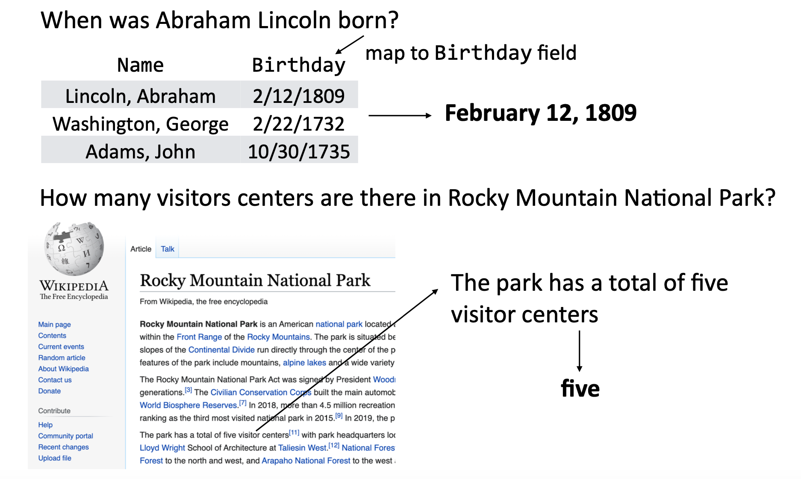
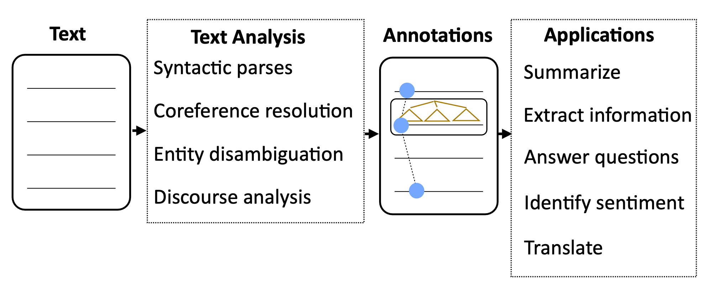
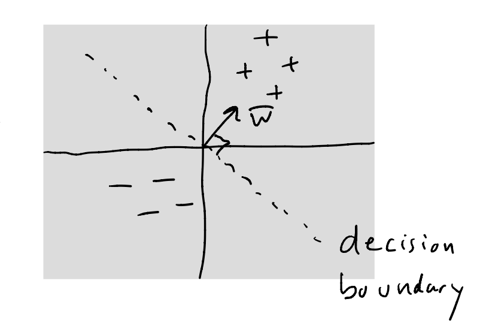
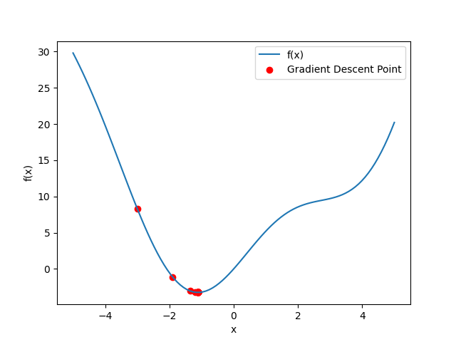
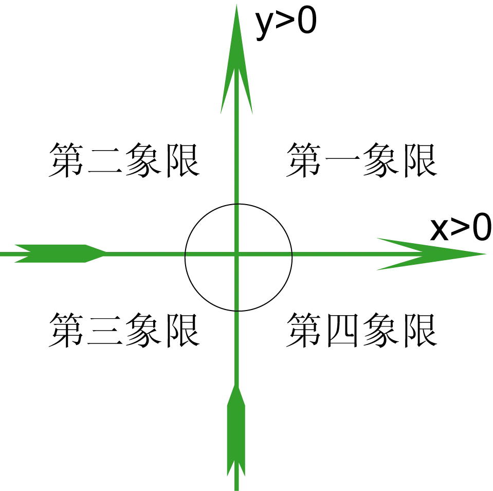
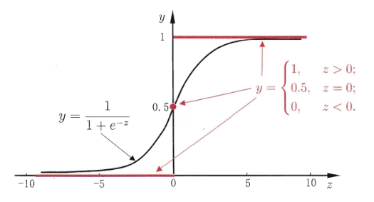
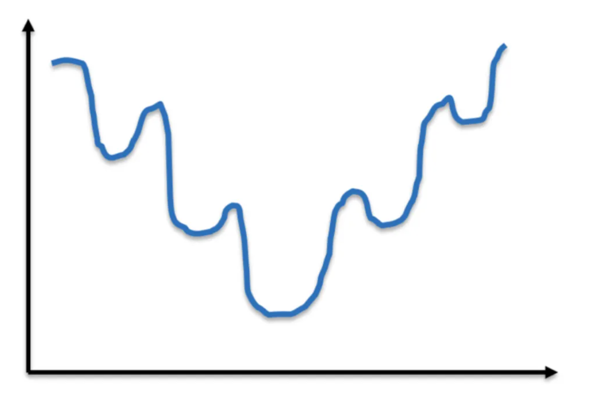
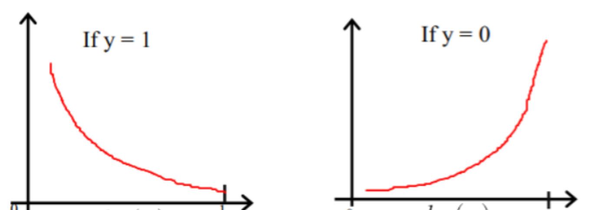
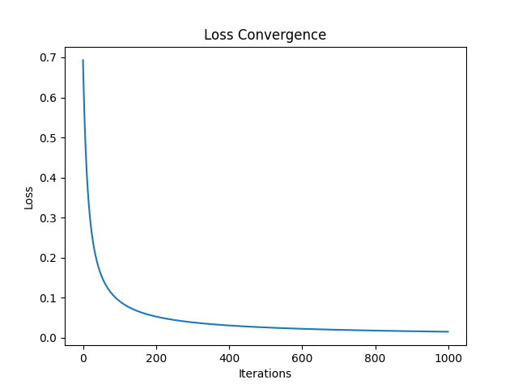

<div align="center">
  <h1>介绍和线性分类</h1>
</div>

# 1. 介绍

* 自然语言处理的目标是什么
  1. 能够解决需要深入理解（deep understanding）文本的问题。
  2. 能够构建与我们交流的系统：对话系统（dialogue system）、机器翻译（machine translation）、摘要（summarization）等。
  3. 能够构建从文本中抽取信息（extract information）并回答问题（answer question）的系统。

<div align="center">
  
</div>

<div align="center">
  
</div>


* 标准自然语言处理流程（pipeline）
  1. 获取原始文本（text）。
  2. 进行文本分析（text analysis）：包括句法/语法分析（syntactic parse），共指/指代消解（coreference resolution），实体消歧（entity disambiguation），话语/篇章分析（discourse analysis）等。
  3. 对文本进行标注（annotation）。
  4. 实际应用（application）：摘要/总结（summarize），抽取信息（extract information），回答问题（answer question），识别情绪（identify sentiment），翻译（translate）等等。

流程中涉及到的所有组件都是使用机器学习的统计方法建模的。

<div align="center">
  
</div>

# 2. 线性二分类

线性二分类（Linear Binary Classification）是一种机器学习中的分类算法，用于将输入数据分为两个互斥的类别。它基于线性模型的概念，尝试在特征空间中找到一个线性边界，将属于不同类别的数据点分开。

在线性二分类中，每个数据点通过一组特征表示，例如向量。算法的目标是找到一个超平面（在二维空间中即为一条直线），它可以最好地将属于不同类别的数据点分开。这个超平面可以被视为一个决策边界，根据数据点在超平面的哪一侧，将其划分为不同的类别。

为了实现线性二分类，常用的算法包括逻辑回归（Logistic Regression）和支持向量机（Support Vector Machines）等。这些算法通过学习适当的权重和偏差参数，来定义决策边界的位置和方向。


* 线性二分类算法

给定文本 $\bar{x}$，通过特征提取器（feature extractor） $f$ 转为数值向量，

$$
\bar{x}: \text{string} \rightarrow f(\bar{x}) \in \mathbb{R}^d
$$

然后输入给带有权重（weight）和偏置（bias）的分类器（classifier），得到分类超平面（决策边界，decision boundary），超平面两边分属两个类别。

$$
\bar{w}^T f(\bar{x}) \geq 0
$$

<div align="center">
  
</div>


# 3. 情感分析和基础特征提取

## 3.1. 情感分析

情感分析（Sentiment Analysis）是一种文本分析技术，用于确定给定文本中的情感倾向或情感极性。它可以帮助我们了解文本中的情感状态，例如正面、负面或中性。情感分析在许多领域都有广泛的应用，包括社交媒体分析、产品评论、舆情监测等。

> 情感分析 vs 情绪分析
> 
> 情感分析（Sentiment Analysis）和情绪分析（Emotional Analysis）是两种在文本分析中用于理解情感和情绪的方法，但它们有一些区别。
> 
> 情感分析（Sentiment Analysis）关注的是文本中的情感倾向或情感极性。它旨在确定文本是积极的、消极的还是中性的。情感分析通常使用情感词典、机器学习算法或深度学习模型来对文本进行情感分类。它可以用于分析产品评论、社交媒体帖子、新闻文章等，以了解公众对某个主题或产品的情感反应。
> 
> 情绪分析（Emotional Analysis）则更加关注文本中的情绪状态。它试图识别文本中表达的具体情绪，如喜悦、愤怒、悲伤、恐惧等。情绪分析通常涉及对情绪词汇、情绪模型或语义规则的分析，以确定文本所包含的情绪类型。情绪分析可用于社交媒体数据、用户评论、电影评论等领域，以了解人们在特定情境下的情绪体验。
> 
> 情感分析更关注整体情感倾向，而情绪分析更关注具体的情绪类型和情感状态。


* 情感分析任务示例

> 这个电影好，想再看这个电影。     【积极的、好评】
> 
> 这个电影不好，不想再看这个电影了。【消极的、差评】

## 3.2. 特征提取

特征提取（Feature Extraction）指的是从文本数据中提取有用信息的过程。它涉及对文本进行预处理和转换，以便能够捕捉文本的关键特征。一些常见的基本特征包括词频（某个词在文本中出现的次数）、词袋模型（文本中所有词的集合）、文本长度等。通过提取这些基本特征，我们可以更好地理解文本数据并进行进一步的分析和建模。

$$
\bar{x}: \text{string} \rightarrow f(\bar{x}) \in \mathbb{R}^d
$$

* 训练数据集

带有标签的数据进行特征抽取后作为标注数据集
$$
\{ f(\bar{x}^{(i)}), y^{(i)} \}_{i=1}^D
$$
可以直接训练分类器。

* 特征提取 - 词袋模型

词袋模型（Bag-of-Words Model）是一种常用的文本表示方法。它将文本视为一个袋子（或集合）中的词汇的无序集合，忽略了词汇的语法和顺序，仅关注词汇的出现频率。

词袋模型的基本思想是将文本转换为一个向量，其中向量的每个维度对应于词汇表中的一个单词。每个维度的值表示该单词在文本中出现的次数或其他权重值（如TF-IDF）。通过这种方式，我们可以将文本表示为数值化的特征向量，以便在机器学习模型中进一步处理和分析。

下面是一个简单的示例来说明词袋模型的概念。假设我们有以下两个句子：

> 句子一：这个电影好，想再看这个电影。
> 
> 句子二：这个电影不好，不想再看这个电影了。

使用词袋模型，我们可以构建词汇表如下：

> ['这个', '电影', '好', '，', '想', '再', '看', '。', '不好', '不想', '了']

然后，我们可以计算每个句子在词汇表中的词频，得到对应的特征向量：

> 句子一的特征向量：[2, 2, 1, 1, 1, 1, 1, 1, 0, 0, 0]
> 
> 句子二的特征向量：[2, 2, 0, 1, 0, 1, 1, 1, 1, 1, 1]

通过这种方式，我们将文本表示为了数值化的特征向量，其中每个维度表示了对应词汇在文本中出现的次数。词袋模型简化了文本的复杂性，使得文本可以更方便地被计算机处理和分析。然而，它忽略了词汇的顺序和上下文信息，可能会丢失一些语义和语境相关的信息。

```python
import jieba


sentence1 = "这个电影好，想再看这个电影。"
sentence2 = "这个电影不好，不想再看这个电影了。"

sentence1_tokenized = jieba.lcut(sentence1)
sentence2_tokenized = jieba.lcut(sentence2)
print("句子一分词结果:", sentence1_tokenized)
print("句子二分词结果:", sentence2_tokenized)


vocabulary = []
for word in sentence1_tokenized + sentence2_tokenized:
    if word not in vocabulary:
        vocabulary.append(word)
print("词表:", vocabulary)


sentence1_feature = [0] * len(vocabulary)
for word in sentence1_tokenized:
    index = vocabulary.index(word)
    sentence1_feature[index] += 1
print("句子一的特征向量(bow):", sentence1_feature)

sentence2_feature = [0] * len(vocabulary)
for word in sentence2_tokenized:
    index = vocabulary.index(word)
    sentence2_feature[index] += 1
print("句子一的特征向量(bow):", sentence2_feature)
```

* 特征提取 - N 元语法模型

N 元语法（N-gram）是一种常用的文本表示方法，而 Bag of Ngrams 则是基于 N 元语法和词袋模型的一种扩展模型。N 元语法表示文本中连续 N 个词的组合，例如二元语法（2-gram）表示连续两个词的组合，三元语法（3-gram）表示连续三个词的组合，以此类推。N 元语法可以捕捉到一定的上下文信息，并且在一些文本任务中具有一定的效果。Bag of Ngrams 模型扩展了词袋模型（Bag-of-Words Model），将 N 元语法作为特征进行文本表示。

下面是一个简单的示例来说明 Bag of Ngrams 模型的概念。假设我们有以下两个句子：

> 句子一：这个电影好，想再看这个电影。
> 
> 句子二：这个电影不好，不想再看这个电影了。

使用 Bag of Ngrams 模型，我们可以构建 2-gram 词汇表如下：

> ['这个电影', '电影好', '好，', '，想', '想再', '再看', '看这个', '电影。', '。这个', '电影不好', '不好，', '，不想', '不想再', '电影了', '了。']

然后，我们可以计算每个 2-gram 在句子中出现的次数，得到对应的特征向量：

> 句子一的特征向量：[2, 1, 1, 1, 1, 1, 1, 1, 0, 0, 0, 0, 0, 0, 0]
> 
> 句子二的特征向量：[2, 0, 0, 0, 0, 1, 1, 0, 0, 1, 1, 1, 1, 1, 1]

通过这种方式，我们将每个句子表示为一个向量，其中向量的每个位置表示对应2-gram在句子中出现的次数。从特征向量可以看出 2-gram 比词袋模型更有区分性。

```python
import jieba


sentence1 = "这个电影好，想再看这个电影。"
sentence2 = "这个电影不好，不想再看这个电影了。"

sentence1_tokenized = jieba.lcut(sentence1)
sentence2_tokenized = jieba.lcut(sentence2)
print("句子一分词结果:", sentence1_tokenized)
print("句子二分词结果:", sentence2_tokenized)


vocabulary = []
tokenized = sentence1_tokenized + sentence2_tokenized
for two_gram in zip(tokenized, tokenized[1:]):
    two_gram_str = "".join(two_gram)
    if two_gram_str not in vocabulary:
        vocabulary.append(two_gram_str)
print("N-gram 词表:", vocabulary)

sentence1_feature = [0] * len(vocabulary)
for i in range(len(sentence1_tokenized) - 1):
    two_gram_str = "".join(sentence1_tokenized[i:i + 2])
    index = vocabulary.index(two_gram_str)
    sentence1_feature[index] += 1
print("句子一的特征向量(2-gram):", sentence1_feature)

sentence2_feature = [0] * len(vocabulary)
for i in range(len(sentence2_tokenized) - 1):
    two_gram_str = "".join(sentence2_tokenized[i:i + 2])
    index = vocabulary.index(two_gram_str)
    sentence2_feature[index] += 1
print("句子二的特征向量(2-gram):", sentence2_feature)
```

> 词袋模型 vs Bag of Ngrams 模型
> 
> Bag of Ngrams 模型相对于词袋模型具有考虑词序和局部上下文的优势，适用于一些需要捕捉词序和上下文关系的任务。然而，根据具体任务和数据集的特点，选择合适的文本表示方法是很重要的，有时词袋模型可能更适用。

* 词频逆文档频率（TF-IDF）

词频逆文档频率（Term Frequency-Inverse Document Frequency，TF-IDF）是一种常用的特征权重计算方法，用于衡量一个词在文档中的重要性。它结合了词频（term frequency）和逆文档频率（inverse document frequency）两个因素。Bag of Ngrams 模型和词袋模型都仅仅使用了词频或 N-gram 频率。

Bag of Ngrams 模型和词袋模型都可以与 TF-IDF 一起使用。在词袋模型中，每个文档可以表示为一个向量，其中每个维度对应一个词，并记录该词在文档中的出现次数。使用 TF-IDF，可以将词袋模型中的词频进行加权，使得更重要的词获得更高的权重。在 Bag of Ngrams 模型中，每个文档也可以表示为一个向量，其中每个维度对应一个 N-gram，并记录该 N-gram 在文档中的出现次数。同样地，可以使用 TF-IDF 来对 N-grams 进行加权，以考虑它们在整个语料库中的重要性。

通过使用 TF-IDF，可以降低常见词（如“the”、“is”等）的权重，提高具有更高信息量的词或 N-grams 的权重。这有助于突出文本中的关键信息，对于一些文本处理任务，如文本分类、信息检索和文本聚类等，可以提升性能。因此，Bag of Ngrams 模型和词袋模型与 TF-IDF 相结合，可以更好地表示文本并捕捉关键信息。

> TF-IDF 是通过以下步骤计算的：
> 
> 计算词频（Term Frequency，TF）：对于给定的文档，计算每个词在文档中的出现频率。可以使用简单计数或标准化的词频计算方法，如将词频除以文档中的总词数，以避免较长文档对词频的影响。
> 
> 词频（TF）= 词在文档中的出现次数 / 文档中的总词数
> 计算逆文档频率（Inverse Document Frequency，IDF）：计算每个词的逆文档频率，表示该词在整个文档集合中的重要性。逆文档频率可以通过以下公式计算：
> 
> IDF = log(总文档数 / 包含该词的文档数)
>
> 其中，总文档数是语料库中的文档总数，包含该词的文档数是包含该词的文档的数量。
> 计算 TF-IDF 权重：将词频（TF）和逆文档频率（IDF）相乘，得到最终的 TF-IDF 权重。
> 
> TF-IDF = TF * IDF

通过计算 TF-IDF 权重，可以衡量一个词在单个文档中的重要性（通过 TF），以及在整个文档集合中的稀有程度（通过 IDF）。常见词在多个文档中频繁出现，其 TF 较高但 IDF 较低，因此其权重会相对较低。而对于在少数文档中出现但具有较高信息量的词，其 TF 较高且 IDF 较高，因此其权重会相对较高。需要注意的是，TF-IDF 权重的计算可以在整个文档集合上进行，也可以在单个文档内部进行。


## 3.3. 文本预处理

* 中文分词（Word Segmentation）和英文分词（Tokenization）

中文分词是将连续的中文字符序列切分成有意义的词语。中文中没有像空格那样明显的词语分隔符，因此需要使用中文分词工具，如jieba、hanlp等。

英文分词将连续的英文文本切分为单词或标点符号。英文文本中通常以空格作为词语的分隔符，但仍需处理标点符号等特殊情况。常用的分词工具有 NLTK、SpaCy 等。

* 停用词过滤（Stop Word Filtering）

中文和英文都需要过滤停用词，去除一些常见且对文本分析任务贡献较少的停用词，例如“的”，“是”，“在”，“the”，“is”，“in”等。可以使用预定义的停用词列表或基于统计方法自动选择停用词。停用词列表可根据任务和语料库进行定制。

* 文本规范化（Text Normalization）

对于中文来说，文本规范化需要处理中文文本中的繁体字、拼音、缩写、汉字表示的数字等，将其转换为标准化的形式。这有助于提高文本的一致性和可处理性。

对于英文来说，文本规范化需要进行大小写转换（Lowercasing/Uppercasing）以避免同一个单词因大小写不同而被视为不同的词。词形还原（Lemmatization）和词干提取（stemming）将单词还原为其原始或基本形式，以减少词形的变化对文本处理的影响。

词形还原是将单词还原为其在词典中的原始形式（称为词元或词根），以保留单词的语义信息。词形还原考虑了词性和上下文，以确保还原后的单词是有效的词元。例如：单词 "running"，词形还原结果 "run"。单词 "better"，词形还原结果 "good"。单词 "went"，词形还原结果："go"。在这些示例中，词形还原将单词还原为其原始形式，去除了时态、派生后缀等，使得不同形式的单词都归并到相同的基本形式上。

词干提取是一种简化的单词还原方法，通过删除单词的后缀来获得词干（即词的基本形式），而不考虑词性和上下文。词干提取可能会生成一些非词元的形式，但它具有较高的运行效率。例如：单词 "running"，词干提取结果 "run"。单词 "better"，词干提取结果"better"。单词 "went"，词干提取结果 "went"。在这些示例中，词干提取通过去除后缀，将单词简化为其词干形式。词干提取不考虑词性和语义，因此可能会产生一些不是真正的单词，但它在某些情况下可以作为一种简化文本处理的方法。

需要注意的是，词形还原通常比词干提取更复杂，并且在某些任务中更为准确。选择使用词形还原还是词干提取取决于具体的应用场景和任务要求。

* 文本预处理的优点

这些预处理步骤有助于减少噪音、统一文本表示，提取有用的信息，为后续的文本分析任务奠定基础。具体的预处理步骤和顺序可能因不同任务和数据而有所变化。

* 文本预处理 Python 实现

```python
import jieba
import nltk
from nltk.tokenize import word_tokenize
from nltk.stem import WordNetLemmatizer
from nltk.stem import PorterStemmer

nltk.download('punkt')

# 中文分词和停用词过滤
stopwords = ['的', '了', '和', '是', '就', '都', '而', '及', '与', '或', '个', '也', '这']
text = "我喜欢看电影，尤其喜欢科幻电影和动作片。"
tokenized_list = jieba.lcut(text)
print("中文分词结果:", tokenized_list)

tokenized_remove_stopword_list = [word for word in tokenized_list if word not in stopwords]
print("中文停用词过滤后的分词结果:", tokenized_remove_stopword_list)


# 英文分词和词形还原
text = "cats ate running better"
words = word_tokenize(text)
print("英文分词结果:", words)

lemmatizer = WordNetLemmatizer()  # 词形还原器
lemmatized_words = [lemmatizer.lemmatize(word) for word in words]
print("词形还原结果:", lemmatized_words)

stemmer = PorterStemmer()         # 词干提取器
stemmed_words = [stemmer.stem(word) for word in words]
print("词干提取结果:", stemmed_words)
```

# 4. 学习的基础 - 梯度下降算法

梯度下降算法（Gradient Descent）是一种常用的优化算法，用于找到函数的最小值或最大值（梯度上升）。它通过迭代更新参数的方式来逐步逼近最优解。

* 算法流程

假设有一个可微的函数 $f(x)$（机器学习中的目标函数），我们的目标是找到使得 $f(x)$ 达到最小值的 $x$ 值。梯度下降算法通过迭代更新参数的方式来逐步逼近最小值。

> 1. 初始化参数 $x$ 和学习率 $\alpha$。
> 2. 计算函数 $f(x)$ 的梯度，即 $f^{\prime}(x)$。
> 3. 更新参数 $x := x - \alpha * f^{\prime}(x)$。
> 4. 重复步骤 2 和步骤 3，直到满足停止条件（例如达到最大迭代次数或梯度变化很小）。

这样，通过不断更新参数 $x$，梯度下降算法可以逐步接近最小值点。

> 以一维坐标为例，梯度主要表示的是变化率，梯度的值可以告诉我们函数在该点上是增长还是减小，以及增长或减小的速度有多快。
> 
> 学习率是一个超参数，用于控制参数更新的步长或称为学习步长。学习率决定了我们在每次参数更新中沿着梯度方向移动的距离。较大的学习率意味着我们会更快地接近最小值，但可能会导致参数在最小值附近波动或无法收敛。较小的学习率意味着我们会以较小的步长更新参数，可能需要更多的迭代次数才能收敛到最小值。
> 
> 梯度和学习率共同作用的方式是通过乘积来确定参数的更新量。学习率乘以梯度确定了参数更新的步长。较大的学习率会导致更大的步长，而较小的学习率会导致更小的步长。因此，学习率可以控制参数更新的速度和稳定性。选择合适的学习率是梯度下降算法中的一个关键问题。如果学习率过大，可能会导致参数在最小值附近来回震荡甚至发散；如果学习率过小，可能会导致收敛速度过慢或陷入局部最小值。

> * 为什么梯度的负方向就是损失下降最快的方向
> 
> 梯度下降算法中选择梯度的负方向作为更新方向的理论依据主要来自于微积分中的一阶导数和泰勒展开的思想。
> 
> 根据微积分中的一阶导数的定义，函数在某一点的导数表示了函数在该点的变化率和变化的方向。对于多变量函数，梯度可以看作是导数的推广，表示了函数在每个参数维度上的变化率和变化的方向。
>
> 梯度的方向指示了函数在当前点的最大上升率，而负梯度的方向则指示了函数在当前点的最大下降率。因此，负梯度的方向可以被认为是函数下降最快的方向。

在一个点上，借助于泰特展开，我们有

$$
f(x + \delta) - f(x) \approx f^{\prime}(x) \cdot \delta
$$

其中，$f^{\prime}(x)$ 和 $\delta$ 为向量，那么这两者的内积就等于

$$
f^{\prime}(x) \cdot \delta = ||f^{\prime}(x)|| \cdot ||\delta|| \cdot \cos \theta
$$

当 $\theta = \pi$ 时，也就是 $\theta$ 在 $f^{\prime}(x)$ 的负方向上时，取得最小值，也就是下降的最快的方向了


以 $f(x) = x^2 + 5*\sin(x)$ 为例，求解步骤如下：

```python
import numpy as np
import matplotlib.pyplot as plt


# 定义函数 f(x)
def f(x):
    return x ** 2 + 5 * np.sin(x)


# 定义函数 f(x) 的导数
def f_derivative(x):
    return 2 * x + 5 * np.cos(x)


# 梯度下降算法
def gradient_descent(x_start, learning_rate, num_iterations):
    x = x_start
    history = [x]                      # 保存每次迭代后的 x 值
    for _ in range(num_iterations):
        gradient = f_derivative(x)     # 计算梯度
        x -= learning_rate * gradient  # 更新参数 x
        history.append(x)              # 保存更新后的 x 值
    return x, history


# 设置初始参数和学习率
x_start = -3         # 初始参数值
learning_rate = 0.1  # 学习率
num_iterations = 50  # 迭代次数

# 运行梯度下降算法
x_min, x_history = gradient_descent(x_start, learning_rate, num_iterations)

# 输出最小值和最小值对应的 x 值
print("最小值:", f(x_min))
print("最小值对应的 x 值:", x_min)

# 绘制函数曲线和梯度下降过程
x = np.linspace(-5, 5, 100)
y = f(x)
plt.plot(x, y, label='f(x)')
plt.scatter(x_history, f(np.array(x_history)), c='r', label='Gradient Descent Point')
plt.legend()
plt.xlabel('x')
plt.ylabel('f(x)')
plt.show()
```

运行上述代码，将得到函数 $f(x)$ 的最小值和最小值对应的 $x$ 值，并绘制出函数曲线和梯度下降过程的图形。

<div align="center">
  
</div>

# 5. 感知机

感知机（Perceptron）是一种简单的二分类线性分类模型，由美国科学家 Frank Rosenblatt 在1957年提出。它是人工神经网络的基础，也是神经网络发展的起点之一。

感知机模型由输入层、权重、激活函数和输出层组成。它的输入是一组特征向量，每个特征都有一个对应的权重。感知机通过将输入特征与对应的权重相乘并加权求和，然后通过激活函数进行非线性变换，得到最终的输出结果。

具体而言，对于一个输入特征向量 $x = (x_1, x_2, ..., x_n)$，感知机模型的输出 $y$ 是通过以下步骤计算得到的：

1. 对于每个输入特征 $x_i$，与对应的权重 $w_i$ 相乘并求和，得到加权求和结果 $z = w_1 x_1 + w_2 x_2 + ... + w_n x_n$。

2. 将加权求和结果 $z$ 输入到激活函数（通常为阶跃函数或符号函数）中，根据激活函数的输出确定感知机的最终输出 $y$。例如，对于阶跃函数，如果 $z$ 大于等于某个阈值（通常为0），则输出为正类（1），否则输出为负类（-1）。

> 感知机模型的训练过程旨在调整权重值，使得模型能够正确地对输入样本进行分类。训练过程使用随机梯度下降算法，通过迭代调整权重，使得模型的分类结果与真实标签一致。需要注意的是，感知机模型只能处理线性可分的情况，即存在一个超平面可以将不同类别的样本完全分开。对于线性不可分的问题，感知机无法收敛到一个满足要求的解。为了处理线性不可分问题，后续发展出了更复杂的分类模型，如多层感知机（Multilayer Perceptron）。


感知机使用的是随机梯度下降（Stochastic Gradient Descent，SGD）算法与传统的梯度下降算法不同，感知机的损失函数不是可微的，因此无法直接使用梯度下降算法。相反，感知机使用了一个简化的更新规则来进行参数更新。梯度下降算法的一般形式是基于损失函数的梯度进行参数更新。但感知机使用的是误分类点的梯度，即每次只选择一个误分类点进行参数更新。

下面是感知机的梯度下降更新规则的简化形式：

1. 对于一个误分类的样本 $(x, y)$，其中 $x$ 是输入特征向量，$y$ 是真实标签。预测结果为 $y\_pred$。
2. 根据预测结果 $y\_pred$ 和真实标签 $y$ 的差异来计算更新量 $\delta = \alpha * (y - y\_pred)$。
3. 更新权重和偏置：$w\_new = w\_old + \delta * x$，$b\_new = b\_old + \delta$。在更新权重的过程中 $x$ 是输入样本的特征信息，如果没有 $x$ 而只有一个更新量 update。这样的更新方式将无法正确地调整权重，使感知机模型能够更好地适应输入数据。没有输入特征信息，将无法正确地调整权重，导致模型不能准确地对样本进行分类。

需要注意的是，感知机只针对误分类点进行参数更新，因此这种更新方式可以将误分类点推向正确的一侧，直到所有样本被正确分类或达到指定的迭代次数。这是感知机使用的简化梯度下降更新规则，与传统梯度下降算法有所不同。传统梯度下降算法通常涉及对整个训练集的梯度计算和参数更新，而感知机仅处理误分类点。

* 感知机 Python 实现

<div align="center">
  
</div>

下面用 Python 实现感知机用于对第一象限和第三象限的点进行分类：

```python
import numpy as np


class Perceptron:
    def __init__(self, input_size):
        self.weights = np.zeros(input_size)
        self.bias = 0

    def predict(self, inputs):
        activation = np.dot(inputs, self.weights) + self.bias
        return np.where(activation >= 0, 1, -1)

    def train(self, inputs, labels, learning_rate, epochs):
        for _ in range(epochs):
            for i in range(len(inputs)):
                prediction = self.predict(inputs[i])
                if prediction != labels[i]:
                    update = learning_rate * (labels[i] - prediction)
                    self.weights += update * inputs[i]
                    self.bias += update

# 训练数据
inputs = np.array([[2, 1], [3, 4], [-2, -1], [-3, -2]])
labels = np.array([1, 1, -1, -1])

# 创建感知机对象
perceptron = Perceptron(input_size=2)

# 训练感知机
perceptron.train(inputs, labels, learning_rate=0.1, epochs=10)

# 测试感知机
test_inputs = np.array([[400, 194], [-13, -34]])
predictions = perceptron.predict(test_inputs)

# 输出预测结果
for i in range(len(test_inputs)):
    print(f"Input: {test_inputs[i]}, Prediction: {predictions[i]}")
```

# 6. 逻辑回归

逻辑回归（Logistic Regression）是一种用于二分类问题的统计学习方法，逻辑回归是一种判别式概率模型。具体来说，逻辑回归使用线性回归模型的输出（线性组合）作为输入，然后通过 logistic 函数将其转换为一个在0到1之间的概率值。这个概率值表示样本属于某个特定类别的概率。基于这个概率值，我们可以进行分类决策，将概率大于一个阈值的样本划分为正类，概率小于阈值的样本划分为负类。

逻辑回归之所以被称为"回归"，是因为它的数学基础和一般的线性回归方法有一些相似之处。逻辑回归的名称起源于它的数学形式和推导过程。在逻辑回归中，主要是使用线性回归方法来建立模型，然后利用 logistic 函数（也称为 sigmoid 函数）将线性模型的输出映射到概率，即目标是预测样本的类别而不是连续的数值结果。

> 判别式概率模型（Discriminative Probabilistic Model）和生成式概率模型（Generative Probabilistic Model）是两种常见的概率建模方法，它们的区别如下：
> 
> 目标：
> * 判别式概率模型的目标是建立一个条件概率分布 P(y|x)，即给定输入 x，预测输出 y 的条件概率。它主要关注于学习输入和输出之间的直接关系，用于分类和回归等判别任务。
> * 生成式概率模型的目标是建立联合概率分布 P(x, y)，即同时建模输入 x 和输出 y 的联合概率分布。它不仅关注输入和输出之间的关系，还可以生成新样本，用于生成、聚类等任务。
> 
> 建模方法：
> * 判别式概率模型通过学习条件概率 P(y|x) 来直接建模输入和输出之间的关系。常见的判别式模型包括逻辑回归、支持向量机（SVM）、神经网络等。
> * 生成式概率模型通过学习联合概率分布 P(x, y) 来建模输入和输出之间的关系。常见的生成式模型包括朴素贝叶斯、高斯混合模型（GMM）、隐马尔可夫模型（HMM）等。
>
> 数据生成：
> * 判别式概率模型主要关注预测输出 y，通常不直接生成新的输入样本。它通过学习训练数据中的模式来进行分类或回归预测。
> * 生成式概率模型可以通过联合概率分布 P(x, y) 来生成新的输入样本。它可以模拟数据的分布，生成符合该分布的新样本。

* 逻辑回归算法的基本流程：

1. 数据预处理：首先，需要对输入数据进行预处理，包括特征缩放、处理缺失值、处理异常值等。还可以进行特征选择或转换，以提高模型性能。
2. 定义模型：逻辑回归使用 logistic 函数（也称为 sigmoid 函数）将线性模型的输出映射到概率值。定义模型和决策边界（decision boundary）如下

$$
\begin{aligned}
z &= \bar{w}^T f(\bar{x}) \\
\hat{y} &= P(y|\bar{x}) = \frac{1}{1 + e^{-z}} \\
y &= 
\begin{cases}
+1, \quad \text{if } P(y|\bar{x}) > \text{threshold} \\
-1, \quad \text{if } \text{other}
\end{cases}
\end{aligned} 
$$

<div align="center">
  
</div>

3. 损失函数：逻辑回归使用对数似然损失函数（log-likelihood loss）来衡量模型预测与真实标签之间的差异。


如果逻辑回归和线性回归一样，利用误差平方和来当作损失函数。对于给定的训练集，损失函数如下：

$$
\mathcal{L}(y, \hat{y}) = \frac{1}{2} \sum_i (y^i - \hat{y}^i)^2
$$

$y^i$ 表示第 $i$ 个样本的真实值，$\hat{y}^i$ 表示第 $i$ 个样本的预测值。如果把 $\hat{y}^i$ 带入损失函数公式中，会发现这是一个非凸函数，这就意味着损失函数有着许多的局部最小值，这不利于我们的求解。

<div align="center">
  
</div>

逻辑回归使用的常见损失函数是二元交叉熵损失函数（Binary Cross-Entropy Loss）。逻辑回归假设数据服从伯努利分布，假设模型的输出值是样本为正例的概率。因此有

$$
\begin{aligned}
P(y=1|x) &= \hat{y} \\
P(y=0|x) &= 1 - \hat{y} \\
\end{aligned}
$$

上面两式可以写成一般形式

$$
P(y|x) = \hat{y}^y (1 - \hat{y})^{(1-y)}
$$

接下来我们就要用极大似然估计（maximum likelihood estimation）来根据给定的训练集估计出参数

$$
L(w) = \prod_{i=1}^n P(y^i|x^i;w) = \prod_{i=1}^n (\hat{y}^i)^{y^i} (1 - \hat{y}^i)^{(1-y^i)}
$$

为了简化运算，我们对上面这个等式的两边都取一个对数

$$
\log L(w) = \sum_{i=1}^n (y^i \log \hat{y}^i + (1-y^i) \log (1 - \hat{y}^i))
$$

以上是求是的 $L(w)$ 最大的参数 $w$，加个负号就成了求最小的损失函数了，即最小化负对数似然（negative log likelihood，NLL）。

$$
\mathcal{L} = -\log L(w) = -\sum_{i=1}^n (y^i \log \hat{y}^i + (1-y^i) \log (1 - \hat{y}^i))
$$

即

$$
\mathcal{L} = 
\begin{cases}
- \log \hat{y} &\text{if } y=1 \\
- \log (1 - \hat{y}) &\text{if } y=0
\end{cases}
$$

<div align="center">
  
</div>

该损失函数的直观解释是，当真实标签 $y$ 为1时，希望预测概率 $\hat{y}$ 越接近1越好；而当真实标签 $y$ 为0时，希望预测概率 $\hat{y}$ 越接近0越好。对于误分类的情况，损失函数会惩罚模型的预测偏离真实标签的程度。换句话说，如果样本的值是 1 的话，估计值越接近 1 付出的代价就越小，反之越大；同理，如果样本的值是 0 的话，估计值越接近 0 付出的代价就越小，反之越大。因此，损失函数也称为成本函数或代价函数或目标函数。


4. 参数优化：使用梯度下降（Gradient Descent）等优化算法，最小化损失函数来更新模型参数。

$$
\begin{aligned}
w &:= w + \Delta w = w - \eta \Delta \mathcal{L}(w) \\
w_j &:= w_j + \Delta w_j = w_j - \eta \frac{\mathcal{L}(w)}{w_j} \\
\end{aligned}
$$

其中，$w_j$ 表示第 $j$ 个特征的权重，$\eta$ 为学习率用来控制步长。

$$
\begin{aligned}
\frac{\mathcal{L}(w)}{w_j}
&= -\sum_{i=1}^n (y^i \frac{1}{\hat{y}^i} + (1-y^i) \frac{1}{(1 - \hat{y}^i)}) \frac{\partial \hat{y}^i}{\partial w_j} \\
&= -\sum_{i=1}^n (y^i \frac{1}{\hat{y}^i} + (1-y^i) \frac{1}{(1 - \hat{y}^i)}) \hat{y}^i (1 - \hat{y}^i) \frac{\partial \hat{z}^i}{\partial w_j} \\
&= -\sum_{i=1}^n (y^i (1 - \hat{y}^i) - (1-y^i) \hat{y}^i) x^i_j \\
&= -\sum_{i=1}^n (y^i - \hat{y}^i) x^i_j \\
\end{aligned}
$$

在使用梯度下降法更新权重时，只要根据下式即可

$$
\begin{aligned}
w_j := w_j + \eta \sum_{i=1}^n (y^i - \hat{y}^i) x^i_j
\end{aligned}
$$

* Python 实现逻辑回归的梯度下降算法

```python
import numpy as np
import matplotlib.pyplot as plt


def sigmoid(z):
    return 1 / (1 + np.exp(-z))


def compute_loss(X, y, theta):
    y_pred = sigmoid(np.dot(X, theta))
    epsilon = 1e-5  # 用于避免log(0)的情况
    loss = -np.mean(y * np.log(y_pred + epsilon) + (1 - y) * np.log(1 - y_pred + epsilon))
    return loss


def gradient_descent(X, y, learning_rate, num_iterations):
    num_samples, num_features = X.shape
    theta = np.zeros((num_features, 1))
    loss_history = []

    for _ in range(num_iterations):
        y_pred = sigmoid(np.dot(X, theta))
        loss = compute_loss(X, y, theta)
        gradient = (1/num_samples) * np.dot(X.T, (y_pred - y))
        theta -= learning_rate * gradient
        loss_history.append(loss)

    return theta, loss_history


np.random.seed(0)
num_samples = 100
X_positive = np.random.normal(loc=2, scale=1, size=(num_samples, 2))
X_negative = np.random.normal(loc=-2, scale=1, size=(num_samples, 2))
X = np.vstack((X_positive, X_negative))
y = np.vstack((np.ones((num_samples, 1)), np.zeros((num_samples, 1))))

X = np.hstack((np.ones((2*num_samples, 1)), X))
X[:, 1:] = (X[:, 1:] - np.mean(X[:, 1:], axis=0)) / np.std(X[:, 1:], axis=0)

learning_rate = 0.1
num_iterations = 1000
theta, loss_history = gradient_descent(X, y, learning_rate, num_iterations)

plt.plot(loss_history)
plt.xlabel('Iterations')
plt.ylabel('Loss')
plt.title('Loss Convergence')
plt.show()

# 生成测试样本
X_test = np.array([[1, 1, 1.5], [1, -1, -1.5]])
# 使用训练后的参数进行预测
y_pred = sigmoid(np.dot(X_test, theta))
print(y_pred)
```

损失的收敛情况如下：

<div align="center">
  
</div>


# 7. 情感分析

[斯坦福情绪树库（Stanford Sentiment Treebank，SST）数据集介绍](https://towardsdatascience.com/the-stanford-sentiment-treebank-sst-studying-sentiment-analysis-using-nlp-e1a4cad03065)

情感分析是对给定文本进行极性分类的任务。SST 是典型情感分析的任务，模型必须分析文本的情感。例如，判断餐厅评论是积极还是消极的形式。关于 SST 更多细节见上述链接。更多情感分析数据集见 [Sentiment Analysis](https://github.com/sebastianruder/NLP-progress/blob/master/english/sentiment_analysis.md)。

> 1. The food at this restaurant is absolutely amazing! I highly recommend it to everyone.
> 
> 2. I had a terrible experience at this place. The service was terrible and the food was tasteless.

对完整句子进行二元分类（将中性句子排除，仅考虑负面或稍微负面 vs 稍微正面或正面），称为 [SST-2 或 SST 二元数据集](https://huggingface.co/datasets/stanfordnlp/sst2)。

最新的排行榜见 [Leaderboard - GLUE Benchmark](https://gluebenchmark.com/leaderboard)。

* 情感分析示例

> 1. this movie was great! would watch again              【积极的】
> 2. the movie was gross and overwrought, but I liked it  【积极的】
> 3. this movie was not really very enjoyable             【消极的】

根据以上示例可以看出，词袋模型似乎不够用，涉及到话语结构（discourse structure）、否定等问题。不过有一些方法可以解决这个问题，否定词（如 "not"）经常会改变句子的情感极性。为了更好地捕捉句子中的否定含义，可以提取以 "not" 为前缀的二元特征。这样可以将 "not" 和其后面的单词或短语作为一个整体来考虑，以更准确地判断句子的情感极性。通过提取这些 "not X" 的二元特征，可以捕捉到否定词对句子情感的影响，从而提高情感分类的性能。使用词袋模型构建一些简单的特征集合也能使得情感分析任务做的比较好了。

以下是一些机器学习在情感分析任务上的研究：

1. [Thumbs up? Sentiment Classification using Machine Learning Techniques](https://aclanthology.org/W02-1011/)

2. [Baselines and Bigrams: Simple, Good Sentiment and Topic Classification](https://aclanthology.org/P12-2018/)

3. [Convolutional Neural Networks for Sentence Classification](https://aclanthology.org/D14-1181/)

* 使用词袋模型和逻辑回归作为情感分析的基本框架，数据集使用 SST-2

```python
from datasets import load_dataset
from sklearn.metrics import accuracy_score
from sklearn.linear_model import LogisticRegression
from sklearn.feature_extraction.text import CountVectorizer


# 加载SST-2数据集
dataset = load_dataset("glue", "sst2")

# 获取训练集和验证集
train_data = dataset["train"]
valid_data = dataset["validation"]

# 初始化词袋模型
vectorizer = CountVectorizer()

# 将训练集文本转换为词袋特征表示
train_features = vectorizer.fit_transform(train_data["sentence"])

# 将验证集文本转换为词袋特征表示
valid_features = vectorizer.transform(valid_data["sentence"])

# 获取训练集标签
train_labels = train_data["label"]

# 初始化逻辑回归模型，并增加最大迭代次数
classifier = LogisticRegression(max_iter=1000)  # 增加最大迭代次数为1000

# 训练情感分类模型
classifier.fit(train_features, train_labels)

# 预测训练集和验证集标签
train_predictions = classifier.predict(train_features)
valid_predictions = classifier.predict(valid_features)

# 计算训练集和验证集准确率
train_accuracy = accuracy_score(train_labels, train_predictions)
valid_accuracy = accuracy_score(valid_data["label"], valid_predictions)

print("训练集准确率：", train_accuracy)
print("验证集准确率：", valid_accuracy)
```

以上实验使用基础的词袋模型和逻辑回归，获得如下结果：

```shell
训练集准确率： 0.9379352328913569
验证集准确率： 0.8188073394495413
```

在实践中，还需要进行更多的预处理、特征工程和模型调优来提高性能。

# 8. 感知机和逻辑回归

感知器（Perceptron）、逻辑回归（Logistic Regression）和支持向量机（Support Vector Machine，SVM）之间存在一些联系和关联。

感知器是一种基本的二元分类算法，它模仿了神经元的工作原理。它通过计算输入特征的加权和，并将结果传递给激活函数，以确定输出类别。感知器通常使用阶跃函数作为激活函数，当加权和超过阈值时输出为正类，否则为负类。感知器通过迭代的方式对权重进行调整，以逐渐减少分类错误。

逻辑回归是一种广泛应用于分类问题的统计学习方法。与感知器不同，逻辑回归使用了一种称为逻辑函数（或称为sigmoid函数）的激活函数，将线性组合的结果映射到0到1之间的概率范围。逻辑回归通过最大化似然函数或最小化交叉熵损失函数来学习模型参数，从而找到最佳的决策边界。

支持向量机是一种强大的监督学习算法，可应用于二元和多元分类问题，以及回归问题。SVM的目标是找到一个最优超平面，将不同类别的数据点最大程度地分开，同时最小化分类错误。SVM使用核函数将数据映射到高维特征空间，从而使非线性问题也能有效解决。

感知器和逻辑回归可以看作是最简单的线性分类器，逻辑回归可以被视为感知器的扩展，使用了更灵活的激活函数和更复杂的参数估计方法。逻辑回归可以看作是一个概率化的线性分类器，将线性组合的结果转化为概率输出。而感知器仅基于硬阈值进行分类。SVM 则是一种更复杂的分类方法，它可以处理非线性问题，通过使用核函数将数据映射到高维空间来实现更高维度的分类边界。总而言之，感知器和逻辑回归是线性分类器的基础，而 SVM 则是一种更具表现力和灵活性的分类器，可以处理更复杂的问题。


