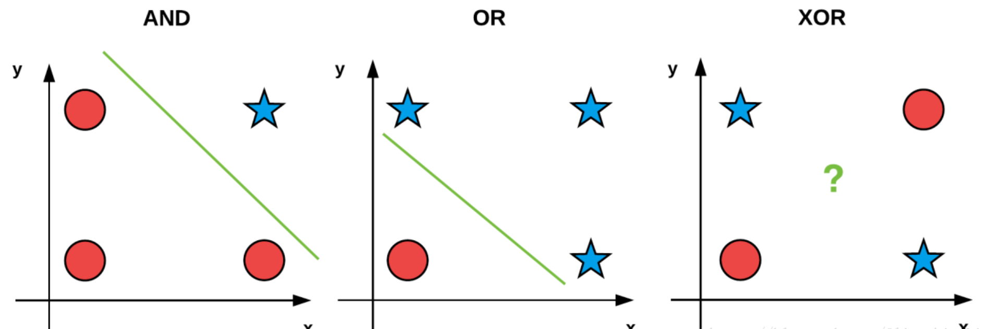
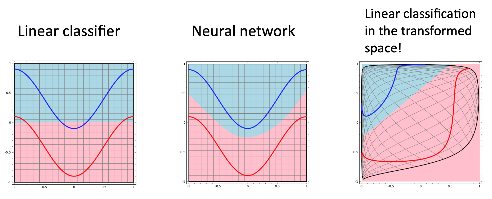
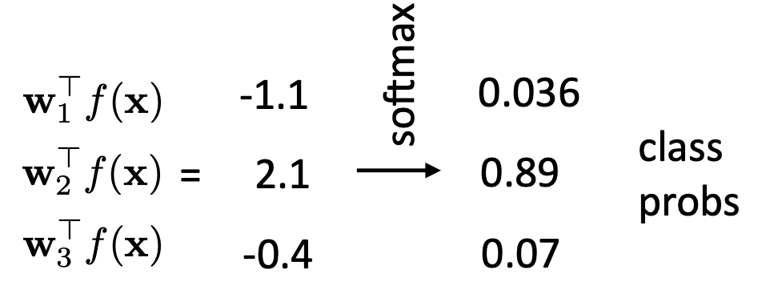
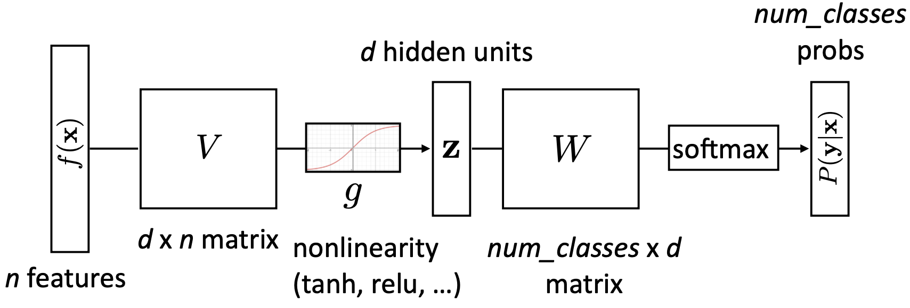
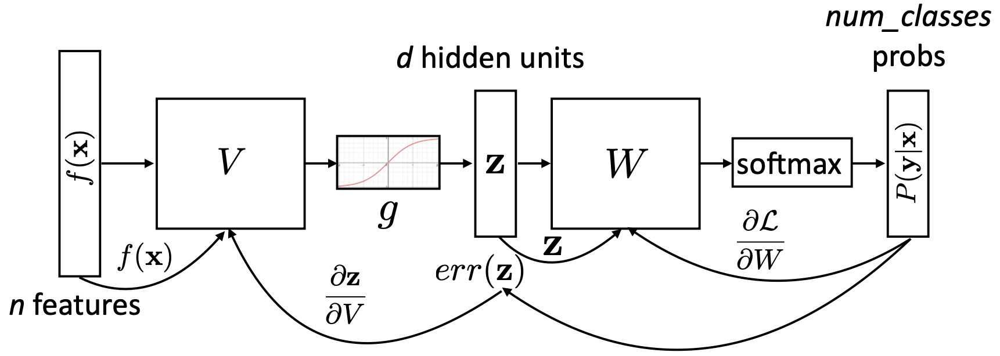
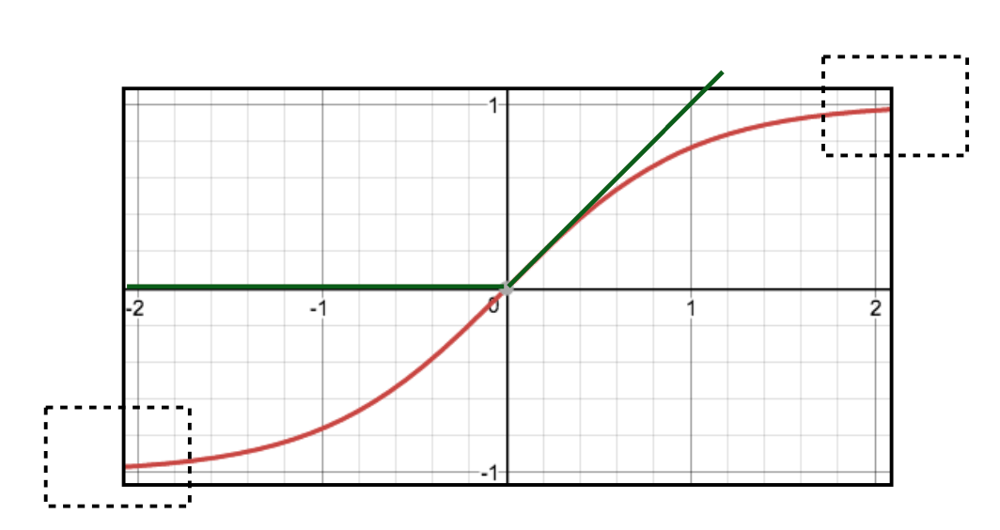

<div align="center">
  <h1>多类别分类和神经网络</h1>
</div>

* [1. 多类别分类](#1-多类别分类)
* [2. 多类别感知机和多类别逻辑回归](#2-多类别感知机和多类别逻辑回归)
* [3. 多类别分类的场景](#3-多类别分类的场景)
* [4. 分类公平性](#4-分类公平性)
* [5. 神经网络](#5-神经网络)
* [6. 神经网络可视化](#6-神经网络可视化)
* [7. 神经网络的前向传播和反向传播](#7-神经网络的前向传播和反向传播)
* [8. 神经网络的训练与优化](#8-神经网络的训练与优化)

# 1. 多类别分类

分类是一个预测建模问题，它涉及到在给定输入的情况下输出类标签。通常分类任务是从两个或多个标签中预测一个标签，在这中情况下，类是互斥的，这意味着分类任务假定输入只属于一个类。这就是多类别分类问题（Multiclass Classification），多分类任务只有一个类别是1，其他都是0。

> 有些分类任务需要预测多个类标签，这意味着类标签不是互斥的。这些任务称为多标签分类（Multi-label Classification）。在多标签分类中，每个输入样本需要零个或多个标签作为输出。

在多类别分类中，"one vs all" 或 "one vs rest"（一对其余）是一种常用的策略，用于将多个类别的分类问题转化为多个二分类问题。在这种策略中，每个类别都被视为一个正类别，而其他所有类别被视为一个统一的负类别。

在"one vs all"策略中，有两种常见的技术：每类一个权重向量（different weight vector per class）和每类不同特征（different feature per class）。

1. 每类一个权重向量（different weight vector per class, DW）：在这种技术中，对于每个类别，都会训练一个独立的二分类模型。对于第i个类别，模型的目标是将第i个类别与其他所有类别区分开来。每个类别都有一个独立的权重向量，用于计算样本的特征与该类别的相似度或概率。在测试时，将样本分别输入每个二分类模型中，然后根据每个模型的输出确定样本所属的类别。

$$
\text{DW: } \arg \max_{y \in \mathcal{y}} \bar{w}_y^T f(\bar{x})
$$

其中，$\bar{w}_y^T$ 标识着不同的类别，即权重控制类别。

2. 每类不同特征（different feature per class, DF）：在这种技术中，针对每个类别，会选择或提取与该类别相关的特征子集。换句话说，每个类别都有一组与之相对应的特征，这些特征被认为对该类别的分类具有更强的区分能力。然后，针对每个类别，训练一个独立的二分类模型，该模型使用该类别对应的特征子集进行训练。在测试时，将样本输入每个二分类模型中，并根据模型的输出确定样本所属的类别。

$$
\text{DF: } \arg \max_{y \in \mathcal{y}} \bar{w}^T f(\bar{x}, y)
$$

其中，$f(\bar{x}, y)$ 标识着不同的类别，即特征控制类别。


* 以主题分类（Topic Classification）为例的多类别分类

假设输入 $\bar{x}$ 为“太多药品需要实验了，需要足够的耐力”，主题标签 $y$ 有【健康】、【运动】、【科学】三个类别。使用词袋模型进行特征提取，假设词表为【药品，耐力，长跑】，可知

$$
f(\bar{x}) = [1, 1, 0]
$$

使用不同权重的方法（假定权重已经获得）DW 有

$$
\begin{aligned}
l_{\text{health}} &= \bar{w}_{\text{health}}^T f(\bar{x}) = [2, 5.6, -3] \cdot f(\bar{x}) = 7.6 \\
l_{\text{sport}} &= \bar{w}_{\text{sport}}^T f(\bar{x}) = [1.2, -3.1, 5.7] \cdot f(\bar{x}) = -1.9 \\
&\cdots
\end{aligned}
$$

最终取最大即可获得预测的类别【健康】。

使用不同特征的方法（假定权重已经获得）DF 有

$$
\begin{aligned}
\bar{w}^T &= [2, 5.6, -3, 1.2, -3.1, 5.7, \cdots] \\
f(\bar{x}, y_{\text{health}}) &= [1, 1, 0, 0, 0, 0, 0, 0, 0] \\
f(\bar{x}, y_{\text{sport}}) &= [0, 0, 0, 1, 1, 0, 0, 0, 0] \\
\bar{w}^T f(\bar{x}, y_{\text{health}}) &= 7.6 \\
\bar{w}^T f(\bar{x}, y_{\text{sport}}) &= -1.9 \\
&\cdots
\end{aligned}
$$

最终取最大即可获得预测的类别【健康】。

# 2. 多类别感知机和多类别逻辑回归

多类别感知器（Multiclass Perceptron）是一种机器学习算法，用于多类别分类任务。它是感知器算法在多类别问题上的扩展。感知器是一种二分类算法，用于将输入数据分为两个类别。然而，对于涉及多个类别的问题，需要使用多类别分类算法。多类别感知器是在这种背景下发展出来的。多类别感知器的基本思想是将多个二分类的感知器（也称为子感知器）组合在一起，每个子感知器对应一个类别。在训练过程中，它通过迭代地调整权重和阈值，使得每个子感知器能够正确地将输入数据分配给对应的类别。在预测时，多类别感知器通过对输入数据应用各个子感知器并比较它们的输出，来确定最终的类别标签。多类别感知器是一种简单而有效的多类别分类算法，并且容易理解和实现。然而，它也有一些限制，例如可能存在类别之间的冲突或不平衡性，需要额外的策略来处理这些问题。

$$
y = \arg \max_y \bar{w}_y^T f(\bar{x})
$$

多类别逻辑回归（Multiclass Logistic Regression）是一种用于多类别分类的机器学习算法。它是逻辑回归算法在多类别问题上的扩展。逻辑回归是一种常见的二分类算法，用于预测二元类别变量。而多类别逻辑回归通过扩展逻辑回归的思想，可以处理具有多个类别的分类任务。多类别逻辑回归的基本思想是使用一组权重和特征的线性组合，并通过将结果应用于一个激活函数（通常是 softmax 函数）来获得每个类别的概率。在训练过程中，通过最大化似然函数或最小化交叉熵损失函数来调整权重，以使模型能够更好地预测不同类别的标签。在预测时，多类别逻辑回归模型将输入特征应用于训练好的权重，并使用激活函数输出每个类别的概率。然后，根据概率值选择具有最高概率的类别作为最终的预测结果。多类别逻辑回归是一种常见且有效的多类别分类算法。它相对简单，并且可以处理具有较小类别数量的问题。然而，对于具有大量类别或复杂关系的问题，可能需要更复杂的算法或模型来获得更好的性能。

$$
P(y=\hat{y}|\bar{x}) = \frac{e^{\bar{w}^T f(\bar{x}, \hat{y})}} {\sum_{y^{\prime}\in y} e^{\bar{w}^T f(\bar{x}, y^{\prime})}}, \quad \sum_y = 1
$$

# 3. 多类别分类的场景

典型的文本分类（text classification）例如新闻标题分类，是指将文本数据分为不同的预定义类别或标签的任务。在新闻标题分类中，给定一组新闻标题，目标是将每个标题分配到正确的类别，例如体育、政治、娱乐、科技等。

文本蕴含（textual entailment）是一个句子对（sentence pair）的三分类任务，旨在确定给定两个文本片段之间的逻辑关系，即一个文本是否可以从另一个文本中推断出来。通过判断文本之间的蕴含关系，可以帮助计算机更好地理解和推理文本内容。在文本蕴含任务中，通常有两个文本片段：一个称为前提（premise），另一个称为假设（hypothesis）。前提是一个陈述性文本，而假设是一个被验证的陈述，我们需要确定假设是否可以从前提中推断出来。文本蕴含任务的目标是根据语义和逻辑关系判断前提和假设之间的关系，通常有以下三种关系：
1. 蕴含（Entailment）：如果前提提供了足够的信息，可以推断出假设的真实性。例如，前提是"狗在跑步"，假设是"动物在移动"，则假设可以从前提中推断出来。
2. 矛盾（Contradiction）：如果前提与假设之间存在逻辑上的矛盾，无法同时成立。例如，前提是"今天是晴天"，假设是"今天下雨了"，则前提与假设相互矛盾。
3. 中性（Neutral）：如果前提和假设之间没有明显的逻辑蕴含或矛盾关系，它们可以是语义上独立的陈述。例如，前提是"人们聚集在公园"，假设是"人们正在享受户外活动"，前提和假设之间没有明显的蕴含或矛盾关系。

关于文本蕴含的 NLI(Natural Language Inference) 数据集 [A large annotated corpus for learning natural language inference](https://aclanthology.org/D15-1075/)

实体消歧（Entity Disambiguation）或实体链接（Entity Linking）旨在将文本中的实体链接到预定义的知识库中的特定实体。实体链接任务的目标是确定文本中的每个实体所指的具体实体对象，并将其与知识库中的相应实体进行关联。这可以帮助理解文本中提到的具体实体，并为信息检索、问答系统、文本摘要等应用提供更准确的语义理解。实体消歧或实体链接任务通常涉及以下步骤：
1. 命名实体识别（Named Entity Recognition，NER）：识别文本中的命名实体，如人名、地名、组织名等。
2. 候选实体生成（Candidate Entity Generation）：为每个识别出的命名实体生成可能的候选实体集合。
3. 实体消歧（Entity Disambiguation）：通过分析上下文、实体属性、关系等信息，选择最佳的候选实体与文本中的命名实体进行链接。这部分属于多分类任务，也可以当做相似度计算的回归任务。


# 4. 分类公平性

分类器可以用来做现实世界的决策，比如谁获得面试机会？我们应该借钱给谁？这种在线活动可疑吗？根据他们的面孔判断某人是否是罪犯？人类在做这些决定时通常受到反歧视法律的约束，我们如何确保分类器在同样的方式下是公平的？在实际部署分类器时还有许多其他因素需要考虑（例如，虚假阳性 False Positive 与虚假阴性 False Negative 的影响）。

在文本分类中确保公平性是一个重要的考虑因素。以下是一些方法和策略来促进文本分类的公平性：
1. 数据收集和准备：确保训练数据集具有代表性，涵盖各种群体和语言特征。避免偏向或歧视性的数据收集，以减少数据偏差。
2. 特征选择和预处理：审查和评估在文本分类中使用的特征，确保它们不包含潜在的歧视性信息。避免使用可能与受保护特征相关的特征，例如种族、性别等。
3. 标签和注释：在进行文本分类任务时，确保标签和注释的一致性和客观性。避免使用含有潜在偏见的标签或注释，以减少分类器的倾向性。
4. 模型评估和验证：对文本分类模型进行全面的评估和验证，包括公平性指标的评估。
5. 多样性和平衡：确保训练数据中包含多样性和平衡的文本样本，以避免对某个群体的过度关注或偏见。

* 评估指标

在文本分类中，最常用的指标是精确度（Accuracy），精确度是分类器正确预测的样本数占总样本数的比例。它可以用以下公式表示：精确度 = (真阳性 + 真阴性) / (真阳性 + 假阳性 + 真阴性 + 假阴性)。精确度衡量了分类器在整体样本中正确预测的能力，包括真阳性和真阴性。

存在以下情况时，准确度可能不足以提供全面的评估，需要使用其他指标如精确率（Precision）也称为查准率、召回率（Recall）也称为查全率、F1分数（F1-score）等：
1. 类别不平衡（Class Imbalance）：当数据集中的不同类别的样本数量差异较大时，准确度可能会产生误导性的结果。在这种情况下，分类器可能倾向于预测数量较多的类别，导致准确度高但在少数类别上的性能较差。精确率和召回率可以提供更详细的信息，特别是对于较少出现的类别。
2. 代价敏感分类（Cost-Sensitive Classification）：在某些应用中，错误分类的代价可能不同。例如，在医学诊断中，将病人误诊为健康可能会导致严重的后果。在这种情况下，精确率和召回率可以提供有关分类器在不同错误类型上的性能信息，帮助权衡不同错误的代价。
3. 假阳性和假阴性的重要性不同：在某些应用中，假阳性和假阴性可能具有不同的影响和后果。例如，评估恶意软件的分类器，将良性文件错误地标记为恶意可能会导致用户的不便，而将恶意文件错误地标记为良性可能会带来严重的安全风险。在这种情况下，精确率和召回率可以提供关于分类器在不同错误类型上的性能信息。

准确率（Precision）：准确率是在预测为正类的样本中，实际为正类的比例。它可以用以下公式表示：准确率 = 真阳性 / (真阳性 + 假阳性)。准确率衡量了分类器在所有预测为正类的样本中的准确性，即在预测为正类的样本中有多少是真正的正类。

召回率（Recall）：召回率是在所有实际为正类的样本中，被正确预测为正类的比例。它可以用以下公式表示：召回率 = 真阳性 / (真阳性 + 假阴性)。召回率衡量了分类器对于正类样本的查全率，即在实际为正类的样本中有多少被正确预测为正类。

F1分数（F1-score）：F1分数是准确率和召回率的调和平均值，综合了分类器的准确性和查全率。它可以用以下公式表示：F1分数 = 2 * (准确率 * 召回率) / (准确率 + 召回率)。F1分数综合考虑了准确率和召回率，对于不平衡的数据集或类别较少的情况下，它是一个常用的评估指标。


# 5. 神经网络

在神经网络（neural network）的发展过程中第一代神经网络是只有输入和输出层（单层感知机），只能进行线性分类，它的分类器形式大概类似于 $f=a x_1 + b x_2 + c$，因此第一代神经网络无法解决异或（XOR）的问题，异或问题如图所示，线性分类器明显不能处理这类问题。

<div align="center">
  
</div>

XOR 问题是一个经典的线性不可分问题。这意味着，单层感知机不能通过简单的线性决策边界（例如一条直线）来正确分类 XOR 的输入输出对。

多层感知机（multiply layer perceptron，MLP）能够解决 XOR 问题的关键在于其非线性特性和层次结构。具体来说，MLP通过引入一个或多个隐藏层和非线性激活函数，能够学习和表示复杂的非线性决策边界。
1. 隐藏层：多层感知机通过引入一个隐藏层增加了网络的复杂性。隐藏层中的神经元能够学习输入数据的非线性组合，这在单层感知机中是无法实现的。
2. 非线性激活函数：隐藏层和输出层的神经元采用非线性激活函数（如Sigmoid、ReLU等），使得神经网络能够学习和表示非线性关系。

> 单独加入隐藏层或非线性激活函数中的一个都无法解决XOR问题。我们需要同时具备这两个条件才能解决 XOR 问题。
> 
> 如果我们仅仅增加一个隐藏层，但是隐藏层和输出层都使用线性激活函数（即没有非线性激活函数），那么整个神经网络仍然是线性的。数学上讲，多个线性变换的组合仍然是一个线性变换，因此我们无法表示非线性的 XOR 关系。
> 
> 如果我们在单层网络中使用非线性激活函数，但没有隐藏层，那么我们仍然无法解决 XOR 问题。单层感知机即使使用非线性激活函数，也只能表示简单的线性可分问题。
> 
> 要解决 XOR 问题，必须同时具备隐藏层和非线性激活函数。隐藏层提供了网络的深度，允许学习复杂的特征组合；非线性激活函数引入了非线性变换，使得网络能够表示复杂的决策边界。单独使用其中任何一个都不足以解决 XOR 问题。

异或问题展示了简单线性模型的局限性以及多层神经网络的强大之处。通过增加隐藏层和非线性激活函数，神经网络能够解决线性不可分的问题，展现出强大的表示和学习能力。

* XOR 单层感知机 Python 实现

```python
import numpy as np

class Perceptron:
    def __init__(self, input_size, lr=0.1, epochs=100):
        self.W = np.zeros(input_size + 1)
        self.lr = lr
        self.epochs = epochs

    def activation_fn(self, x):
        return 1 if x >= 0 else 0

    def predict(self, x):
        z = self.W.T.dot(x)
        return self.activation_fn(z)

    def fit(self, X, d):
        for _ in range(self.epochs):
            for i in range(d.shape[0]):
                x = np.insert(X[i], 0, 1) # Insert bias term in x
                y = self.predict(x)
                e = d[i] - y
                self.W = self.W + self.lr * e * x

# Input data and corresponding labels
X = np.array([
    [0, 0],
    [0, 1],
    [1, 0],
    [1, 1]
])

d = np.array([0, 1, 1, 0])  # XOR labels

# Create perceptron instance
perceptron = Perceptron(input_size=2)

# Train the perceptron model
perceptron.fit(X, d)

# Test the perceptron model
print("Predictions:")
for x in X:
    x = np.insert(x, 0, 1)  # Insert bias term
    print(f"{x[1:]} -> {perceptron.predict(x)}")
```

```shell
Predictions:
[0 0] -> 1
[0 1] -> 1
[1 0] -> 0
[1 1] -> 0
```

* XOR 多层感知机 Python 实现

```python
import numpy as np

# Sigmoid activation function
def sigmoid(x):
    return 1 / (1 + np.exp(-x))

# Derivative of sigmoid function
def sigmoid_derivative(x):
    return x * (1 - x)

# XOR input and output
X = np.array([
    [0, 0],
    [0, 1],
    [1, 0],
    [1, 1]
])

y = np.array([[0], [1], [1], [0]])  # XOR outputs

# Seed for reproducibility
np.random.seed(42)

# Initialize weights randomly with mean 0
input_layer_neurons = X.shape[1]
hidden_layer_neurons = 2  # You can change this number
output_neurons = 1

# Weight matrix for input to hidden layer
W1 = np.random.uniform(size=(input_layer_neurons, hidden_layer_neurons))

# Weight matrix for hidden to output layer
W2 = np.random.uniform(size=(hidden_layer_neurons, output_neurons))

# Bias for hidden and output layers
b1 = np.random.uniform(size=(1, hidden_layer_neurons))
b2 = np.random.uniform(size=(1, output_neurons))

# Learning rate
lr = 0.1

# Training the MLP
epochs = 10000
for epoch in range(epochs):
    # Forward propagation
    hidden_input = np.dot(X, W1) + b1
    hidden_output = sigmoid(hidden_input)
    
    final_input = np.dot(hidden_output, W2) + b2
    final_output = sigmoid(final_input)
    
    # Backpropagation
    error = y - final_output
    d_output = error * sigmoid_derivative(final_output)
    
    error_hidden_layer = d_output.dot(W2.T)
    d_hidden_layer = error_hidden_layer * sigmoid_derivative(hidden_output)
    
    # Updating the weights and biases
    W2 += hidden_output.T.dot(d_output) * lr
    b2 += np.sum(d_output, axis=0, keepdims=True) * lr
    W1 += X.T.dot(d_hidden_layer) * lr
    b1 += np.sum(d_hidden_layer, axis=0, keepdims=True) * lr

# Testing the MLP
print("Predictions after training:")
for x in X:
    hidden_input = np.dot(x, W1) + b1
    hidden_output = sigmoid(hidden_input)
    
    final_input = np.dot(hidden_output, W2) + b2
    final_output = sigmoid(final_input)
    
    print(f"{x} -> {final_output.round()}")
```

```shell
Predictions after training:
[0 0] -> [[0.]]
[0 1] -> [[1.]]
[1 0] -> [[1.]]
[1 1] -> [[0.]]
```

# 6. 神经网络可视化

对于神经网络

$$
\begin{aligned}
z &= g(V f(x) + b) \\
y_{\text{pred}} &= \arg \max_y w_y^T z
\end{aligned}
$$

其中，$g$ 表示非线性变换（nonlinear transformation），$V$ 表示扭曲空间变换（warp space），$b$ 表示偏移量。神经网络可视化结果如图：

<div align="center">
  
</div>

更多细节可阅读 [Neural Networks, Manifolds, and Topology](https://colah.github.io/posts/2014-03-NN-Manifolds-Topology/)


# 7. 神经网络的前向传播和反向传播

* 向量化

向量化（Vectorization）是指在数值计算中，特别是在处理大规模数据时，使用向量和矩阵操作来代替显式的逐元素操作。这种方法可以显著提高计算效率，因为现代计算机硬件（如CPU和GPU）通常对向量和矩阵操作进行了高度优化。优点主要是两方面，（1）性能提升：向量化利用底层优化和并行计算，提高了计算速度。（2）代码简洁：向量化操作通常比显式的循环更简洁、更易读。

传统的逐元素操作 Python 实现：

```python
# 逐元素操作
a = [1, 2, 3, 4]
b = [5, 6, 7, 8]
c = []

for i in range(len(a)):
    c.append(a[i] + b[i])

print(c)  # [6, 8, 10, 12]
```

向量操作 Numpy 实现：

```python
import numpy as np

a = np.array([1, 2, 3, 4])
b = np.array([5, 6, 7, 8])
c = a + b

print(c)  # [ 6  8 10 12]
```

* Softmax

softmax 计算公式如下：

$$
p(y|x) = \frac{\exp(w_y^T f(x))}{\sum_{y^{\prime} \in \mathcal{Y}} \exp(w_{y^{\prime}}^T f(x))}
$$

其中 $p(y|x)$ 是单标量概率。

如下是一个三分类示例：

<div align="center">
  
</div>

综上可知，softmax 操作等价于先指数化（exponentiate）再归一化（normalize）。

矩阵形式的 softmax 公式如下：

$$
P(y|x) = \text{softmax} (W f(x))
$$

* 神经网络分类

带有一个隐藏层的神经网络如下：

$$
P(y|x) = \text{softmax} (W g(V f(x)))
$$

具体神经网络分类流程（前向传播，feedforward）如图所示：

<div align="center">
  
</div>

* 目标函数

神经网络按照传播过程计算如下：

$$
\begin{aligned}
z &= g(V f(x)) \\
P(y|x) &= \text{softmax} (W z)
\end{aligned}
$$

训练神经网络需要在训练数据集上求 $P(y|x)$ 的最大对数似然。

$$
\begin{aligned}
\mathcal{L}(x, i^*) 
&= \log P(y=i^*|x) \\
&= \log (\text{softmax}(Wz) \cdot e_{i^*}) \\
&= Wz \cdot e_{i^*} - \log \sum_j \exp(Wz) e_{j^*}
\end{aligned}
$$

其中，$i^*$ 是真实标签（gold label）的索引，$e_{i^*}$ 表示第 $i$ 行为1，其余行为0，点积运算等价于选择前一层的第 $i$ 个特征，$z=g(Vf(x))$ 表示隐藏层的激活值。

* 神经网络的反向传播

神经网络的反向传播(backpropagation)过程主要是通过链式法则计算梯度，即

$$
\begin{aligned}
\frac{\partial \mathcal{L}(x, i^*)}{\partial V_{ij}} &= \frac{\partial \mathcal{L}(x, i^*)}{\partial z} \frac{\partial z}{\partial V_{ij}} \\
\frac{\partial z}{\partial V_{ij}} &= \frac{\partial g(a)}{\partial z} \frac{\partial a}{\partial V_{ij}} \\
a &= V f(x)
\end{aligned}
$$

<div align="center">
  
</div>

* 带有一个隐藏层的神经网络 Python 实现

以下实现一个基于随机数据集的带有一个隐藏层的神经网络。

```python
import torch
import torch.nn as nn
import torch.optim as optim
from torch.utils.data import DataLoader, TensorDataset

# 定义单隐藏层神经网络
class SingleLayerNet(nn.Module):
    def __init__(self, input_size, hidden_size, output_size):
        super(SingleLayerNet, self).__init__()
        self.fc1 = nn.Linear(input_size, hidden_size)
        self.relu = nn.ReLU()
        self.fc2 = nn.Linear(hidden_size, output_size)
    
    def forward(self, x):
        out = self.fc1(x)
        out = self.relu(out)
        out = self.fc2(out)
        return out

# 参数设置
input_size = 784  # 输入层大小（如28x28的图像展开为784）
hidden_size = 128  # 隐藏层大小
output_size = 10  # 输出层大小（如10个类别）
learning_rate = 0.001
num_epochs = 20
batch_size = 64

# 生成一些随机数据
x_train = torch.randn(600, input_size)  # 600个训练样本
y_train = torch.randint(0, output_size, (600,))  # 600个训练标签
x_test = torch.randn(100, input_size)  # 100个测试样本
y_test = torch.randint(0, output_size, (100,))  # 100个测试标签

# 创建数据集和数据加载器
train_dataset = TensorDataset(x_train, y_train)
train_loader = DataLoader(train_dataset, batch_size=batch_size, shuffle=True)
test_dataset = TensorDataset(x_test, y_test)
test_loader = DataLoader(test_dataset, batch_size=batch_size, shuffle=False)

# 实例化神经网络和损失函数
model = SingleLayerNet(input_size, hidden_size, output_size)
criterion = nn.CrossEntropyLoss()
optimizer = optim.Adam(model.parameters(), lr=learning_rate)

# 训练神经网络
for epoch in range(num_epochs):
    model.train()
    for inputs, labels in train_loader:
        # 前向传递
        outputs = model(inputs)
        loss = criterion(outputs, labels)
        
        # 反向传播和优化
        optimizer.zero_grad()
        loss.backward()
        optimizer.step()
    
    print(f'Epoch [{epoch+1}/{num_epochs}], Loss: {loss.item():.4f}')

# 测试神经网络
model.eval()
with torch.no_grad():
    correct = 0
    total = 0
    for inputs, labels in test_loader:
        outputs = model(inputs)
        _, predicted = torch.max(outputs.data, 1)
        total += labels.size(0)
        correct += (predicted == labels).sum().item()
    
    print(f'Test Accuracy: {100 * correct / total:.2f}%')
```

# 8. 神经网络的训练与优化


* 批处理(batching)

由于更有效的矩阵操作，数据批处理可以加速计算。需要计算图在同一时间处理批量数据。


* 合适的激活函数

<div align="center">
  
</div>

从 sigmoid 激活函数的图中可以看出，如果激活的绝对值太大，梯度就很小。梯度很小可能会导致梯度消失、训练变慢、局部最优解等影响学习的问题。

某些激活函数（例如ReLU、Leaky ReLU）在输入较大时可以避免梯度消失问题，因为它们的导数在正区间保持较大的值。


* 初始化(Initialization)

Xavier 原始论文 [Understanding the difficulty of training deep feedforward neural networks](https://proceedings.mlr.press/v9/glorot10a/glorot10a.pdf)

kaiming 原始论文 [Delving Deep into Rectifiers: Surpassing Human-Level Performance on ImageNet Classification](https://arxiv.org/abs/1502.01852)

合适的权重初始化方法，如 Glorot(Xavier) 初始化或 He(kaiming) 初始化，可以帮助避免梯度消失问题，确保梯度在前向传播和反向传播过程中保持稳定。


* 批量归一化(Batch Normalization)

原始论文 [Batch Normalization: Accelerating Deep Network Training by Reducing Internal Covariate Shift](https://arxiv.org/abs/1502.03167)

[Standardization vs Normalization](https://medium.com/@meritshot/standardization-v-s-normalization-6f93225fbd84)

批量归一化可以帮助缓解梯度消失问题，通过对每个批次的数据进行归一化，使得输入分布更稳定，有助于梯度的传播。

* Dropout

原始论文 [Dropout: A Simple Way to Prevent Neural Networks from Overfitting](https://www.cs.toronto.edu/~rsalakhu/papers/srivastava14a.pdf)

Dropout 是一种用于减少神经网络过拟合的正则化技术。在训练过程中，Dropout 随机地将神经网络中的一些神经元的输出设置为零，这样可以防止网络过度依赖特定的神经元，从而提高网络的泛化能力。

Dropout 在每次训练迭代中以一定的概率（通常是 0.5）随机地将某些神经元的输出置为零。这意味着在每次迭代中，网络的结构都会有所变化，因为不同的神经元被随机地“丢弃”。这样一来，网络不会过度依赖于任何特定的神经元，因为它们在训练过程中可能会被丢弃，从而增加了网络的鲁棒性。

Dropout 的效果类似于集成学习中的 Bagging，它可以看作是在训练过程中对多个不同的神经网络进行平均，从而减少过拟合风险。通过随机地丢弃神经元，Dropout 强迫网络学习到更加鲁棒和泛化的特征，提高了模型在未见过的数据上的性能。

在测试或推理阶段，Dropout 不会被应用，而是将所有的神经元都保留，并按照一定的比例缩放它们的权重，以保持期望的激活值。这是因为 Dropout 主要是在训练阶段用于正则化，通过丢弃部分神经元来减少过拟合，而在测试阶段，我们希望使用整个网络的能力进行预测。

* Adam

原始论文 [Adam: A Method for Stochastic Optimization](https://arxiv.org/abs/1412.6980)

Adam（Adaptive Moment Estimation）是一种常用的优化算法，用于训练神经网络和其他机器学习模型。它结合了自适应学习率和动量的概念，有效地调整学习率并加速优化过程。

Adam 算法的核心思想是维护每个参数的两个动量变量：第一个是梯度的一阶矩估计，即平均梯度的指数移动平均值；第二个是梯度的二阶矩估计，即平均梯度平方的指数移动平均值。这两个动量变量分别被称为梯度的一阶矩估计（mean）和二阶矩估计（variance）。

Adam 算法的优点在于它能够自适应地调整学习率。通过计算梯度的一阶矩和二阶矩估计，Adam 算法可以自动调整每个参数的学习率，使得对于不同的参数，学习率可以根据其梯度的历史表现进行适当的缩放。这有助于加快优化过程，并在不同参数的更新中提供更好的收敛性和稳定性。此外，Adam 算法还具有动量的特性，使得在梯度存在一致方向时能够加速优化过程。动量项可以减少参数更新之间的波动，并有助于跳出局部最优解。

以上仅仅介绍一些基础的技巧，更多实用的技巧需要学习深度学习或最优化方法课程


