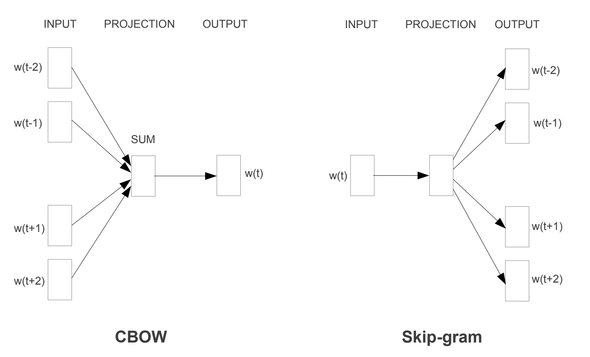
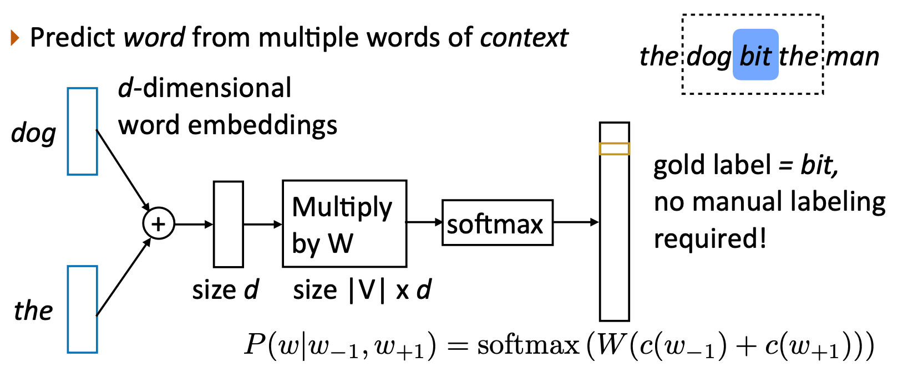
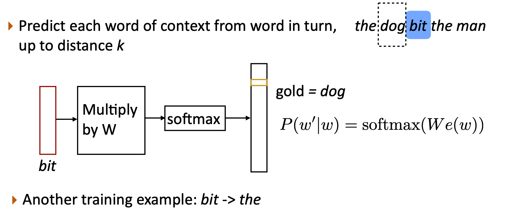
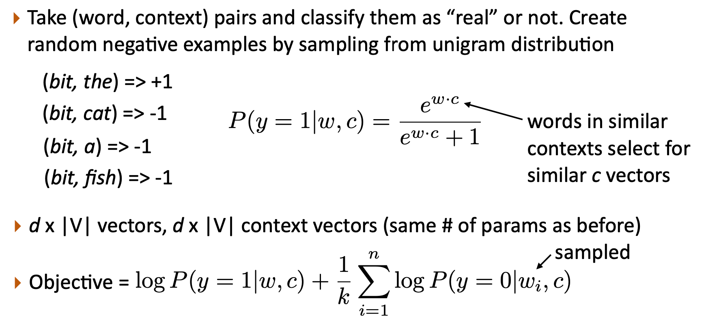
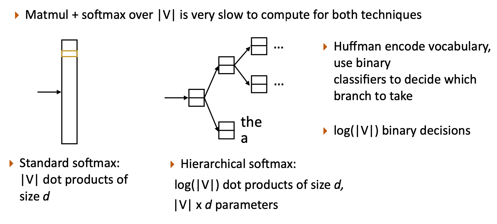
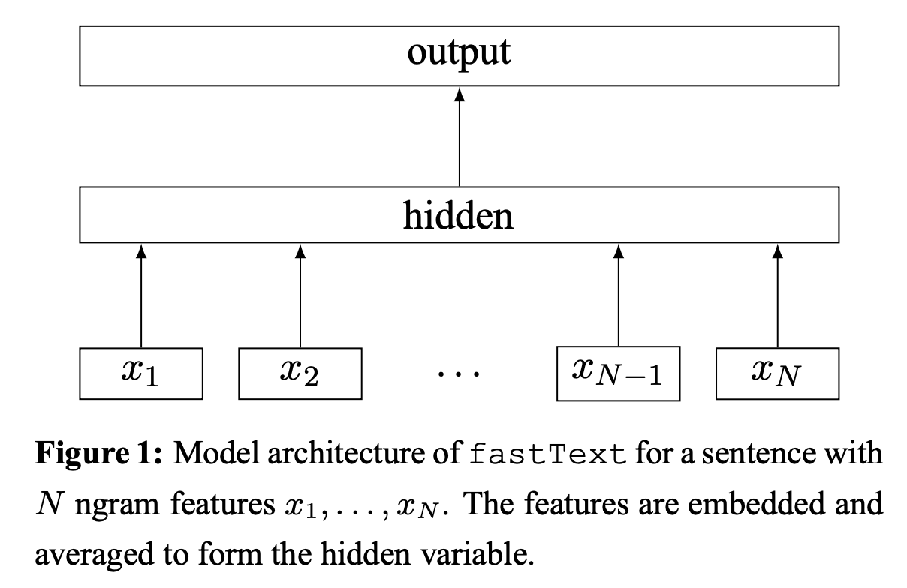
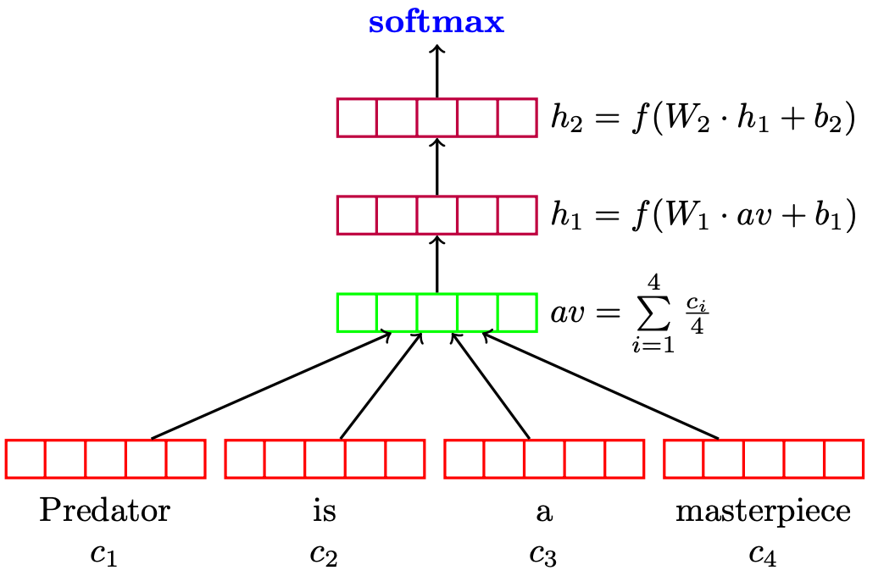

<div align="center">
  <h1>词嵌入</h1>
</div>

* [1. 词嵌入](#1-词嵌入)
* [2. Word2Vec](#2-word2vec)
* [3. 其他词嵌入方法](#3-其他词嵌入方法)
    * [3.1. GloVe](#31-glove)
    * [3.2. FastText](#32-fasttext)
    * [3.3. 动态词向量](#33-动态词向量)
* [4. 词嵌入中的偏见](#4-词嵌入中的偏见)
* [5. 词嵌入的应用](#5-词嵌入的应用)
    * [5.1. 深度平均网络](#51-深度平均网络)


# 1. 词嵌入

词嵌入(Word Embeddings)是一种将单词映射到连续向量空间中的技术，用于表示单词的语义信息。相比于传统的离散表示，如独热编码(one-hot)，词嵌入能够捕捉到单词之间的语义关联性，并且在向量空间中相似的单词更加接近。

词嵌入的基本思想是基于分布式假设(Distributional Hypothesis)理论。该假设认为，单词的含义可以通过其上下文中的词汇信息来表示。换句话说，具有相似上下文的单词往往具有相似的含义。基于这一假设，词嵌入的目标是将单词映射到一个高维向量空间，使得在该空间中相似的单词在几何上也更加接近。这样的表示方式使得单词的语义关系能够以向量空间中的距离和方向来刻画。

通过将单词表示为连续的向量，词嵌入克服了传统的离散表示(如One-Hot)所带来的维度灾难问题，同时也捕捉到了单词之间的语义相似性和关联性。这种分布式表示不仅可以用于下游自然语言处理任务，还可以进行向量运算，比如计算词语间的相似度、词语的聚类等。

词嵌入的目标是通过训练模型，将单词映射到一个低维的稠密向量空间，使得单词的语义相似性在向量空间中能够以距离或方向的形式表示。下面是几种常见的词嵌入方法：

1. 基于计数的方法(Count-based Methods)：这类方法通过分析语料库中单词的共现信息来构建单词的向量表示。其中，最经典的方法是词频-逆文档频率(TF-IDF)和潜在语义分析(Latent Semantic Analysis，LSA)。它们利用单词在文档中的频率和全局语料库的统计信息，计算单词之间的相似性，并将单词表示为稠密向量。

2. 基于神经网络的方法(Neural Network-based Methods)：这类方法使用神经网络来学习单词的向量表示。其中，Word2Vec是代表性的方法，包括两种模型：CBOW和Skip-gram。CBOW模型根据上下文单词预测目标单词，而Skip-gram模型则根据目标单词预测上下文单词。这些模型通过训练神经网络来学习单词的分布式表示。还有一些其他的神经网络模型，如GloVe和FastText。GloVe通过分析全局的单词共现信息，构建共现矩阵，并通过优化算法得到单词的向量表示。FastText引入了子词级别的信息，将单词表示为子词的集合，并通过平均或叠加子词的向量来得到单词的表示。

3. 基于语言模型的方法(Language Model-based Methods)：这类方法通过训练语言模型来学习单词的向量表示。ELMo，BERT和GPT就是这类方法的代表。ELMo和BERT通过训练一个双向语言模型，得到每个单词的上下文相关向量表示。GPT则通过训练一个自回归语言模型，预测下一个单词，同时学习得到单词的向量表示。其中ELMo使用LSTM建模语言模型，BERT和GPT使用Transformer建模语言模型。

# 2. Word2Vec

Word2Vec是一种用于学习单词向量表示的算法，它由Tomas Mikolov等人在2013年提出，并成为自然语言处理中的重要技术之一。Word2Vec算法通过分析大规模文本语料库，将每个单词映射到一个固定长度的向量表示，使得具有相似语义和上下文的单词在向量空间中距离较近。

Word2Vec算法有两种主要的模型架构：连续词袋模型(Continuous Bag-of-Words, CBOW)和连续跳词模型(Continuous Skip-gram)。这两种模型都是基于神经网络的无监督学习方法。

<div align="center">
  
</div>

1. 连续词袋模型(CBOW)：在CBOW模型中，算法的目标是根据上下文单词来预测当前单词。具体而言，CBOW模型将上下文单词作为输入，通过一个隐藏层的线性映射，得到当前单词的概率分布。通过调整模型参数，使得模型能够最大化预测当前单词的准确性。CBOW模型适用于在大规模文本中出现频率较高的单词。

$$
P(w|w_{-1},w_{+1}) = \text{softmax}(W(c(w_{-1}) + c(w_{+1})))
$$

<div align="center">
  
</div>

2. 连续跳词模型(Skip-gram)：与CBOW模型相反，Skip-gram模型的目标是根据当前单词来预测上下文单词。Skip-gram模型通过将当前单词作为输入，通过一个隐藏层的线性映射，得到上下文单词的概率分布。同样，通过调整模型参数，使得模型能够最大化预测上下文单词的准确性。Skip-gram模型适用于在大规模文本中出现频率较低的单词。

$$
P(w^{\prime}|w) = \text{softmax}(W e(w))
$$

<div align="center">
  
</div>

Word2Vec算法在训练过程中使用了反向传播算法和随机梯度下降等优化技术。通过迭代训练过程，模型可以逐渐学习到单词的分布式表示，其中每个单词被表示为一个固定长度的向量。学习得到的单词向量具有一些有趣的性质。例如，它们可以捕捉到语义关系，例如"king - man + woman = queen"的关系。此外，通过计算单词向量之间的余弦相似度，可以找到具有相似语义的单词。

Word2Vec算法的优点包括简单有效、可以处理大规模语料库、能够捕捉语义关系和上下文信息。它已经被广泛应用于自然语言处理任务中，如词义相似度计算、文本分类、命名实体识别等。

为了提高效率，对Skip-gram模型进行了一些优化，以提高训练速度和向量质量。以下是一些优化技术：

1. 负采样(Negative Sampling)：原始的Skip-gram模型使用了分层Softmax作为损失函数，计算所有单词的概率分布，这在大规模词汇上是计算密集型的。为了加快训练速度，引入了负采样作为一种替代方法。负采样通过随机选择一小部分负样本（非上下文单词）来更新模型参数，从而减少计算量。

<div align="center">
  
</div>

2. 层次Softmax(Hierarchical Softmax)：尽管负采样是一种有效的加速方法，但在某些应用中，仍然需要计算所有单词的概率分布。为了改善计算效率，层次Softmax被提出。层次Softmax使用一棵二叉树来表示单词的概率分布，其中每个内部节点对应于一个单词，每个叶子节点对应于一个单词和其概率。这样，计算单词概率分布的复杂度从线性降低为对数级别。

<div align="center">
  
</div>

3. 子采样(Subsampling)：在大规模文本语料库中，一些常见单词（如"the"、"and"等）出现的频率非常高，但它们通常没有很多有意义的语义信息。为了减少训练过程中这些常见单词的影响，可以采用子采样方法，按照一定的概率丢弃高频单词的一部分出现实例。这样可以减少噪音和训练时间，并且有助于学习更有意义的单词向量。

4. 增量训练(Incremental Training)：当需要在新的文本数据上更新或扩展已经训练好的Word2Vec模型时，可以使用增量训练的方法。增量训练只需在新数据上运行几个额外的训练迭代，而不是重新训练整个模型。这样可以节省时间和计算资源。

这些优化技术使得Skip-gram模型更加高效和可扩展，能够处理大规模的文本语料库，并学习到更准确的单词向量表示。

原始论文 [Efficient Estimation of Word Representations in Vector Space](https://arxiv.org/abs/1301.3781v3)

优化方法 [Distributed Representations of Words and Phrases and their Compositionality](https://arxiv.org/abs/1310.4546)


* CBOW 的 Python 实现

```python
import torch
import torch.nn as nn
import torch.optim as optim
from torch.utils.data import Dataset, DataLoader

# 数据预处理
corpus = [
    "I enjoy playing football, do you know",
    "I like watching movies, do you like",
    "I love eating pizza, are you?"
]

# 构建词汇表
word2idx = {}
idx2word = {}
idx = 0
for sentence in corpus:
    for word in sentence.lower().split():
        if word not in word2idx:
            word2idx[word] = idx
            idx2word[idx] = word
            idx += 1

vocab_size = len(word2idx)


# 定义CBOW模型
class CBOW(nn.Module):
    def __init__(self, vocab_size, embedding_dim):
        super(CBOW, self).__init__()
        self.embedding = nn.Embedding(vocab_size, embedding_dim)
        self.fc = nn.Linear(embedding_dim, vocab_size)

    def forward(self, x):
        embedded = self.embedding(x).sum(dim=1)
        output = self.fc(embedded)
        return output


# 定义数据集
class CBOWDataset(Dataset):
    def __init__(self, corpus, word2idx, window_size):
        self.data = []
        for sentence in corpus:
            tokens = sentence.lower().split()
            for i in range(window_size, len(tokens) - window_size):
                context = [word2idx[tokens[j]] for j in range(i - window_size, i + window_size + 1) if j != i]
                target = word2idx[tokens[i]]
                self.data.append((context, target))

    def __getitem__(self, index):
        context, target = self.data[index]
        return torch.tensor(context), torch.tensor(target)

    def __len__(self):
        return len(self.data)


# 训练参数设置
embedding_dim = 10
window_size = 2
batch_size = 1
lr = 0.001
epochs = 100

# 创建数据加载器
dataset = CBOWDataset(corpus, word2idx, window_size)
dataloader = DataLoader(dataset, batch_size=batch_size, shuffle=True)

# 创建模型和优化器
model = CBOW(vocab_size, embedding_dim)
criterion = nn.CrossEntropyLoss()
optimizer = optim.Adam(model.parameters(), lr=lr)

# 训练过程
for epoch in range(epochs):
    total_loss = 0.0
    for context, target in dataloader:
        optimizer.zero_grad()
        output = model(context)
        loss = criterion(output, target)
        loss.backward()
        optimizer.step()
        total_loss += loss.item()

    print(f"Epoch {epoch+1}/{epochs}, Loss: {total_loss/len(dataloader)}")

# 获取训练后的词向量
word_vectors = model.embedding.weight.data

# 打印词向量
for i in range(vocab_size):
    word = idx2word[i]
    vector = word_vectors[i]
    print(f"{word}: {vector}")
```

* Skip-gram 的 Python 实现

```python
import torch
import torch.nn as nn
import torch.optim as optim
from torch.utils.data import Dataset, DataLoader

# 数据预处理
corpus = [
    "I enjoy playing football, do you know",
    "I like watching movies, do you like",
    "I love eating pizza, are you?"
]

# 构建词汇表
word2idx = {}
idx2word = {}
idx = 0
for sentence in corpus:
    for word in sentence.lower().split():
        if word not in word2idx:
            word2idx[word] = idx
            idx2word[idx] = word
            idx += 1

vocab_size = len(word2idx)


# 定义Skip-gram模型
class SkipGram(nn.Module):
    def __init__(self, vocab_size, embedding_dim):
        super(SkipGram, self).__init__()
        self.embedding = nn.Embedding(vocab_size, embedding_dim)
        self.fc = nn.Linear(embedding_dim, vocab_size)

    def forward(self, x):
        embedded = self.embedding(x)
        output = self.fc(embedded)
        return output


# 定义数据集
class SkipGramDataset(Dataset):
    def __init__(self, corpus, word2idx, window_size):
        self.data = []
        for sentence in corpus:
            tokens = sentence.lower().split()
            for i in range(window_size, len(tokens) - window_size):
                center_word = word2idx[tokens[i]]
                context_words = [word2idx[tokens[j]] for j in range(i - window_size, i + window_size + 1) if j != i]
                for context_word in context_words:
                    self.data.append((center_word, context_word))

    def __getitem__(self, index):
        center_word, context_word = self.data[index]
        return torch.tensor(center_word), torch.tensor(context_word)

    def __len__(self):
        return len(self.data)


# 训练参数设置
embedding_dim = 10
window_size = 2
batch_size = 1
lr = 0.001
epochs = 100

# 创建数据加载器
dataset = SkipGramDataset(corpus, word2idx, window_size)
dataloader = DataLoader(dataset, batch_size=batch_size, shuffle=True)

# 创建模型和优化器
model = SkipGram(vocab_size, embedding_dim)
criterion = nn.CrossEntropyLoss()
optimizer = optim.Adam(model.parameters(), lr=lr)

# 训练过程
for epoch in range(epochs):
    total_loss = 0.0
    for center_word, context_word in dataloader:
        optimizer.zero_grad()
        output = model(center_word)
        loss = criterion(output, context_word)
        loss.backward()
        optimizer.step()
        total_loss += loss.item()

    print(f"Epoch {epoch+1}/{epochs}, Loss: {total_loss/len(dataloader)}")

# 获取训练后的词向量
word_vectors = model.embedding.weight.data

# 打印词向量
for i in range(vocab_size):
    word = idx2word[i]
    vector = word_vectors[i]
    print(f"{word}: {vector}")
```

# 3. 其他词嵌入方法

## 3.1. GloVe

GloVe (Global Vectors for Word Representation) 是一种词嵌入方法，由斯坦福大学的研究人员 Jeffrey Pennington、Richard Socher 和 Christopher Manning 在2014年提出。它是自然语言处理领域中一个重要的里程碑，旨在通过统计方法学习高质量的词向量表示，这些表示能够捕获词汇之间的语义和语法关系。

GloVe模型结合了两种词嵌入学习方法的优点：全局矩阵分解（如LSA）和局部上下文窗口方法（如Word2Vec）。具体来说，它基于以下观察：一个词的共现频率与其上下文中其他词的共现频率之间存在一定的数学关系，这种关系反映了词之间的意义联系。

$$
\text{Objective} = \sum_{i,j} f(\text{count}(w_i, c_j)) (w_i^T c_j + a_i + b_j - \log \text{count}(w_i, c_j))^2
$$

* GloVe 原始实现及相关权重

[Software in C and data files for the popular GloVe model for distributed word representations](https://github.com/stanfordnlp/GloVe)

* GloVe 的 Python 实现

```python
import torch
import torch.nn as nn
import torch.optim as optim
import numpy as np
from sklearn.metrics.pairwise import cosine_similarity

# 假设数据集
# 词汇表
vocab = ['the', 'cat', 'dog', 'in', 'hat']
vocab_size = len(vocab)

# 构建一个非常简单的共现矩阵（通常这个矩阵是从大量文本中统计得到）
# 这里使用随机值填充，实际应用中应基于真实文本统计
X = np.random.randint(1, 10, (vocab_size, vocab_size))

# 将numpy数组转换为PyTorch张量
X_tensor = torch.tensor(X, dtype=torch.float)

# 定义GloVe模型
class GloVe(nn.Module):
    def __init__(self, vocab_size, embedding_dim):
        super(GloVe, self).__init__()
        self.W = nn.Embedding(vocab_size, embedding_dim)
        self.U = nn.Embedding(vocab_size, embedding_dim)

    def forward(self, i, j):
        w_i = self.W(i)
        u_j = self.U(j)
        dot_product = torch.sum(w_i * u_j, dim=1)
        return dot_product

# 初始化模型和优化器
embedding_dim = 5  # 选择一个较小的维度以便快速演示
glove_model = GloVe(vocab_size, embedding_dim)
optimizer = optim.Adam(glove_model.parameters(), lr=0.05)

# 训练函数
def train_glove():
    for epoch in range(10):  # 进行少量迭代以示例
        for i in range(vocab_size):
            for j in range(vocab_size):
                optimizer.zero_grad()
                
                # 转换索引为张量
                i_idx = torch.tensor([i], dtype=torch.long)
                j_idx = torch.tensor([j], dtype=torch.long)
                
                # 计算目标值（这里简化处理，实际GloVe使用的是更复杂的权重函数）
                target = torch.log(X_tensor[i][j])
                
                # 计算模型输出
                pred = glove_model(i_idx, j_idx)
                
                # 计算损失（这里仅作为示例，实际GloVe损失函数更复杂）
                loss = (pred - target) ** 2
                
                # 反向传播与优化
                loss.backward()
                optimizer.step()

# 训练模型
train_glove()

# 查看学习到的词嵌入并计算词之间的余弦相似度
word_to_idx = {word: idx for idx, word in enumerate(vocab)}
word1 = 'the'
word2 = 'cat'

word1_idx = word_to_idx[word1]
word2_idx = word_to_idx[word2]

w1 = glove_model.W(torch.tensor([word1_idx]))
w2 = glove_model.W(torch.tensor([word2_idx]))

similarity = cosine_similarity(w1.detach().numpy(), w2.detach().numpy())
print(f"Cosine similarity between '{word1}' and '{word2}': {similarity[0][0]}")
```

## 3.2. FastText

FastText是Facebook AI研究团队开发的一种词向量和文本分类算法，由Tomas Mikolov等人提出。它在2016年开源，迅速成为自然语言处理领域的一个重要工具，尤其是在处理稀有词和多语言任务方面表现出色。FastText最显著的特点是引入了“子词（Subword）”嵌入的概念，这一方法克服了传统词嵌入技术（如Word2Vec、GloVe）在处理未登录词（Out-of-Vocabulary, OOV）时的局限性。

在FastText中，每个词不仅由其整体表示，还由构成它的字符n-grams（通常是3-gram或4-gram）的嵌入加权求和得到。这意味着即便对于模型未曾见过的新词，只要这些新词的字符子序列在训练数据的其他词中出现过，FastText就能够为其生成有意义的表示。这种方法尤其适用于形态丰富的语言，如德语、芬兰语等，因为这些语言中通过词缀变化可以生成大量派生词。

FastText模型包括两个主要部分：

1. 词袋模型（Bag of n-grams）: 首先，将每个词分解成长度为n的字符序列（n-grams），然后对每个n-gram学习一个独立的向量表示。如果一个词很长，会有很多重叠的n-grams，但较短的词可能只包含几个独特的n-grams。

2. 词向量组合: 每个词的最终向量是其所有n-grams向量的加权求和，其中权重可以简单地基于n-gram是否出现在词的开头或结尾来设定，或者通过学习得到。这种组合方式允许模型利用局部上下文信息来推断词的意义。

<div align="center">
  
</div>

* FastText 的 Python 实现

```python
import torch
import torch.nn as nn
import torch.optim as optim
from torch.utils.data import Dataset, DataLoader
from torch.nn.functional import softmax

# 数据预处理
corpus = [
    "I enjoy playing football, do you know",
    "I like watching movies, do you like",
    "I love eating pizza, are you?"
]

# 构建词汇表
word2idx = {}
idx2word = {}
idx = 0
for sentence in corpus:
    for word in sentence.lower().split():
        if word not in word2idx:
            word2idx[word] = idx
            idx2word[idx] = word
            idx += 1

vocab_size = len(word2idx)

# 定义FastText模型
class FastText(nn.Module):
    def __init__(self, vocab_size, embedding_dim, num_classes):
        super(FastText, self).__init__()
        self.embedding = nn.Embedding(vocab_size, embedding_dim)
        self.fc = nn.Linear(embedding_dim, num_classes)

    def forward(self, x):
        embedded = self.embedding(x)
        pooled = torch.mean(embedded, dim=1)  # 池化操作改为按行平均
        output = self.fc(pooled)
        return output

# 定义数据集
class FastTextDataset(Dataset):
    def __init__(self, corpus, word2idx):
        self.data = []
        for sentence in corpus:
            tokens = sentence.lower().split()
            label = word2idx[tokens[0]]
            text = [word2idx[word] for word in tokens[1:]]
            self.data.append((text, label))

    def __getitem__(self, index):
        text, label = self.data[index]
        return torch.tensor(text), torch.tensor(label)

    def __len__(self):
        return len(self.data)

# 训练参数设置
embedding_dim = 10
batch_size = 1
lr = 0.001
epochs = 100

# 创建数据加载器
dataset = FastTextDataset(corpus, word2idx)
dataloader = DataLoader(dataset, batch_size=batch_size, shuffle=True)

# 创建模型和优化器
model = FastText(vocab_size, embedding_dim, len(idx2word))
criterion = nn.CrossEntropyLoss()
optimizer = optim.Adam(model.parameters(), lr=lr)

# 训练过程
for epoch in range(epochs):
    total_loss = 0.0
    for text, label in dataloader:
        optimizer.zero_grad()
        output = model(text)
        loss = criterion(output, label)
        loss.backward()
        optimizer.step()
        total_loss += loss.item()

    print(f"Epoch {epoch+1}/{epochs}, Loss: {total_loss/len(dataloader)}")

# 获取训练后的词向量
word_vectors = model.embedding.weight.data

# 打印词向量
for i in range(vocab_size):
    word = idx2word[i]
    vector = word_vectors[i]
    print(f"{word}: {vector}")
```

## 3.3. 动态词向量

Word2Vec，GloVe，FastText 都称为静态词向量。静态词向量是指每个词被映射到一个固定长度的向量空间中，且这个向量在整个语料库中是不变的。这意味着，无论一个词出现在何种上下文中，它都对应着同一个向量表示。这种方法假设词的含义是固定的，忽略了词在不同上下文中的多义性。

动态词向量，也称为上下文敏感的词向量，意味着同一个词在不同上下文中会有不同的向量表示。这种方法能够捕捉到词的多义性，因为它允许词向量反映具体的语境信息。

ELMo: 通过深层双向LSTM网络，为每个词产生基于上下文的向量表示，汇总了整个句子中不同层的LSTM输出。

BERT: 使用Transformer架构，通过掩码语言模型和下一句预测任务进行预训练，能够生成基于上下文的词向量，每个词的表示会根据它在句子中的具体位置和周围环境动态变化。

GPT: 虽然GPT最初被设计为生成任务的模型，但其后续版本如GPT-2和GPT-3同样能生成上下文相关的词表示，尤其是GPT-3通过大规模的无监督学习，能够生成高质量的文本并适应不同场景，尽管它更侧重于生成而非编码任务。

静态词向量模型（如Word2Vec、GloVe、FastText）提供了一种快速且相对简单的词表示方法，但它们无法处理一词多义问题。而动态词向量模型（如ELMo、BERT、GPT系列）则通过考虑词的上下文信息，提供了更为丰富和灵活的词表示，尤其擅长于捕捉语言的细微差别和复杂语境，但计算成本较高。这些模型的发展体现了NLP领域从静态向动态、从单一向上下文敏感表示的演进趋势。

* 相关阅读

[A Scalable Hierarchical Distributed Language Model](https://papers.nips.cc/paper/2008/hash/1e056d2b0ebd5c878c550da6ac5d3724-Abstract.html)

[Neural Word Embedding as Implicit Matrix Factorization](https://papers.nips.cc/paper_files/paper/2014/hash/feab05aa91085b7a8012516bc3533958-Abstract.html)

[GloVe: Global Vectors for Word Representation](https://aclanthology.org/D14-1162/)

[Enriching Word Vectors with Subword Information](https://arxiv.org/abs/1607.04606)

[Bag of Tricks for Efficient Text Classification](https://arxiv.org/abs/1607.01759)

# 4. 词嵌入中的偏见

词嵌入中的偏见源自用于训练它们的大规模文本数据集，这些数据集通常是从互联网或其他来源中收集而来。这些数据集可能包含了社会、文化和性别等方面的偏见。由于这些偏见在原始数据中存在，词嵌入模型在学习单词之间的语义关系时可能会捕捉到这些偏见。

具体来说，偏见可能表现为以下几个方面：

1. 性别偏见：词嵌入模型可能在词汇之间捕捉到性别偏见。例如，一些职业词汇可能更倾向于与男性相关联，而某些家庭或照顾相关的词汇可能更倾向于与女性相关联。
2. 种族偏见：词嵌入模型可能在词汇之间捕捉到种族偏见。例如，某些词汇可能更倾向于与特定种族相关联，这可能导致对特定种族的刻板印象或歧视。
3. 文化偏见：词嵌入模型可能在词汇之间捕捉到文化偏见。例如，某些词汇可能更倾向于与特定文化相关联，这可能导致对其他文化的刻板印象或偏见。

这些偏见可能在自然语言处理任务中产生负面影响，例如文本分类、情感分析和机器翻译等任务。如果模型在训练过程中接触到偏见数据，并将其视为语义关系的一部分，那么它可能在应用中产生不公平的结果或误导性的推断。

解决词嵌入中的偏见是一个重要的研究领域。一些方法包括使用更平衡和多样化的训练数据集、使用降低偏见的训练算法、进行后处理和调整来减少偏见的影响。此外，审查和评估词嵌入模型中的偏见也是必要的，以确保它们在实际应用中不会产生不公平或歧视性的结果。

* 相关阅读

[Man is to Computer Programmer as Woman is to Homemaker? Debiasing Word Embeddings](https://arxiv.org/abs/1607.06520)

[Black is to Criminal as Caucasian is to Police: Detecting and Removing Multiclass Bias in Word Embeddings](https://arxiv.org/abs/1904.04047)

[Lipstick on a Pig: Debiasing Methods Cover up Systematic Gender Biases in Word Embeddings But do not Remove Them](https://arxiv.org/abs/1903.03862)


# 5. 词嵌入的应用 

## 5.1. 深度平均网络

* 原始论文

[Deep Unordered Composition Rivals Syntactic Methods for Text Classification](https://aclanthology.org/P15-1162/)


深度平均网络(Deep Averaging Networks，DAN)是一种用于自然语言处理的模型，它使用输入的词嵌入的平均值作为其输入，并通过一个前馈神经网络进行处理。

DAN的主要思想是将输入文本中的每个单词转换为其对应的词向量(word embeddings)，然后对这些词向量取平均值作为整个文本的表示。这种平均化的操作可以捕捉到整个文本的语义信息，并且不会受到输入文本长度的影响。在这种表示下，DAN可以对文本进行分类、情感分析等任务。

下面是DAN网络的基本结构：

<div align="center">
  
</div>

1. 输入层：将输入文本表示为一个由词向量组成的矩阵。每个词向量表示一个单词的语义信息。
2. 平均池化层：对输入的词向量矩阵进行平均操作，将每个词向量相加并除以词向量的个数，得到整个文本的表示。
3. 隐藏层：接收平均池化层的输出，可以包含一个或多个隐藏层。每个隐藏层通常由具有非线性激活函数的全连接层组成。
4. 输出层：最后一个隐藏层的输出通过一个全连接层，并使用适当的激活函数（例如softmax）进行分类、情感分析等任务。

DAN的训练过程通常使用监督学习方法，通过最小化损失函数来调整模型的参数。训练数据通常由带有标签的文本样本组成，例如情感分类任务中的正面和负面评论。DAN模型的优点之一是它能够在没有显式词序信息的情况下处理文本，因为它仅使用了词向量的平均值。然而，它也存在一些限制，例如无法捕捉到词序信息和上下文相关性。总而言之，DAN是一种简单而有效的模型，适用于许多自然语言处理任务，特别是当词序信息不是关键因素时。

* DAN 的 Python 实现

```python
import torch
import itertools
from datasets import load_dataset
from torch.utils.data import Dataset, DataLoader
from torchtext.vocab import pretrained_aliases
import nltk
from sklearn.metrics import accuracy_score
import torch.optim as optim
from torch.nn import functional as F
import torch.nn as nn
from tqdm import tqdm

# 加载SST-2数据集
dataset = load_dataset("glue", "sst2")

# 分割数据集
train_dataset = dataset["train"]
val_dataset = dataset["validation"]

# 加载GloVe预训练词嵌入
glove = pretrained_aliases['glove.6B.300d'](cache='./.vector_cache')

# 数据预处理函数
def preprocess_function(examples):
    sentences = examples['sentence']
    labels = examples['label']
    tokenized_sentences = [nltk.word_tokenize(s.lower()) for s in sentences]  # 分词并转小写
    return {"sentences": tokenized_sentences, "labels": labels}

# 应用预处理
train_dataset = train_dataset.map(preprocess_function, batched=True)
val_dataset = val_dataset.map(preprocess_function, batched=True)

# 定义PyTorch数据集类
class SST2PyTorchDataset(Dataset):
    def __init__(self, data, word_embeddings, seq_length=50):
        self.data = data
        self.word_embeddings = word_embeddings
        self.seq_length = seq_length
    
    def __len__(self):
        return len(self.data["sentences"])
    
    def __getitem__(self, idx):
        sentence = self.data["sentences"][idx][:self.seq_length]
        label = self.data["labels"][idx]
        vecs = [self.word_embeddings[word] for word in sentence if word in self.word_embeddings.stoi]
        avg_vec = torch.mean(torch.stack(vecs), dim=0) if vecs else torch.zeros(self.word_embeddings.dim)
        return avg_vec, label

# 创建数据集实例
train_pt_dataset = SST2PyTorchDataset(train_dataset, glove)
val_pt_dataset = SST2PyTorchDataset(val_dataset, glove)

# 数据加载器
train_dataloader = DataLoader(train_pt_dataset, batch_size=32, shuffle=True)
val_dataloader = DataLoader(val_pt_dataset, batch_size=32)

# 定义Deep Averaging Network模型
class DAN(nn.Module):
    def __init__(self, input_dim, hidden_dim, output_dim):
        super(DAN, self).__init__()
        self.fc1 = nn.Linear(input_dim, hidden_dim)
        self.fc2 = nn.Linear(hidden_dim, output_dim)
        self.dropout = nn.Dropout(p=0.5)
        
    def forward(self, x):
        x = self.fc1(x)
        x = F.relu(x)
        x = self.dropout(x)
        x = self.fc2(x)
        return F.log_softmax(x, dim=1)

# 实例化模型和相关组件
model = DAN(input_dim=glove.dim, hidden_dim=100, output_dim=2)
loss_fn = nn.NLLLoss()
optimizer = optim.Adam(model.parameters(), lr=1e-3)

# 训练函数
def train_epoch(model, dataloader, loss_fn, optimizer):
    model.train()
    total_loss = 0
    for inputs, targets in tqdm(dataloader):
        optimizer.zero_grad()
        outputs = model(inputs)
        loss = loss_fn(outputs, targets)
        loss.backward()
        optimizer.step()
        total_loss += loss.item()
    return total_loss / len(dataloader)

# 验证函数
def evaluate(model, dataloader):
    model.eval()
    corrects = 0
    total = 0
    with torch.no_grad():
        for inputs, targets in dataloader:
            outputs = model(inputs)
            _, preds = torch.max(outputs, 1)
            corrects += torch.sum(preds == targets).item()
            total += len(targets)
    return corrects / total

# 训练和验证循环
num_epochs = 1
for epoch in range(num_epochs):
    train_dataloader = list(itertools.islice(train_dataloader, 3))  # 资源足够可以注释掉这行代码
    train_loss = train_epoch(model, train_dataloader, loss_fn, optimizer)
    val_acc = evaluate(model, val_dataloader)
    print(f"Epoch {epoch+1}: Train Loss={train_loss:.4f}, Val Acc={val_acc*100:.2f}%")

print("Training complete.")
```