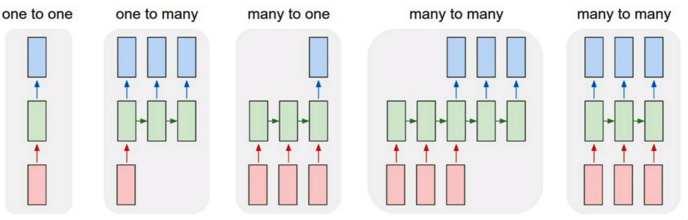
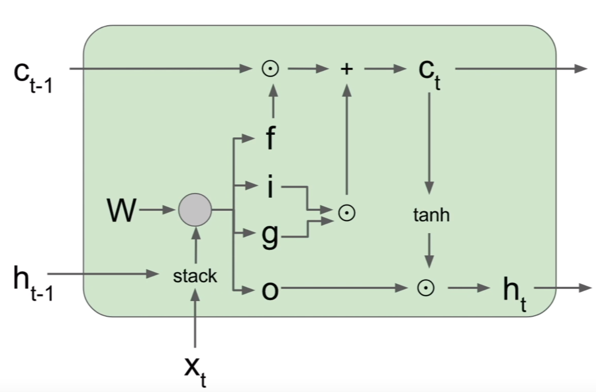

<div align="center">
  <h1>语言建模</h1>
</div>

* [1. 统计语言模型](#1-统计语言模型)
* [2. N-gram语言建模](#2-n-gram-语言建模)
    * [2.1. N-gram语言模型中的平滑处理](#21-n-gram-语言模型中的平滑处理)
* [3. 语言模型评估](#3-语言模型评估)
* [4. 神经语言模型](#4-神经语言模型)
* [5. 循环神经网络](#5-循环神经网络)
    * [5.1. Vanilla RNN](#51-vanilla-rnn)
    * [5.2. LSTM](#52-lstm)

# 1. 统计语言模型

统计语言模型旨在量化自然语言文本中序列的概率分布，即计算一个词序列（如一个句子或文档）出现的可能性。这类模型基于统计方法，利用大量文本数据学习语言的统计规律，进而预测未知文本的概率，或者为给定的文本序列生成最可能的后续词汇。

统计语言模型的核心思想是将语言视为一个随机过程，每一个词的选择都受到其上下文的影响。模型通常定义为一个概率函数，比如假设一个句子由$T$个单词顺序组成： 

$$
W = w^{T} := (w_{1}, w_{2}, \cdots, w_{T})
$$

那么该句子的联合概率如下：

$$
p(w^{T}) = p(w_{1}) \cdot p(w_{2}|w_{1}) \cdot p(w_{3}|w_{1}^{2}) \cdots p(w_{T}|x_{1}^{T-1})
$$

其中，模型参数为：

$$
p(w_{1}), p(w_{2}|w_{1}) , p(w_{3}|w_{1}^{2}), \cdots, p(w_{T}|w_{1}^{T-1})
$$

根据贝叶斯公式可得：

$$
p(w_{k}|w_{1}^{k-1}) = \frac{p(w_{1}^{k})}{p(w_{1}^{k-1})}
$$

根据大数定理可得：

$$
p(w_{k}|w_{1}^{k-1}) \approx \frac{count(w_{1}^{k})}{count(w_{1}^{k-1})}
$$

其中count表示统计词串在语料中的出现次数，当k比较大时，上述计算比较耗时。

# 2. N-gram 语言建模

N-gram模型是一种统计语言模型，用于预测给定文本中下一个词（或字符）的概率。该模型基于一个简化的假设：一个词（或字符）的出现概率只依赖于它前面的N-1个词（或字符），也就是n-1阶的马尔科夫假设。这里的N代表了模型考虑的上下文窗口大小，因此模型被称为N-gram。

$$
\begin{aligned}
p(w_{k}|w_{1}^{k-1}) 
&\approx p(w_{k}|w_{k-n+1}^{k-1}) \\
&\approx \frac{\text{count}(w_{k-n+1}^{k})}{\text{count}(w_{k-n+1}^{k-1})}
\end{aligned}
$$

N-gram模型中的概率通常通过从大型文本语料库中计算词序列的频次来估计。具体来说，使用最大似然估计（Maximum Likelihood Estimation, MLE）计算每个N-gram的概率，这些概率可以通过简单地统计每个N-gram在语料库中出现的频次来估计。


该模型基于这样一种假设，第N个词的出现只与前面N-1个词相关，而与其它任何词都不相关，整句的概率就是各个词出现概率的乘积。这些概率可以通过直接从语料中统计N个词同时出现的次数得到，然后可以使用这些概率来计算给定上下文情况下下一个词或字符的概率。常用的是二元(Bi-gram)建模和三元(Tri-gram)建模。

例如，在一个句子"ChatGPT is a powerful language model"中，如果我们使用2-gram，那么句子可以被分成以下2-gram序列：["ChatGPT is", "is a", "a powerful", "powerful language", "language model"]。假设我们有一个足够大的文本语料库，其中包含很多句子。我们可以使用2-gram语言模型来计算给定一个词的前提下，下一个词出现的概率。如果我们想要预测句子中的下一个词，我们可以使用前面的一个词作为上下文，并计算每个可能的下一个词的概率。例如，在句子"ChatGPT is a"中，我们可以计算出给定上下文"ChatGPT is"下一个词"powerful"的概率。通过统计语料库中"ChatGPT is"后面是"powerful"的次数，并将其除以"ChatGPT is"出现的次数，我们可以得到这个概率。


## 2.1. N-gram 语言模型中的平滑处理

在统计语言模型中，平滑操作是至关重要的一个步骤，主要目的是解决以下几个关键问题：

1. 零概率问题（Zero Frequency Problem）：在基于计数的统计语言模型中，如果某个词或词序列在训练数据中没有出现过，那么其概率会被直接估计为零，这显然不符合实际情况，因为未观测到并不意味着不可能发生。平滑通过分配一些概率质量给这些零频率事件，确保所有可能的事件都有非零的概率。
2. 数据稀疏性：自然语言具有极大的词汇量和结构多样性，即使是大型语料库也难以覆盖所有可能的词序列组合，导致许多长尾或罕见事件的计数非常少。平滑帮助模型更好地泛化到未见过的数据，减少因数据不足引起的过拟合。
3. 模型稳定性：极端的计数（如极高或极低频词）可能会导致模型对训练数据中的噪声过度敏感。平滑通过减少这种极端情况的影响，提高模型的稳定性和鲁棒性。
4. 促进泛化能力：通过减少对高频项的过分信任，同时给予低频项一定的机会，平滑有助于模型学习到更普遍的语言规律，提高在新数据上的表现。

常见的平滑技术包括但不限于：

1. 加一平滑（Additive Smoothing, 拉普拉斯平滑）：对所有计数加1，包括未出现的事件。
2. 古德-图灵估计（Good-Turing Smoothing）：基于实际观察到的频率分布来估计未见事件的概率。
3. 绝对减值平滑（Absolute Discounting）：从高频率计数中减去一个固定值，再进行重新分配。
4. Kneser-Ney Smoothing：特别处理尾随事件，改进对未登录词的处理。
5. 插值平滑（Interpolation）：结合不同N-gram模型的结果，如Jelinek-Mercer平滑。

平滑不仅是统计语言模型构建中的一个必要步骤，也是提升模型实用性和准确性的重要手段。

以2-gram为例，最大似然估计如下：

$$
p(w_i|w_{i-1}) = \frac{c(w_{i-1} w_i)}{c(w_{i-1})}
$$

以上其实就是简单的计数，然后我们就要在这里去做平滑，其实就是减少分母为0的出现。拉普拉斯平滑如下：

$$
p_{\text{add}}(w_i|w_{i-1}) = \frac{c(w_{i-1} w_i) + \delta}{c(w_{i-1}) + \delta |V|}
$$

一般地，$\delta$取1，$|V|$表示词典库的大小。


* 2-gram 模型的 Python 实现

基于二元模型的简单示例，包括数据预处理、构建模型、平滑处理以及基于模型进行预测。

```python
import collections


class BigramLanguageModel:
    def __init__(self, sentences: list):
        """
        初始化Bigram模型
        :param sentences: 训练语料，类型为字符串列表
        """
        self.sentences = sentences
        self.word_counts = collections.Counter()
        self.bigram_counts = collections.defaultdict(int)
        self.unique_words = set()
        
        # 预处理数据：分词并合并所有句子
        words = ' '.join(sentences).split()
        for w1, w2 in zip(words[:-1], words[1:]):
            self.word_counts[w1] += 1
            self.word_counts[w2] += 1
            self.bigram_counts[(w1, w2)] += 1
            self.unique_words.update([w1, w2])
    
    def laplace_smooth(self, delta: float = 1.0):
        """
        拉普拉斯平滑
        :param delta: 平滑因子，默认为1.0
        """
        V = len(self.unique_words)  # 词汇表大小
        self.model = {}
        for w1 in self.unique_words:
            total_count_w1 = self.word_counts[w1] + delta*V
            self.model[w1] = {}
            for w2 in self.unique_words:
                count_w1w2 = self.bigram_counts.get((w1, w2), 0) + delta
                self.model[w1][w2] = count_w1w2 / total_count_w1
                
    def generate_text(self, start_word: str, length: int = 10) -> str:
        """
        生成文本
        :param start_word: 文本起始词
        :param length: 生成文本的长度
        :return: 生成的文本字符串
        """
        if start_word not in self.model:
            raise ValueError(f"Start word '{start_word}' not found in the model.")
        sentence = [start_word]
        current_word = start_word
        
        for _ in range(length):
            next_word_probs = self.model[current_word]
            next_word = max(next_word_probs, key=next_word_probs.get)
            sentence.append(next_word)
            current_word = next_word
            
        return ' '.join(sentence)

# 示例使用
corpus = [
    "ChatGPT is a powerful language model for multi task",
    "ChatGPT is a powerful language model",
    "ChatGPT can generate human-like text",
    "ChatGPT is trained using deep learning",
]

model = BigramLanguageModel(corpus)
model.laplace_smooth()
generated_text = model.generate_text('ChatGPT', 5)
print(generated_text)  # ChatGPT is a powerful language model
```

# 3. 语言模型评估

准确率作为语言模型的评估指标没有太多意义，语言是开放的序列预测问题，给定前面的文本，下一个词的可能性是非常多的，因此准确率值会非常低。

作为替代，应该在模型保留数据(held-out data)上，计算其对应的似然性(取平均值以消除长度影响)来评估语言模型。对数似然(log likelihood，LL)计算如下：

$$
\text{LL}(W) = \frac{1}{n} \sum_{i=1}^n \log P(w_i|w_1, \cdots, w_{i-1})
$$

> 保留数据：指在训练语言模型时，专门保留一部分数据不参与训练，用作评估模型性能的数据集。这确保了评估数据独立于训练数据，能够真实反映模型在新数据上的泛化能力。

困惑度(Perplexity，PPL)是评价语言模型质量的一个重要指标，能够更好地体现语言模型对句子流畅性、语义连贯性的建模能力。困惑度是指数形式的平均负对数似然，计算如下：

$$
\text{PPL}(W) = \exp (\text{NLL}(W) ) = \exp (- \text{LL}(W) )
$$

> 对数似然：给定语料库数据，对数似然衡量模型为这些数据赋予的概率的对数值。对数似然越高，模型对数据的建模能力越强。
> 
> 负对数似然：由于对数似然值通常是个负值，取负号得到正值更利于分析比较。
> 
> 平均负对数似然：将负对数似然值加总后除以数据长度(如词数)，得到平均负对数似然。这样可以消除数据长度的影响，更公平地比较不同模型。
> 
> 指数形式：将平均负对数似然值做指数运算，得到Perplexity值。由于似然本身很小，对数似然为负值，做指数能使结果值落在较合理的范围。

困惑度本质上反映了模型对数据的平均怀疑程度。值越低，说明模型对数据的建模质量越高、不确定性越小。通常优秀模型的困惑度值在10-100之间，值越接近1越好。


# 4. 神经语言模型

神经语言模型(Neural Language Model, NLM)是一种利用神经网络来建模和生成自然语言序列的模型。相比传统的统计语言模型(如n-gram模型)，神经语言模型具有以下几个主要特点:

1. 神经网络的强大建模能力：神经网络能够自动从大量数据中学习复杂的特征模式，克服了传统模型需要人工设计特征的缺陷，无需人工特征工程。
2. 分布式词向量表示：将每个词映射为一个连续的向量表示，能够自然地捕捉词与词之间的语义和句法关联。
3. 长距离依赖建模：传统n-gram模型只考虑有限历史窗口，神经网络可以更好地学习长程语境依赖关系。
4. 泛化能力更强：神经网络内部分布式表示有助于更好的泛化，可以很好地应对未见数据。

常见神经语言模型有基于RNN、LSTM、Transformer等不同网络架构，并广泛应用于语言建模、机器翻译、对话系统等自然语言处理任务中。神经语言模型弥补了传统模型的不足，极大地推进了语言模型的发展，但也面临训练资源需求大、解释性较差等新的挑战。


# 5. 循环神经网络

前馈神经网络(Feedforward NNs)无法处理可变长度的输入，特征向量中的每个位置都有固定的语义。使用传统前馈神经网络作为语言模型时的主要缺陷和局限性如下：

1. 前馈神经网络要求输入是固定长度的向量，输入向量中每个位置的元素都对应特定的语义含义。但在自然语言处理任务中，输入序列(如句子或文本)的长度是可变的，不同的输入会有不同的序列长度。
2. 前馈神经网络位置语义固定，对于不同长度的输入序列，每个位置的语义无法自动对应和调整。为了将变长序列映射到固定向量，不可避免需要截断或填充，这会导致信息损失或人为噪声的引入。

为了解决这个问题，出现了诸如循环神经网络(RNN)、长短期记忆网络(LSTM)等能够更好地处理序列输入的神经网络架构。

## 5.1. Vanilla RNN

循环神经网络是一种可以接受变长输入和产生变长输出的网络架构类型，这与标准的前馈神经网络形成对比。我们也可以考虑变长的输入，比如视频帧序列，并希望在该视频的每一帧上都做出决策。

<div align="center">
  
</div>

1. 一对一：经典的前馈神经网络架构，其中有一个输入并期望一个输出。
2. 一对多：可以将其视为图像描述生成。有一个固定大小的图像作为输入，输出可以是长度可变的单词或句子。
3. 多对一：用于情感分类。输入预期为一系列单词或甚至是段落。输出可以是具有连续值的回归输出，表示具有积极情感的可能性。
4. 多对多：该模型非常适合机器翻译。输入可以是变长的英语句子，输出将是相同句子的另一种语言版本，其长度也可变。最后一个多对多模型可以用于基于词级别的机器翻译。将英语句子的每一个词输入神经网络，并期望立即得到输出。然而，由于词通常彼此相关，因此需要将网络的隐藏状态从上一个词传递到下一个词。因此，我们需要循环神经网络来处理这种任务。

对于循环神经网络，我们可以在每个时间步应用递推公式来处理向量序列：

$$
h_t = f_W(h_{t-1}, x_t) 
$$

对于简单的 Vanilla 循环神经网络来说，计算公式如下：

$$
\begin{aligned}
h_t &= \tanh (W_{hh} h_{t-1} + W_{xh} x_t + b_h) \\
y_t &= W_{hy} h_t + b_y
\end{aligned}
$$

* Vanilla RNN 的 Python 实现

```python
import numpy as np


np.random.seed(0)


class RecurrentNetwork(object):
    """When we say W_hh, it means a weight matrix that accepts a hidden state and produce a new hidden state.
    Similarly, W_xh represents a weight matrix that accepts an input vector and produce a new hidden state. This
    notation can get messy as we get more variables later on with LSTM and I simplify the notation a little bit in
    LSTM notes.
    """
    def __init__(self):
        self.hidden_state = np.zeros((3, 3))
        self.W_hh = np.random.randn(3, 3)
        self.W_xh = np.random.randn(3, 3)
        self.W_hy = np.random.randn(3, 3)
        self.Bh = np.random.randn(3,)
        self.By = np.random.rand(3,)

    def forward_prop(self, x):
        # The order of which you do dot product is entirely up to you. The gradient updates will take care itself
        # as long as the matrix dimension matches up.
        self.hidden_state = np.tanh(np.dot(self.hidden_state, self.W_hh) + np.dot(x, self.W_xh) + self.Bh)
        return self.W_hy.dot(self.hidden_state) + self.By
    
    
input_vector = np.ones((3, 3))
rnn = RecurrentNetwork()

# Notice that same input, but leads to different ouptut at every single time step.
print(rnn.forward_prop(input_vector))
print(rnn.forward_prop(input_vector))
print(rnn.forward_prop(input_vector))
```

## 5.2. LSTM

虽然 Vanilla RNN 在处理序列数据方面具有一定的能力，但它在长期依赖性建模方面存在一些挑战。长短期记忆网络(Long Short Term Memory, LSTM )是一种特殊类型的 RNN，通过引入细胞状态(cell state)和门控机制来解决长期依赖性问题。以下是 LSTM 相对于 Vanilla RNN 的一些优点和特点：

1. 处理长期依赖性问题：Vanilla RNN 在处理长序列时容易发生梯度消失或梯度爆炸的问题，导致无法有效地捕捉长期依赖关系。LSTM 通过细胞状态和门控机制，能够更好地捕捉和传递长期依赖性信息，使得网络能够更好地学习并记住与序列任务相关的远距离依赖关系。
2. 门控机制：LSTM 引入了三个门控单元：输入门(input gate)、遗忘门(forget gate)和输出门(output gate)。这些门控单元通过使用适当的权重来控制信息的流动，决定哪些信息应该被保留、遗忘或输出。这种门控机制使得 LSTM 能够自适应地选择性地记住或遗忘相关信息，增强了网络的记忆和泛化能力。
3. 细胞状态：LSTM 引入了细胞状态(cell state)，作为网络的记忆单元。细胞状态在时间步长中一直传递，并且可以选择性地更新或清除信息。这种机制使得 LSTM 能够更好地处理长期依赖性，同时减少了梯度传播中的问题。
4. 灵活性和建模能力：LSTM 具有更强大的建模能力，能够处理更复杂和多样化的序列任务。通过适当的设计和调整，LSTM 可以学习到不同时间尺度上的模式，对输入序列中的关键事件和特征进行建模。

LSTM 相对于 Vanilla RNN 具有更强的记忆和建模能力，能够更好地处理长期依赖性和序列任务。它通过引入细胞状态和门控机制，解决了 Vanilla RNN 在处理长序列时出现的梯度消失和梯度爆炸问题。

<div align="center">
  
</div>

LSTM 计算过程如下：

$$
\begin{aligned}
f_t &= \sigma(W_{hf} h_{t-1} + W_{xf} x + b_f) \\
i_t &= \sigma(W_{hi} h_{t-1} + W_{xi} x + b_i) \\
o_t &= \sigma(W_{ho} h_{t-1} + W_{xo} x + b_o) \\
c_t &= f_t \odot c_{t_1} + i_t \odot \tanh(W_{gx} x + W_{gh} h_{t-1} + b_g) \\
h_t &= o_t \odot \tanh(c_t)
\end{aligned}
$$

其中，$f_t$表示遗忘门，控制记忆的遗忘程度；$i_t$表示输入门，控制信息写入状态单元的程度；$o_t$表示输出门，控制状态单元的暴露程度；$c_t$表示状态单元，负责内部记忆；$h_t$表示隐藏单元，负责对外暴露信息。

* LSTM 的 Python 实现

```python
import numpy as np


np.random.seed(0)


class LSTMNetwork(object):
    def __init__(self):
        self.hidden_state = np.zeros((3, 3))
        self.cell_state = np.zeros((3, 3))
        self.W_hh = np.random.randn(3, 3)
        self.W_xh = np.random.randn(3, 3)
        self.W_ch = np.random.randn(3, 3)
        self.W_fh = np.random.randn(3, 3)
        self.W_ih = np.random.randn(3, 3)
        self.W_oh = np.random.randn(3, 3)
        self.W_hy = np.random.randn(3, 3)
        self.Bh = np.random.randn(3,)
        self.By = np.random.randn(3,)

    def forward_prop(self, x):
        # Input gate
        i = sigmoid(np.dot(x, self.W_xh) + np.dot(self.hidden_state, self.W_hh) + np.dot(self.cell_state, self.W_ch))
        # Forget gate
        f = sigmoid(np.dot(x, self.W_xh) + np.dot(self.hidden_state, self.W_hh) + np.dot(self.cell_state, self.W_fh))
        # Output gate
        o = sigmoid(np.dot(x, self.W_xh) + np.dot(self.hidden_state, self.W_hh) + np.dot(self.cell_state, self.W_oh))
        # New cell state
        c_new = np.tanh(np.dot(x, self.W_xh) + np.dot(self.hidden_state, self.W_hh))
        self.cell_state = f * self.cell_state + i * c_new
        self.hidden_state = o * np.tanh(self.cell_state)
        return np.dot(self.hidden_state, self.W_hy) + self.By


def sigmoid(x):
    return 1 / (1 + np.exp(-x))


input_vector = np.ones((3, 3))
lstm = LSTMNetwork()

# Notice that the same input will lead to different outputs at each time step.
print(lstm.forward_prop(input_vector))
print(lstm.forward_prop(input_vector))
print(lstm.forward_prop(input_vector))
```

* LSTM 的缺陷

LSTM 可以一定程度上缓解梯度消失问题，但对于非常长的序列或复杂的任务，仍然存在一定的限制。除了梯度消失问题，LSTM 在处理序列时也存在性能上的限制。由于它们是逐步处理序列的，无法充分利用并行计算的优势。对于长度为 n 的序列，LSTM 需要执行 O(n) 的非并行操作来进行编码，导致速度较慢。

为了克服这些限制，提出了 Transformer 模型作为解决方案。Transformer 可以扩展到处理数千个单词的序列，并且能够并行计算。它引入了自注意力机制和位置编码，使得模型能够同时关注序列中不同位置的信息，并且能够以高效的方式对输入进行编码。这使得 Transformer 在处理长序列和大规模数据时具有优势，并且在机器翻译和自然语言处理等领域取得了显著的成功。

* 相关阅读

[Understanding LSTM Networks](https://colah.github.io/posts/2015-08-Understanding-LSTMs/)

[Vanilla Recurrent Neural Network](https://calvinfeng.gitbook.io/machine-learning-notebook/supervised-learning/recurrent-neural-network/recurrent_neural_networks)

[LSTM Recurrent Neural Network](https://calvinfeng.gitbook.io/machine-learning-notebook/supervised-learning/recurrent-neural-network/long_short_term_memory)


