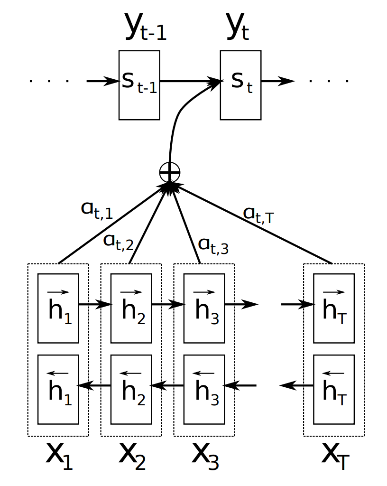
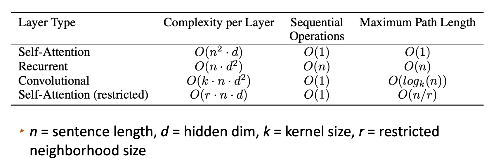
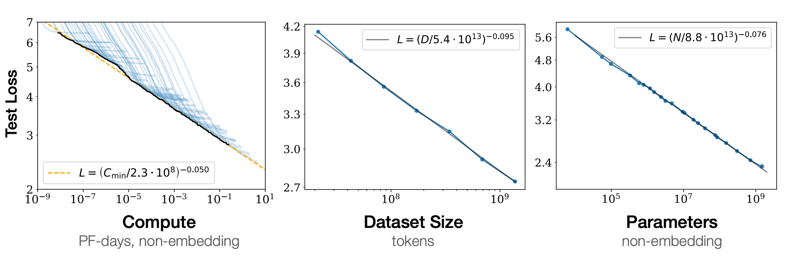

<div align="center">
  <h1>Transformer</h1>
</div>


# 1. 注意力机制


在语言建模中，注意力(attention)是一个关键机制，用于在给定上下文中访问相关信息以进行预测。注意力机制允许模型根据输入上下文中的重要信息来加权关注不同的部分，并根据其重要性来决定对不同部分的关注程度。

例如，对于一个给定的输入句子，语言模型可以使用注意力机制来确定在生成下一个单词时应该关注句子中的哪些部分。当模型预测下一个单词时，它可以根据输入句子中不同位置的单词的重要性来调整注意力权重。这意味着模型可以更有针对性地关注与当前预测相关的上下文信息，而不是简单地平均考虑整个句子。

通过使用注意力机制，语言模型可以更好地捕捉输入上下文中的关联和重要信息，从而提高预测的准确性。注意力使模型能够动态地根据不同输入示例的需要来聚焦不同的信息，从而提高了语言建模的效果。

<div align="center">
  
</div>

上图示例中，是一个预测下一个字母是A还是B的游戏，规则是如果全是A则下一个字母是A，只要有一个是B则下一个字母是B，注意力在这里的作用就是可以访问之前的所有位置信息。

循环神经网络(RNN)在处理长期依赖性和保持上下文方面存在一些困难。由于RNN的隐藏状态是通过时间步骤递归传递的，较早的输入在经过一系列的时间步骤后会逐渐消失，而只有较近的输入对当前预测有较大的影响。对于较长的上下文依赖性，RNN可能无法有效地记住所有位置的信息。当需要跨越较长的时间步骤进行预测时，RNN可能会遇到困难，因为它们在传递信息时可能会丢失重要的上下文。虽然RNN本身可能在处理简化的例子时能够记住上下文并进行预测，但在实践中，特别是对于更复杂的问题和长期依赖性，这变得更加困难。然而，可以通过手动调整权重或使用更复杂的RNN变体（例如长短时记忆网络(LSTM)或门控循环单元(GRU)）来改善RNN的上下文记忆能力。这些变体通过引入额外的机制来帮助模型更好地捕捉长期依赖性并记住重要的上下文信息，但本质上不如注意力机制直接有效。

## 1.1. Bahdanau 注意力

* 提出注意力机制的论文

[Neural Machine Translation by Jointly Learning to Align and Translate](https://arxiv.org/abs/1409.0473)


Bahdanau注意力是一种用于序列到序列(seq2seq)模型的注意力机制，由Bahdanau等人在2014年提出。它旨在解决神经机器翻译任务中的上下文对齐和长距离依赖性建模的问题。

传统的seq2seq模型使用编码器-解码器结构，其中编码器将输入序列编码为固定长度的上下文向量，然后解码器使用该上下文向量生成输出序列。然而，这种固定长度的上下文向量无法有效地捕捉输入序列的不同位置对生成每个输出的贡献程度。

<div align="center">
  
</div>

图中计算公式如下：

$$
\begin{aligned}
s_i &= f(s_{i-1}, y_{i-1}, c_i) \\
c_i &= \sum_{j=1}^{T_x} \alpha_{ij} h_j \\
\alpha_{ij} &= \frac{\exp(e_ij)}{\sum_{k=1}^{T_x} \exp(e_ik)} \\
e_{ij} &= a(s_{i-1}, h_j)
\end{aligned}
$$

Bahdanau注意力机制通过引入一个可学习的注意力权重来解决这个问题。具体而言，它在解码器的每个时间步骤上计算一个注意力分布，该分布决定了编码器输出中不同位置的重要性。这个注意力分布是通过将解码器的当前隐藏状态与编码器的所有隐藏状态进行比较来计算的。计算注意力分布的常见方法是使用一个前馈神经网络，该网络接受解码器隐藏状态和编码器隐藏状态作为输入，并输出一个标量分数。这些分数经过softmax函数处理，得到注意力权重，表示了每个编码器隐藏状态对当前解码器步骤的重要性。使用Bahdanau注意力机制，解码器可以根据输入序列中不同位置的重要性加权关注，并在生成每个输出时利用加权的上下文信息。这样，模型能够更好地处理长距离依赖性和上下文对齐，提高了翻译质量和其它序列生成任务的性能。

Bahdanau注意力机制的提出对于注意力机制的研究产生了重要影响，并为后续的改进和变体奠定了基础。

* Badhanau 注意力 Pytorch 实现

```python
import torch
import torch.nn as nn
import torch.nn.functional as F


class BahdanauAttention(nn.Module):
    def __init__(self, hidden_size):
        super(BahdanauAttention, self).__init__()
        self.hidden_size = hidden_size
        self.W = nn.Linear(hidden_size, hidden_size, bias=False)
        self.U = nn.Linear(hidden_size, hidden_size, bias=False)
        self.v = nn.Linear(hidden_size, 1, bias=False)

    def forward(self, encoder_outputs, decoder_hidden):
        decoder_hidden = decoder_hidden.unsqueeze(1)  # (batch_size, 1, hidden_size)
        encoder_outputs = self.W(encoder_outputs)  # (batch_size, seq_len, hidden_size)

        attention_scores = self.v(torch.tanh(encoder_outputs + self.U(decoder_hidden)))  # (batch_size, seq_len, 1)
        attention_weights = F.softmax(attention_scores, dim=1)  # (batch_size, seq_len, 1)

        context_vector = torch.sum(attention_weights * encoder_outputs, dim=1)  # (batch_size, hidden_size)

        return context_vector, attention_weights
    
    
# 创建注意力对象
attention = BahdanauAttention(hidden_size=256)

# 模拟输入数据
encoder_outputs = torch.randn(32, 10, 256)  # (batch_size, seq_len, hidden_size)
decoder_hidden = torch.randn(32, 256)  # (batch_size, hidden_size)

# 前向传播
context_vector, attention_weights = attention(encoder_outputs, decoder_hidden)

# 打印输出结果
print("Context vector shape:", context_vector.shape)  # (32, 256)
print("Attention weights shape:", attention_weights.shape)  # (32, 10, 1)
```

## 1.2. 缩放点积注意力

* 注意力机制的变体

[Effective Approaches to Attention-based Neural Machine Translation](https://arxiv.org/abs/1508.04025)


<div align="center">
  
</div>

在Loung提出的Global Attention中计算如下

$$
\begin{aligned}
a_t(s) &= \text{align}(h_t, \bar{h}_s) \\
&= \frac{\exp(\text{score} (h_t, \bar{h}_s))}{\sum_{s^{\prime}} \exp(\text{score} (h_t, \bar{h}_{s^{\prime}}))}
\end{aligned}
$$

score的计算方式有三种：

$$
\text{score}(h_t, \bar{h}_s) = 
\begin{cases}
h_t^T \bar{h}_x  & \text{dot} \\
h_t^T W_a \bar{h}_x & \text{general} \\
v_a^T \tanh (W_a [h_t^T; \bar{h}_x ]) & \text{concat}
\end{cases}
$$

其中，$W_a$ 和 $v_a$ 都是可学习的参数，特别地，general 也称为缩放点积(scaled dot product)注意力，等价于

$$
(W_k h_t)^T (W_q \bar{h}_x)
$$

1. dot使用点乘计算的好处是模型简单，没有额外的参数。点乘的方法要求编码器的隐状态和解码器的隐状态维度相同，并强制它们在同一个空间中。
2. general是点乘方法的一个扩展，由于不同语言的隐状态空间可能会存在区别，强行将它们约束在同一个空间中可能并不合适。general方法的本质是在编码器隐状态和解码器隐状态之间做一个线性转换然后计算点乘。
3. concat是将编码器隐状态和解码器隐状态进行拼接得到的向量。

* Luong 注意力 Pytorch 实现

```python
import torch
import torch.nn as nn
import torch.nn.functional as F


class LuongAttention(nn.Module):
    def __init__(self, hidden_size, attention_type='dot'):
        super(LuongAttention, self).__init__()
        self.hidden_size = hidden_size
        self.attention_type = attention_type

        if attention_type == 'dot':
            self.dot = True
        elif attention_type == 'general':
            self.W = nn.Linear(hidden_size, hidden_size, bias=False)
            self.dot = False
        elif attention_type == 'concat':
            self.W = nn.Linear(hidden_size * 2, hidden_size, bias=False)
            self.v = nn.Linear(hidden_size, 1, bias=False)
            self.dot = False
        else:
            raise ValueError("Invalid attention type.")

    def forward(self, encoder_outputs, decoder_hidden):
        decoder_hidden = decoder_hidden.unsqueeze(1)  # (batch_size, 1, hidden_size)

        if self.attention_type == 'dot':
            attention_scores = torch.bmm(encoder_outputs, decoder_hidden.transpose(1, 2))  # (batch_size, seq_len, 1)
        elif self.attention_type == 'general':
            attention_scores = torch.bmm(self.W(encoder_outputs), decoder_hidden.transpose(1, 2))  # (batch_size, seq_len, 1)
        elif self.attention_type == 'concat':
            decoder_hidden = decoder_hidden.expand(-1, encoder_outputs.size(1), -1)  # (batch_size, seq_len, hidden_size)
            concat_inputs = torch.cat((encoder_outputs, decoder_hidden), dim=2)  # (batch_size, seq_len, hidden_size * 2)
            attention_scores = self.v(torch.tanh(self.W(concat_inputs)))  # (batch_size, seq_len, 1)
        else:
            raise ValueError("Invalid attention type.")

        attention_weights = F.softmax(attention_scores, dim=1)  # (batch_size, seq_len, 1)

        context_vector = torch.sum(attention_weights * encoder_outputs, dim=1)  # (batch_size, hidden_size)

        return context_vector, attention_weights
    

# 创建注意力对象
attention = LuongAttention(hidden_size=256, attention_type='dot')

# 模拟输入数据
encoder_outputs = torch.randn(32, 10, 256)  # (batch_size, seq_len, hidden_size)
decoder_hidden = torch.randn(32, 256)  # (batch_size, hidden_size)

# 前向传播
context_vector, attention_weights = attention(encoder_outputs, decoder_hidden)

# 打印输出结果
print("Context vector shape:", context_vector.shape)  # (32, 256)
print("Attention weights shape:", attention_weights.shape)  # (32, 10, 1)
```

## 1.3. 自注意力

* 自注意力及其可视化

[Attention Is All You Need](https://arxiv.org/abs/1706.03762)

[The Illustrated Transformer](http://jalammar.github.io/illustrated-transformer/)

自注意力(Self-Attention)是一种注意力机制的变体，它引入了自我关注的概念。在传统的注意力机制中，通过计算查询(query)和键(key)之间的相关性来为每个查询分配权重，然后使用这些权重对值(value)进行加权求和。而在自注意力中，每个单词既是查询又是键，因此可以同时计算它与序列中其他单词之间的相关性得分。

通过将每个单词作为查询和键，自注意力能够捕捉到单词与其他单词之间的相互关系。它可以计算每个单词与整个序列中其他单词的相关性得分，并根据这些得分分配注意力权重。这样，每个单词都可以考虑到序列中所有其他单词的信息，而不仅仅是前面的单词。自注意力的优点在于它能够捕捉到单词之间的长距离依赖关系，因为每个单词都可以直接与其他单词进行交互。这使得自注意力在处理自然语言处理任务时非常强大，特别是对于需要考虑上下文信息的任务，如机器翻译和文本摘要。

<div align="center">
  
</div>

自注意力计算公式如下：

$$
\text{Attention}(Q, K, V) = \text{softmax} \left( \frac{Q K^T}{\sqrt{d_k}} \right) V
$$

$$
Q = E W^Q, K = E W^K, V = E W^V
$$

使用$\sqrt{d_k}$进行归一化有助于控制softmax的范围尺度，使其更平缓。在自注意力中，使用softmax函数来将注意力权重进行归一化，以确保它们的总和为1。这样可以使得每个位置的注意力权重表示其在整个序列中的相对重要性。然而，当注意力权重的值分布不平衡时，即某些权重远大于其他权重时，softmax函数可能会产生一个非常尖锐的峰值(peaked)。这意味着少数位置会集中获得大部分的注意力，而其他位置则得到很少的注意力。

为了避免这种情况，增加一个缩放因子$\sqrt{d_k}$(value-dependent scaling factor)，将注意力权重进行归一化。$\sqrt{d_k}$是根据值(value)的信息来调整注意力权重的尺度。通过与值相关联，$\sqrt{d_k}$可以帮助控制softmax函数的尺度，使得注意力权重更平缓地分布。通过引入$\sqrt{d_k}$进行归一化，可以减轻softmax函数产生尖锐峰值的问题。这有助于确保每个位置获得适当的关注，并更好地平衡注意力分配。

* 时间复杂度分析

<div align="center">
  
</div>

## 1.4. 多头自注意力

* 多头自注意力及其可视化

[Attention Is All You Need](https://arxiv.org/abs/1706.03762)

[The Illustrated Transformer](http://jalammar.github.io/illustrated-transformer/)


尽管自注意力理论上可以学习关注多个词元(token)，但在实践中，softmax分布往往会变得尖锐。具体来说，在自注意力机制中，通过应用softmax函数来计算注意力权重，以确保它们的总和为1。这样可以使得每个位置的注意力权重表示其在整个输入序列中的相对重要性。然而，当注意力权重的值分布不平衡时，即某些权重远大于其他权重时，softmax函数可能会产生一个非常尖锐的分布。这意味着少数位置会集中获得大部分的注意力，而其他位置则得到很少的注意力。这种尖锐的分布可能导致问题，其中只有少数位置被有效地关注，而其他位置的信息被忽略或弱化。这可能会限制模型的表达能力，并导致注意力分配的不平衡。

在单个层级内部，使用多个自注意力头部也可以提供帮助。这就是多头自注意力(Multi-Head Self-Attention)。在自注意力机制中，可以在单个层级内使用多个自注意力头部。每个头部都可以学习不同的关注模式和特征表示。通过引入多个头部，模型可以同时从不同的表示空间中学习，并捕捉输入序列中更丰富的关系和结构。每个头部都有自己的参数矩阵，用于计算注意力权重和值的加权和。这样可以使每个头部能够独立地学习和表示不同的关注模式。多个头部的输出可以通过连接或拼接的方式进行合并，形成单个层级的最终输出。在单个层级内使用多个自注意力头部可以增加模型的表达能力，并允许模型在更细粒度的层面上进行特征提取和关注。这有助于模型更好地捕捉输入序列中的多样性和复杂性，提高模型的性能和表示能力。

尽管单个层级内的自注意力机制本身已经有助于模型的表达能力，但通过使用多个自注意力头部，可以在单个层级内进一步增强模型的学习能力和表示能力。

<div align="center">
  
</div>

多头自注意力计算公式如下：

$$
\begin{aligned}
\text{MultiHead}(Q, K, V) &= \text{Concat}(\text{head}_1, \cdots, \text{head}_h) W^O \\
\text{where } \text{head}_i &= \text{Attention}(Q W_i^Q, K W_i^K, V W_i^V)
\end{aligned}
$$


* 多头自注意力的 Pytorch 实现

```python
import torch
import torch.nn as nn


class MultiHeadAttention(nn.Module):
    def __init__(self, d_model, num_heads):
        super(MultiHeadAttention, self).__init__()
        self.num_heads = num_heads
        self.d_model = d_model
        self.head_dim = d_model // num_heads
        
        self.query_linear = nn.Linear(d_model, d_model)
        self.key_linear = nn.Linear(d_model, d_model)
        self.value_linear = nn.Linear(d_model, d_model)
        self.output_linear = nn.Linear(d_model, d_model)
    
    def forward(self, query, key, value):
        batch_size = query.size(0)
        
        # Linear transformations for query, key, and value
        query = self.query_linear(query)
        key = self.key_linear(key)
        value = self.value_linear(value)
        
        # Reshape query, key, and value for multi-head attention
        query = query.view(batch_size, -1, self.num_heads, self.head_dim).transpose(1, 2)
        key = key.view(batch_size, -1, self.num_heads, self.head_dim).transpose(1, 2)
        value = value.view(batch_size, -1, self.num_heads, self.head_dim).transpose(1, 2)
        
        # Compute attention scores
        scores = torch.matmul(query, key.transpose(-2, -1)) / torch.sqrt(torch.tensor(self.head_dim, dtype=torch.float32))
        attention_weights = torch.softmax(scores, dim=-1)
        
        # Apply attention weights to value
        attended_values = torch.matmul(attention_weights, value)
        
        # Concatenate and reshape attended values
        attended_values = attended_values.transpose(1, 2).contiguous().view(batch_size, -1, self.d_model)
        
        # Linear transformation for output
        output = self.output_linear(attended_values)
        
        return output
    
    
# Create input tensors
batch_size = 2
seq_length = 5
d_model = 64
num_heads = 4

query = torch.randn(batch_size, seq_length, d_model)
key = torch.randn(batch_size, seq_length, d_model)
value = torch.randn(batch_size, seq_length, d_model)

# Create multi-head attention module
multihead_attention = MultiHeadAttention(d_model, num_heads)

# Compute multi-head attention
output = multihead_attention(query, key, value)

print(output.shape)  # Output shape: (batch_size, seq_length, d_model)
```

# 2. 位置编码

由于自注意力机制是基于元素之间的相对位置来计算注意力权重的，无法隐式地捕捉序列中的顺序信息。因此在使用自注意力之前需要添加位置编码，如果没有位置编码会导致模型无法区分不同位置上的元素。位置编码的引入确保了模型在计算注意力时考虑到了位置信息。

从直觉上，我们可以使用绝对编码，即将每个序列位置编码为整数，并将其添加到词嵌入向量中来作为位置信息，但这导致一些问题：
1. 无法体现相对位置关系：使用位置索引无法很好地表示词与词之间的相对位置关系。例如索引3和4表示的只是绝对位置，无法直接反映它们之间相邻的位置关系。
2. 缺乏泛化能力：仅使用位置索引作为输入，模型很难从有限的训练数据中推广到不同长度的输入序列。因为序列长度的变化会导致位置索引的数值分布发生剧烈变化，模型难以学习长度不变的位置模式。
3. 数值不稳定性：对于很长的序列,使用大的位置索引数值会导致梯度计算时的数值不稳定和underflow/overflow等问题。
4. 信息瓶颈：将位置信息直接编码为一个标量索引，其携带的位置信息有限，限制了模型对位置的表达能力。而将其编码为向量可以提供更高维的位置信息表示。
5. 缺乏结构归纳偏置：直接使用索引则缺乏结构化的归纳偏置(Inductive Bias)。合理的位置编码函数设计(如基于三角函数的编码)，可以为模型引入一些有益的归纳偏置,帮助模型更容易学习一些位置模式和结构。

## 2.1. 正弦位置编码

* 正弦位置编码及其可视化

[Attention Is All You Need](https://arxiv.org/abs/1706.03762)

[The Illustrated Transformer](http://jalammar.github.io/illustrated-transformer/)


正弦位置编码(sinusoidal positional embedding)是Transformer模型中使用的一种位置编码方式。对于一个长度为$t$的序列,生成一个$d$维的位置编码向量。其中，第$i$个位置的第$j$维编码计算公式为:

$$
\begin{aligned}
PE_{(pos,2i)} &= \sin(pos/10000^{2i/d}) \\
PE_{(pos,2i+1)} &= \cos(pos/10000^{2i/d})
\end{aligned}
$$

其中pos表示词的位置索引，从0开始计数。

<div align="center">
  
</div>

正弦位置编码的优点：

1. 编码结构：偶数维度使用sin函数编码，奇数维度使用cos函数编码，编码向量的每个维度对应一个不同的sin/cos周期项。这种结构能自然地表示绝对位置和相对位置信息。
2. 相对位置关系：两个不同位置的embeddings之间的关系能通过三角函数的周期性很好地体现它们的相对位置关系，即距离越近的两个词，其位置向量将越相似。相对位置信息是距离近的两个位置，由于使用相近的sin/cos值，其位置向量也会较为相近。
3. 绝对位置关系：每个位置对应一个唯一的向量表示，可以较为明确地编码绝对位置索引信息。绝对位置信息是每个位置pos对应一个唯一的向量表示[sin(x), cos(y), ...]。
4. 长度无关：与直接使用位置索引不同，正弦/余弦编码可以处理任意长度的序列，避免了可能的数值溢出等问题。
5. 长距离关系：使用不同频率的三角函数，可以在有限维度下恰当地编码任意长距离的位置关系。


## 2.1. 学习的位置编码

* 相关论文

[BERT: Pre-training of Deep Bidirectional Transformers for Language Understanding](https://arxiv.org/abs/1810.04805)


学习的位置嵌入(Positional Embeddings)是另一种常用的位置编码方式，其思路是将位置信息直接作为需要学习的参数来获取。具体来说，为每个可能的位置索引(如0,1,2,...,max_len)分别分配一个可学习的嵌入向量，用来表示该位置的位置编码。所有这些嵌入向量通常被存储在一个位置嵌入矩阵(Positional Embedding Matrix)之中。在输入序列经过单词嵌入之后，将对应位置的位置嵌入向量直接相加到单词嵌入上，充当输入到模型的综合表示。单词嵌入和位置嵌入作为整个模型的一部分参数，在训练过程中通过反向传播算法一同学习得到合适的向量表示。

<div align="center">
  
</div>

* 学习的位置嵌入的优点

与固定的编码函数(如正弦/余弦编码)不同，学习的位置嵌入方式完全由数据驱动，可以学习到最优的位置编码表示，表现力更强。它不需要设计特定的编码函数，直接使用学习的向量表示即可，易于使用和实现。

* 学习的位置嵌入的缺点

学习的位置嵌入需要大量的可学习参数(嵌入向量数×嵌入维度)，对较长序列来说计算代价高。此外每个位置使用单独的向量，难以建模位置之间的一些结构关系。

## 2.3. 相对位置编码

* 相关论文

[Self-Attention with Relative Position Representations](https://arxiv.org/abs/1803.02155)

[Exploring the Limits of Transfer Learning with a Unified Text-to-Text Transformer](https://arxiv.org/abs/1910.10683)

相对位置编码是一种基于自注意力结构的编码方式，典型应用是T5模型，它允许模型自动学习位置表示，而不是直接使用固定的位置嵌入。与传统的位置编码相比，T5相对位置编码更加灵活和高效。在T5相对位置编码中，每个位置的表示都是相对于其他位置的。具体来说，每个位置的表示由两部分组成：一部分是该位置相对于起始位置的偏移量，另一部分是该位置相对于其他位置的相对位置关系。这种表示方式使得模型可以更好地理解序列中的元素是如何排列的，从而提高了模型的性能。

具体来说，T5模型在自注意力机制中引入了相对位置嵌入，用于表示元素之间的相对位置关系。这些嵌入被添加到原始的输入嵌入中，以在注意力计算中引入位置信息。通过这种方式，模型可以在处理序列数据时充分利用位置信息，提高模型的性能。

## 2.4. 旋转位置编码

* 相关论文

[RoFormer: Enhanced Transformer with Rotary Position Embedding](https://arxiv.org/abs/2104.09864)

旋转位置编码(Rotary Position Embedding, RoPE)是一种新型的位置编码方法。在RoPE中，每个位置被编码为一个复数，这个复数的模长为1，角度与位置成正比。具体来说，如果我们把词的位置表示为p，那么我们可以得到一个复数的位置编码ei⋅p，其中i是虚数单位。

RoPE通过绝对位置编码的方式实现相对位置编码，综合了绝对位置编码和相对位置编码的优点。主要就是对attention中的q, k向量注入了绝对位置信息，然后用更新的q，k向量做attention中的内积就会引入相对位置信息。RoPE不是像传统的位置编码那样将位置信息和词的嵌入向量直接相加。这样，RoPE可以在不增加模型大小的情况下提供丰富的位置信息。

<div align="center">
  
</div>


## 2.5. ALiBi位置编码

* 相关论文

[Train Short, Test Long: Attention with Linear Biases Enables Input Length Extrapolation](https://arxiv.org/abs/2108.12409)

ALiBi(Attention with Linear Biases)位置编码是一种在自注意力模型中使用的位置编码方法。它的目标是在自注意力机制中引入位置信息，使模型能够理解单词之间的相对位置。具体来说，ALiBi通过向自注意力机制的每个输入添加一个线性偏置项来实现这一目标。这个线性偏置项是基于输入的位置计算的，因此可以反映出输入之间的相对位置信息。

ALiBi位置编码的特点在于在网络中的任何位置都不添加位置嵌入。唯一的修改是在查询-键点积之后，添加了一个静态的、非可学习的偏置项。这个偏置项的作用是为了在计算注意力分数时引入一些偏置，从而影响模型对不同位置的关注程度。这种修改可以帮助模型更好地处理输入序列中的位置信息，而无需额外学习位置嵌入参数。

$$
\text{softmax} \left(q_i K^T + m \cdot [-(i-1), \cdots, -2, -1, 0] \right)
$$


# 3. Transformer

尽管LSTM在处理序列数据方面表现出色，但在处理长序列时仍存在一些限制。Transformer架构的引入旨在解决这些限制，并在自然语言处理和其他序列建模任务中取得突破。

以下是Transformer相对于LSTM的一些优点和特点：

1. 并行计算：在LSTM中，处理序列数据是顺序进行的，每个时间步的计算依赖于前一个时间步的输出。这限制了并行计算的能力，导致训练和推理速度较慢。相比之下，Transformer使用自注意力机制，使得所有位置的输入都可以同时进行计算，实现了更好的并行化，从而加速了训练和推理过程。
2. 长期依赖性建模：虽然LSTM引入了门控机制来处理长期依赖性，但对于非常长的序列，这仍然可能存在挑战。Transformer 中的自注意力机制允许每个位置直接关注所有其他位置的信息，无论其距离有多远。这使得Transformer能够更好地建模长期依赖性，捕捉全局上下文关系。
3. 位置编码：在LSTM中，序列的顺序信息是通过时间步骤的顺序隐含地编码的。相比之下，Transformer显式地引入了位置编码，将序列的位置信息注入到输入中。这样，Transformer能够更好地处理序列中不同位置的关系，并减少位置顺序的敏感性。
4. 扩展性和泛化性：Transformer架构可以很容易地扩展到更大的模型和更长的序列，而不会受到梯度消失或梯度爆炸等问题的限制。它可以通过增加层和头(multi-head attention)来增加模型的容量，使其适应更复杂的任务和更大规模的数据。
5. 注意力机制：Transformer引入了自注意力机制，使得模型能够根据输入序列中的相关性自适应地分配注意力。这使得模型能够更好地理解和捕捉输入序列中的重要信息，并在不同位置之间建立相关性。

总的来说，Transformer相比LSTM有着很好的并行性、长距建模能力和很好的扩展性。

## 3.1. Transformer架构

* Transfomer 原始论文

[Attention Is All You Need](https://arxiv.org/abs/1706.03762)


<div align="center">
  
</div>


自注意力机制(Self-Attention)是Transformer模型中最核心的部分之一，完整的Transformer还包括其他部分：

前馈层(FeedForward)：在Transformer中前馈层与自注意力层交替排列，使得Transformer能够从不同的子层中捕捉不同级别的特征，自注意力捕捉远程依赖关系，前馈层对每个单词进行建模。通过这种方式编码和解码序列，最终得到建模目标任务所需的表示。

$$
\text{FFN}(x) = \max(0, x W_1 + b_1) W_2 + b2
$$

残差连接(Residual Connections)：一层的输入直接加到它的输出上，残差连接是深度学习模型中常用的一种技巧，目的是帮助更好地训练深层神经网络。这种设计的好处是可以更好地保留输入的原始信息，避免在很深的网络中完全压缩或丢失。同时残差连接也有利于梯度传播，缓解了深层网络的梯度消失问题，从而使深度模型更容易训练。这一机制有助于加深网络、缓解梯度问题，是提高模型性能的有力手段。

层归一化(Layer Normalization)：是一种用于控制深度神经网络中不同层的尺度的技术。在深度神经网络中，每个层都包含很多神经元或节点，这些节点的输入和输出可以具有不同的尺度。这可能导致训练过程中的梯度消失或梯度爆炸等问题，这对于网络的稳定性和收敛性是不利的。为了解决这个问题，层归一化引入了一种正则化方法，用于对每个层的输入进行归一化处理。具体而言，对于每个层的输入向量，层归一化将其均值和方差计算出来，并使用这些统计量对输入进行中心化和缩放，以使其具有零均值和单位方差。这样可以增加网络层之间的稳定性，有助于更好地传播梯度并加速训练。与批归一化(Batch Normalization)不同，层归一化是针对每个样本单独进行归一化，而不是对整个批次进行归一化。这使得层归一化在小批量训练或单样本推理时更有效。

<div align="center">
  
</div>

原始的Transformer论文提出的是一个编码器-解码器模型。编码器用于将输入序列编码为一系列上下文向量，而解码器则根据编码器的输出和之前生成的标记来生成目标序列。编码器即是上面的介绍，解码器通过将三角形因果注意力掩码应用于编码器的注意力层，可以限制注意力只能关注前面的标记，而不会泄露未来的信息。这意味着在解码器阶段，每个位置的标记只能依赖于较早的标记，模型在生成序列时遵循自左向右的顺序。

* Transformer 的 Pytorch 实现

```python
import math
import copy
import torch
import torch.nn as nn
import torch.nn.functional as F
from torch.autograd import Variable


class PositionalEncoder(nn.Module):
    def __init__(self, d_model, max_seq_len=80):
        super().__init__()
        self.d_model = d_model

        pe = torch.zeros(max_seq_len, d_model)
        for pos in range(max_seq_len):
            for i in range(0, d_model, 2):
                pe[pos, i] = math.sin(pos / (10000 ** ((2 * i) / d_model)))
                pe[pos, i + 1] = math.cos(pos / (10000 ** ((2 * (i + 1)) / d_model)))
        pe = pe.unsqueeze(0)
        self.register_buffer("pe", pe)

    def forward(self, x):
        x = x * math.sqrt(self.d_model)
        seq_len = x.size(1)
        x = x + Variable(self.pe[:, :seq_len], requires_grad=False)
        return x
    

class MultiHeadAttention(nn.Module):
    def __init__(self, heads, d_model, dropout=0.1):
        super().__init__()

        self.d_model = d_model
        self.d_k = d_model // heads
        self.h = heads

        self.q_linear = nn.Linear(d_model, d_model)
        self.k_linear = nn.Linear(d_model, d_model)
        self.v_linear = nn.Linear(d_model, d_model)
        self.dropout = nn.Dropout(dropout)
        self.out = nn.Linear(d_model, d_model)

    def attention(self, q, k, v, d_k, mask=None, dropout=None):
        scores = torch.matmul(q, k.transpose(-2, -1)) / math.sqrt(d_k)

        # 掩盖掉那些为了填补长度增加的单元，使其通过 softmax 计算后为 0
        if mask is not None:
            mask = mask.unsqueeze(1)
            scores = scores.masked_fill(mask == 0, -1e9)

        scores = F.softmax(scores, dim=-1)

        if dropout is not None:
            scores = dropout(scores)

        output = torch.matmul(scores, v)
        return output
    
    def forward(self, q, k, v, mask=None):
        bs = q.size(0)

        # 进行线性操作划分为成 h 个头
        q = self.q_linear(q).view(bs, -1, self.h, self.d_k) 
        k = self.k_linear(k).view(bs, -1, self.h, self.d_k) 
        v = self.v_linear(v).view(bs, -1, self.h, self.d_k)

        # 矩阵转置
        q = q.transpose(1,2) 
        k = k.transpose(1,2) 
        v = v.transpose(1,2)

        # 计算 attention
        scores = self.attention(q, k, v, self.d_k, mask, self.dropout)

        # 连接多个头并输入到最后的线性层
        concat = scores.transpose(1,2).contiguous().view(bs, -1, self.d_model)
        output = self.out(concat) 

        return output
    

class FeedForward(nn.Module):
    def __init__(self, d_model, d_ff=2048, dropout=0.1):
        super().__init__()

        # d_ff 默认设置为 2048
        self.linear_1 = nn.Linear(d_model, d_ff)
        self.dropout = nn.Dropout(dropout)
        self.linear_2 = nn.Linear(d_ff, d_model)

    def forward(self, x):
        x = self.dropout(F.relu(self.linear_1(x)))
        x = self.linear_2(x)
        return x
    

class NormLayer(nn.Module):
    def __init__(self, d_model, eps=1e-6):
        super().__init__()

        self.size = d_model
        # 层归一化包含两个可以学习的参数
        self.alpha = nn.Parameter(torch.ones(self.size))
        self.bias = nn.Parameter(torch.ones(self.size))

        self.eps = eps

    def forward(self, x):
        norm = self.alpha * (x - x.mean(dim=-1, keepdim=True)) / (x.std(dim=-1, keepdim=True) + self.eps) + self.bias
        return norm
    

class EncoderLayer(nn.Module):
    def __init__(self, d_model, heads, dropout=0.1):
        super().__init__()

        self.norm_1 = NormLayer(d_model)
        self.norm_2 = NormLayer(d_model)
        self.attn = MultiHeadAttention(heads, d_model, dropout)
        self.ff = FeedForward(d_model, dropout=dropout)
        self.dropout_1 = nn.Dropout(dropout)
        self.dropout_2 = nn.Dropout(dropout)

    def forward(self, x, mask):
        x2 = self.norm_1(x)
        x = x + self.dropout_1(self.attn(x2, x2, x2, mask))
        x2 = self.norm_2(x)
        x = x + self.dropout_2(self.ff(x2))
        return x
    

class Encoder(nn.Module):
    def __init__(self, vocab_size, d_model, N, heads, dropout):
        super().__init__()

        self.N = N
        self.embed = nn.Embedding(vocab_size, d_model)
        self.pe = PositionalEncoder(d_model)
        self.layers = nn.ModuleList([copy.deepcopy(EncoderLayer(d_model, heads, dropout)) for _ in range(N)])
        self.norm = NormLayer(d_model)

    def forward(self, src, mask):
        x = self.embed(src)
        x = self.pe(x)
        for i in range(self.N):
            x = self.layers[i](x, mask)
        return self.norm(x)
    

class DecoderLayer(nn.Module):
    def __init__(self, d_model, heads, dropout=0.1):
        super().__init__()
        self.norm_1 = NormLayer(d_model)
        self.norm_2 = NormLayer(d_model)
        self.norm_3 = NormLayer(d_model)

        self.dropout_1 = nn.Dropout(dropout)
        self.dropout_2 = nn.Dropout(dropout)
        self.dropout_3 = nn.Dropout(dropout)

        self.attn_1 = MultiHeadAttention(heads, d_model, dropout)
        self.attn_2 = MultiHeadAttention(heads, d_model, dropout)
        self.ff = FeedForward(d_model, dropout=dropout)

    def forward(self, x, e_outputs, src_mask, trg_mask):
        x2 = self.norm_1(x)
        x = x + self.dropout_1(self.attn_1(x2, x2, x2, trg_mask))
        x2 = self.norm_2(x)
        x = x + self.dropout_2(self.attn_2(x2, e_outputs, e_outputs, src_mask))
        x2 = self.norm_3(x)
        x = x + self.dropout_3(self.ff(x2))
        return x
    

class Decoder(nn.Module):
    def __init__(self, vocab_size, d_model, N, heads, dropout) -> None:
        super().__init__()
        self.N = N
        self.embed = nn.Embedding(vocab_size, d_model)
        self.pe = PositionalEncoder(d_model)
        self.layers = nn.ModuleList([copy.deepcopy(DecoderLayer(d_model, heads, dropout)) for _ in range(N)])
        self.norm = NormLayer(d_model)

    def forward(self, trg, e_outputs, src_mask, trg_mask):
        x = self.embed(trg)
        x = self.pe(x)
        for i in range(self.N):
            x = self.layers[i](x, e_outputs, src_mask, trg_mask)
        return self.norm(x)
    

class Transformer(nn.Module):
    def __init__(self, src_vocab, trg_vocab, d_model, N, heads, dropout):
        super().__init__()
        self.encoder = Encoder(src_vocab, d_model, N, heads, dropout) 
        self.decoder = Decoder(trg_vocab, d_model, N, heads, dropout) 
        self.out = nn.Linear(d_model, trg_vocab)

    def forward(self, src, trg, src_mask, trg_mask):
        e_outputs = self.encoder(src, src_mask)
        d_output = self.decoder(trg, e_outputs, src_mask, trg_mask) 
        output = self.out(d_output)
        return output
    
    
vocab_size = 100
d_model = 6
N = 3
heads = 2
dropout = 0.1
transformer = Transformer(vocab_size, vocab_size, d_model, N, heads, dropout)
x = torch.tensor([[1, 2], [2, 3]])
mask = torch.tensor([[1, 1], [1, 1]])
output = transformer(x, x, mask, mask)
print(output.shape)
```


## 3.2. Transformer延伸

* 扩展定律

大模型的扩展定律(Scaling Laws)指的是描述随着模型规模（如参数数量、数据量、计算量等）变化而产生的性能变化规律的数学或经验关系。这些定律对于理解和预测模型性能、优化资源配置、指导模型设计和训练策略具有重要意义。

<div align="center">
  
</div>

相关论文：[Scaling Laws for Neural Language Models](https://arxiv.org/abs/2001.08361)

* Transformer运行时

<div align="center">
  
</div>

Transformer运行时(Runtime)一般是指Transformer模型在实际应用和执行过程中所涉及的计算时间和资源消耗。理解Transformer模型的运行时特性对于优化模型性能、提高计算效率以及在资源受限的环境中部署模型至关重要。

尽管大多数参数和浮点运算(FLOPs)集中在前馈层中，Transformer模型仍然受到自注意力机制的二次复杂度的限制。已经提出了许多方法来处理这个问题。

稀疏注意力(Sparse Attention)：仅计算部分元素之间的相似度，从而减少计算量。

低秩近似(Low-Rank Approximation)：使用低秩矩阵来近似注意力矩阵，降低计算复杂度。

分块自注意力(Blocked Self-Attention / Local Attention)：将序列分成若干块，每个块内进行自注意力计算，以减少计算量。

线性时间注意力(Linear-Time Attention)：设计新的注意力机制，使其计算复杂度从二次降到线性。

这些方法的目标都是在保证模型性能的前提下，降低自注意力机制的计算复杂度，从而提高 Transformer 模型在处理长序列时的效率。

相关论文：[Efficient Transformers: A Survey](https://arxiv.org/abs/2009.06732)

* Performers

<div align="center">
  
</div>

Performers是一种改进的Transformer模型，旨在解决传统Transformer模型中自注意力机制计算复杂度高的问题。具体来说，Performers提出了一种名为线性注意力的方法，将自注意力的计算复杂度从二次降低到线性，从而显著提高了模型的效率。

Performers使用核技巧(kernel trick)来近似标准的自注意力机制。具体来说，它们利用随机特征映射(random feature mapping)将注意力计算转化为线性操作。这种方法的核心思想是通过特征映射将输入数据映射到一个高维空间，使得点积注意力可以通过线性计算来近似。由于计算复杂度降低，Performers 在处理长序列时所需的内存也显著减少。这使得它们在实际应用中更加实用，特别是在内存受限的环境中。

Performers的核心方法基于随机特征映射和核技巧。具体步骤是：

1. 特征映射：输入序列通过特征映射函数映射到高维空间。常用的特征映射方法包括高斯核和其他类型的核函数。

2. 线性化注意力：使用映射后的特征计算线性注意力，而不是直接计算原始输入的点积注意力。通过这种线性化操作，可以将复杂度从二次降低到线性。

3. 近似注意力矩阵：Performers 通过特征映射和线性化操作，近似计算注意力矩阵，从而保持了模型性能，同时显著提高了计算效率。

相关论文：[Rethinking Attention with Performers](https://arxiv.org/abs/2009.14794)


* Longformer

Longformer是一种改进的Transformer模型，专门设计用于处理长序列输入。它通过引入稀疏注意力机制(Sparse Attention)，有效地解决了传统Transformer模型中的计算瓶颈问题，使得处理长文本和序列数据变得更加高效。

<div align="center">
  
</div>

Longformer使用稀疏注意力机制，将注意力计算限制在局部范围内，而不是全局范围。这种方法显著降低了计算复杂度。稀疏注意力包括局部窗口注意力(Local Window Attention)和全局注意力(Global Attention)，后者仅在少数重要位置进行全局计算。Longformer 通过稀疏注意力机制将复杂度降低为线性，使其可以处理更长的序列。Longformer允许在序列中的特定位置设置全局注意力，这些位置可以是任务相关的关键位置，如段落开头、标题或特定标记位置。这种灵活性使得模型在处理不同任务时具有更好的适应性。通过滑动窗口机制，Longformer可以处理任意长度的序列，而不需要分割输入序列。这种机制保证了模型在处理长文本时的连续性和完整性。

相关论文：[Longformer: The Long-Document Transformer](https://arxiv.org/abs/2004.05150)

# 4. 解码策略

Transformer通常由编码器和解码器两部分组成。编码器将输入序列转换为隐藏表示，解码器则根据这些隐藏表示生成输出序列。在文本生成任务中，Transformer解码器自回归地生成每个词，即每次生成一个词，并将其作为输入用于生成下一个词，直到生成结束标记。生成任务中的解码(decoding)过程是从模型中生成文本的关键步骤。

以下是一些常见的解码方法：
1. 贪心搜索(Greedy Search)：每一步选择概率最高的词作为输出。优点：简单快速。缺点：可能会错过全局最优解，导致生成的文本质量不高。
2. 束搜索(Beam Search)：保留多个束宽(beam width)候选序列，每一步扩展这些序列并选择概率最高的几个继续。优点：比贪心搜索有更好的全局搜索能力，生成文本质量较高。缺点：计算量较大，仍然可能错过最佳序列。
3. 采样(Sampling)：根据概率分布随机选择下一个词。随机采样(Random Sampling)：直接根据模型输出的概率分布进行采样。温度采样(Temperature Sampling)：调整概率分布的平滑度，温度参数T用于控制采样的随机性。较高的T增强多样性，较低的T增强确定性。
4. Top-k采样：每一步只从概率最高的k个词中进行采样，排除概率较低的词。优点：平衡生成多样性和质量。
5. Top-p采样（又称核采样，Nucleus Sampling）：每一步从使累积概率达到阈值p的词集合中进行采样。优点：自适应地选择候选词集合，兼顾多样性和生成质量。

基本的解码步骤：
1. 初始化：给定输入序列（如翻译任务中的源语言句子）并通过编码器生成隐藏表示。初始化解码器输入（通常是特殊的开始标记 \<s\>）。
2. 自回归生成：将解码器输入通过解码器，生成输出词的概率分布。根据选定的解码方法（如贪心搜索、束搜索、采样等）生成下一个词。将生成的词追加到解码器输入序列，并重复此过程，直到生成结束标记或达到最大长度。