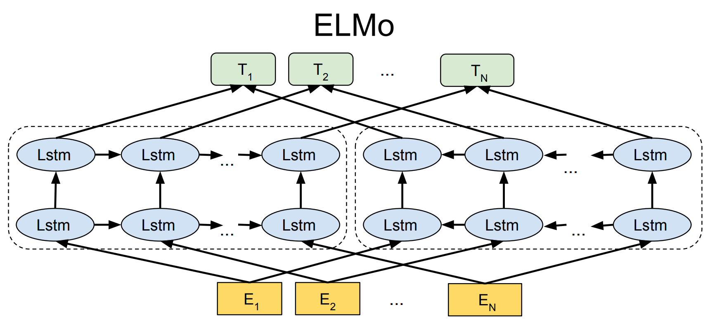
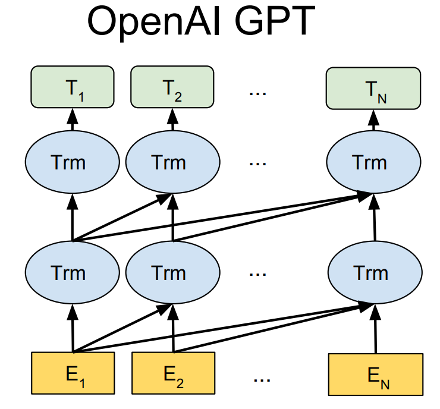
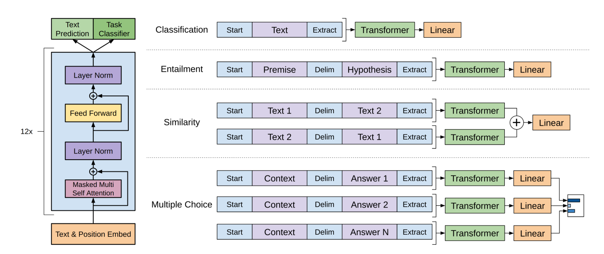
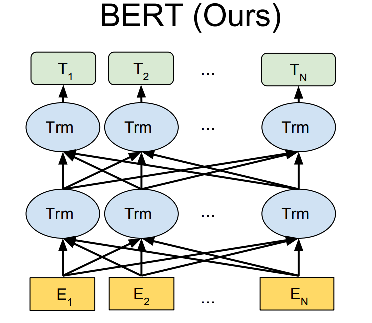
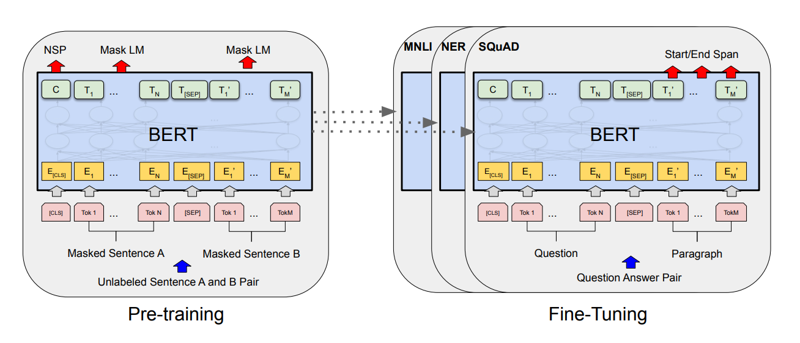
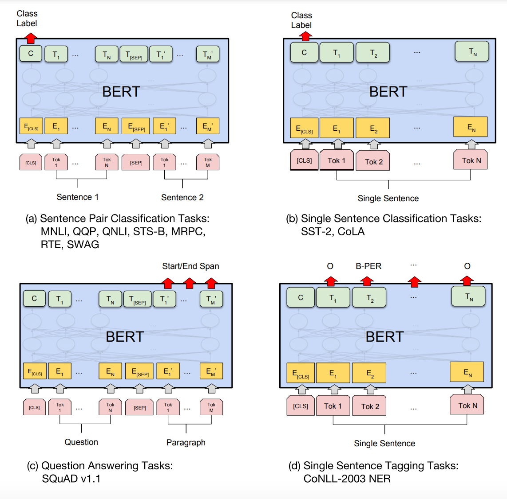
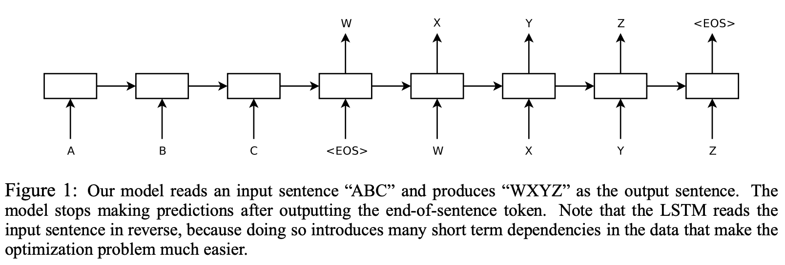
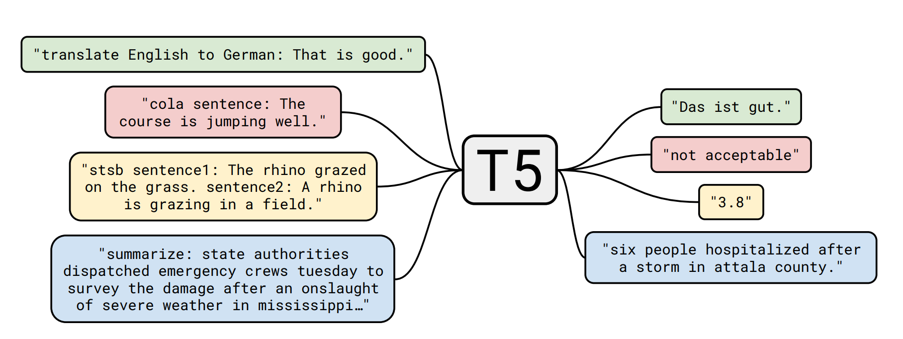
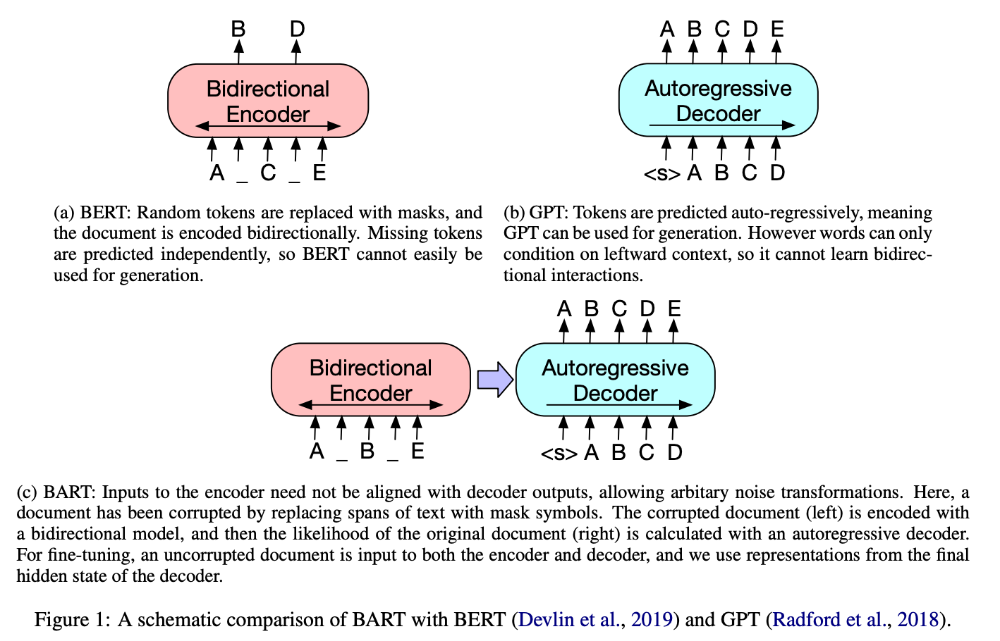
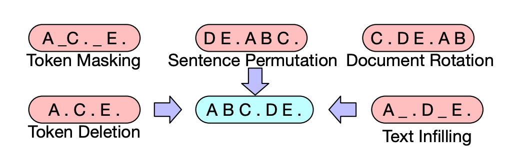

<div align="center">
  <h1>预训练模型</h1>
</div>

# 1. 预训练模型介绍

在预训练语言模型出现之前，统计语言模型（如N-gram模型）是主流方法。这些模型利用统计方法来预测文本中的下一个词，但它们对长距离依赖和上下文理解能力有限。

2013年，Google提出的Word2Vec模型利用神经网络来学习词的分布式表示（词向量），使得相似词在向量空间中彼此接近。这是预训练词嵌入技术的开端。斯坦福大学提出的GloVe(Global Vectors for Word Representation)模型通过结合全局词共现统计信息来生成词向量，进一步提升了词表示的质量。

2018年，ELMo(Embeddings from Language Models)由AllenNLP团队提出，它通过双向LSTM来生成上下文感知的词表示。这标志着从静态词向量到动态上下文词向量的转变。2017年，Google提出的Transformer模型引入了自注意力机制，极大地提升了处理长距离依赖和并行计算的能力，为后续的大规模预训练模型奠定了基础。2018年，Google提出BERT(Bidirectional Encoder Representations from Transformers)，它是首个双向Transformer模型，能够利用句子中所有词的上下文信息进行预训练。BERT在多项NLP任务中取得了显著的效果。2018年，OpenAI提出的GPT(Generative Pre-trained Transformer)采用了单向Transformer结构，通过生成式任务进行预训练。GPT-2(2019)和GPT-3(2020)进一步扩大了模型规模，展示了预训练模型在生成任务中的强大能力。2019，Google提出的T5(Text-To-Text Transfer Transformer)将各种NLP任务统一为文本到文本的格式，展示了预训练模型在多任务学习中的潜力。


## 1.1. ELMo

* 相关论文

[Deep contextualized word representations](https://arxiv.org/abs/1802.05365)

ELMo(Embeddings from Language Models)是由AllenNLP团队在2018年提出的一种预训练语言模型。它是首个通过上下文感知的词嵌入来显著提升自然语言处理任务性能的模型之一。

ELMo的核心思想是生成上下文感知的词表示，这意味着同一个词在不同的上下文中会有不同的表示。传统的词嵌入方法（如Word2Vec和GloVe）生成的是固定的词向量，而ELMo则通过考虑句子的上下文，使得词表示更加动态和灵活。

<div align="center">
  
</div>

ELMo的训练过程包括以下步骤：
1. 预训练：ELMo在大规模语料库上预训练双向语言模型，通过最大化前向和后向语言模型的对数似然估计来学习参数。ELMo使用双向LSTM(Long Short-Term Memory)作为基础结构，分别从前向和后向两个方向处理句子。前向LSTM从句子的开头到结尾逐词处理，后向LSTM则从句子的结尾到开头逐词处理。通过双向LSTM，ELMo生成了每个词在不同上下文中的表示。每个词的最终表示是由不同层的表示加权和得到的。
2. 特征提取和微调：在特定任务中，预训练的ELMo模型可以作为特征提取器使用，生成上下文感知的词嵌入。可以进一步对特定任务的训练数据进行微调，以提升性能。


双向语言模型：

$$
\begin{aligned}
p(t_1, t_2, \cdots, t_N) &= \sum_{k=1}^N p(t_k | t_1, t_2, \cdots, t_{k-1}) \\
p(t_1, t_2, \cdots, t_N) &= \sum_{k=1}^N p(t_k | t_{k+1}, t_{t+2}, \cdots, t_N) \\
\end{aligned}
$$


目标函数：

$$
\begin{aligned}
\sum_{k=1}^N \left( \log p(t_k | t_1, \cdots, t_{k-1}; \Theta_x, \overrightarrow{\Theta}_{LSTM}, \Theta_s) + \log p(t_k | t_{k+1}, \cdots, t_{N}; \Theta_x, \overleftarrow{\Theta}_{LSTM}, \Theta_s)\right)
\end{aligned}
$$

ELMo 的计算流程：

$$
\begin{aligned}
R_k &= \{ x_k^{LM}, \overrightarrow{h}_{kj}^{LM}, \overleftarrow{h}_{kj}^{LM} | j=1, \cdots, L \} \\
&= \{ h_{k,j}^{LM} | j=1, \cdots, L \} \\
\end{aligned}
$$

$$
\begin{aligned}
\text{ELMo}_k^{task} &= E(R_k; \Theta^{task}) = \gamma^{task} \sum_{j=0}^L s_j^{task} h_{k,j}^{LM}
\end{aligned}
$$

ELMo的优势：
1. 上下文感知：ELMo生成的词表示能够捕捉词在不同上下文中的意义变化，提高了对多义词和同义词的处理能力。
2. 动态表示：相比于静态词嵌入，ELMo的词表示是动态的，能够更好地适应复杂的语言现象。


## 1.2. GPT

* 相关论文

[Improving Language Understanding by Generative Pre-Training](https://cdn.openai.com/research-covers/language-unsupervised/language_understanding_paper.pdf)

GPT(Generative Pre-trained Transformer)是由OpenAI提出的一系列预训练语言模型，这些模型在自然语言生成和理解任务中表现出了卓越的能力。GPT系列包括GPT、GPT-2、GPT-3和GPT-4，每一代都在规模和性能上有显著提升。

GPT模型的核心架构基于Transformer的解码器部分，专注于生成式任务。与BERT不同，GPT采用单向的自回归方法，即在生成当前词时仅依赖于左侧的上下文。GPT的预训练任务是语言建模，即通过预测序列中的下一个词来训练模型。这种自回归的方法使得GPT能够生成连贯和上下文相关的文本。

<div align="center">
  
</div>

GPT的架构特点如下：
1. 单向自回归：GPT是单向的，即在生成每个词时，仅考虑它之前的词。这使得GPT特别适合生成任务，如文本生成、对话生成等。
2. Transformer解码器：GPT使用多层的Transformer解码器，每层包括多头自注意力机制和前馈神经网络。

GPT的训练分为两个阶段：
1. 预训练：GPT使用了BooksCorpus数据集进行预训练。BooksCorpus包含了约7000本未标注的英语书籍，总共约8亿词。预训练任务是语言建模，即通过预测序列中的下一个词来训练模型。这种自回归方法使得模型能够生成连贯的文本。损失函数是标准的最大似然估计(Maximum Likelihood Estimation, MLE)，即最大化训练数据的对数似然。
2. 微调：在微调阶段，使用特定任务的数据集。例如，对于文本分类任务，使用标注了类别标签的数据集。将任务数据转换为适合模型输入的格式。例如，对于分类任务，输入格式可能是“[CLS] 文本 [SEP]”，其中[CLS]表示分类标记，[SEP]表示分隔符。在预训练模型的顶部添加一个任务特定的输出层。例如，对于分类任务，添加一个全连接层用于预测类别标签。

预训练阶段损失函数：

$$
L_1(\mathcal{U}) = \sum_i \log P(u_i | u_{i-k}, \cdots, u_{i-1}; \Theta)
$$

GPT的前向计算过程：

$$
\begin{aligned}
h_0 &= U W_e + W_p \\
h_l &= \text{transformer\_block}(h_{i-1}), \forall i \in [1,n] \\
P(u) &= \text{softmax}(h_n W_e^T)
\end{aligned}
$$

GPT微调的前向计算，需要在最后一层隐藏层再额外增加一层线性层：

$$
P(y|x^1, \cdots, x^m) = \text{softmax}(h_l^m W_y)
$$

微调阶段损失函数：

$$
L_2(\mathcal{C}) = \sum_{(x,y)} \log P(y|x^1, \cdots, x^m)
$$

实验发现将语言建模作为模型微调的辅助目标，可以改善监督模型的泛化能力，即在未见过的数据上表现更好，并且可以加快模型的收敛速度。即新的目标函数集合了预训练和微调两个阶段的损失函数：

$$
L_3(\mathcal{C}) = L_2(\mathcal{C}) + \lambda L_1(\mathcal{C})
$$

<div align="center">
  
</div>


GPT的优势：
1. 生成能力强：GPT在生成连贯、上下文相关的文本方面表现出色。
2. 适应性强：通过微调，GPT可以适应多种NLP任务。
3. 大规模预训练：利用大规模预训练数据，GPT能够捕捉丰富的语言特征和模式。

GPT的限制：
1. 单向性：GPT的单向自回归方法限制了其上下文理解能力，无法像双向模型（如BERT）那样同时考虑词汇的前后文。
2. 规模限制：相较于后续的GPT-2和GPT-3，GPT的模型参数量和预训练数据规模较小，性能和生成能力有限。


## 1.3. BERT 

* 相关论文

[BERT: Pre-training of Deep Bidirectional Transformers for Language Understanding](https://arxiv.org/abs/1810.04805)


BERT(Bidirectional Encoder Representations from Transformers)是由Google在2018年提出的一种预训练语言模型，它在自然语言处理任务中引入了革命性的进步。BERT的设计使得它能够在多种NLP任务上实现显著的性能提升。

BERT的核心创新是其双向Transformer架构，这使得模型可以同时考虑上下文中的前后信息，从而生成更加准确和丰富的词表示。BERT的架构基于Transformer的编码器部分，具体特点如下：
1. 双向性：与之前的单向语言模型（如GPT）不同，BERT是双向的，即它在预训练过程中同时从左到右和从右到左读取文本。这种双向性使得BERT能够更好地理解单词的上下文。
2. Transformer编码器：BERT使用多层的Transformer编码器（通常有BERT-Base和BERT-Large两种配置，分别有12层和24层编码器）。每层包含多头自注意力机制和前馈神经网络。

<div align="center">
  
</div>

BERT通过两个主要任务进行预训练：
1. Masked Language Model (MLM)：在输入文本中随机掩盖（mask）一些词，模型的任务是预测这些被掩盖的词。这种方法允许模型在训练过程中利用双向上下文信息。
2. Next Sentence Prediction (NSP)：给定两个句子A和B，模型需要判断B是否是A的下一个句子。这种任务帮助模型理解句子间的关系，有利于问答和自然语言推理等任务。

<div align="center">
  
</div>

BERT的训练分为两个阶段：
1. 预训练：在大规模无标注语料库（如Wikipedia和BooksCorpus）上进行预训练，通过MLM和NSP任务学习通用的语言表示。
2. 微调：在特定任务的数据集上进行微调，只需在预训练模型的基础上添加一个简单的分类层，并在该任务的数据上进行进一步训练即可。

<div align="center">
  
</div>

BERT的优势:
1. 双向上下文理解：BERT能够同时考虑词汇的前后文信息，生成更准确的词表示。
2. 通用性强：预训练后，BERT可以通过微调，适用于各种NLP任务，包括文本分类、命名实体识别、问答系统等。
3. 性能优秀：在多个基准测试（如GLUE、SQuAD等）中，BERT都取得了领先的性能。

BERT的影响:
1. 推动了预训练模型的发展：BERT的成功激励了大量后续工作，如RoBERTa、ALBERT、DistilBERT等，它们在BERT的基础上进行了改进和优化。
2. 标准化微调方法：BERT展示了预训练-微调范式的有效性，这一方法已成为NLP模型开发的标准流程。


# 2. Seq2Seq

* 相关论文

[Sequence to Sequence Learning with Neural Networks](https://arxiv.org/abs/1409.3215)

Seq2Seq(Sequence to Sequence，序列到序列)模型是一类用于处理序列数据的模型，特别适用于需要将一个序列转换为另一个序列的任务。该模型最初由Ilya Sutskever等人在2014年提出，广泛应用于机器翻译、文本摘要、对话系统等领域。

Seq2Seq模型主要由两个部分组成：编码器(Encoder)和解码器(Decoder)。

编码器的作用是将输入序列编码成一个固定长度的上下文向量(context vector)。编码器通常采用RNN如LSTM或GRU。其过程如下：
1. 输入序列依次输入到编码器的RNN单元中。
2. 每个时间步都会更新隐藏状态。
3. 最终的隐藏状态被视为整个输入序列的上下文向量。

解码器的任务是根据上下文向量生成目标序列。解码器同样采用RNN结构，其过程如下：
1. 初始化解码器的隐藏状态为上下文向量。
2. 解码器在每个时间步生成一个输出，并将该输出作为下一个时间步的输入。
3. 直到生成结束标志或达到预定义的序列长度。

<div align="center">
  
</div>

早期的Seq2Seq模型存在一个问题，即只能依赖固定长度的上下文向量，这在处理长序列时效果不佳。为了解决这个问题，Bahdanau等人在2015年引入了注意力机制。注意力机制允许解码器在生成每个输出时，动态地关注输入序列的不同部分。具体来说：对于解码器的每个时间步，计算一组注意力权重，这些权重表示当前时间步应关注编码器输出的哪些部分。使用这些权重计算一个加权和，作为当前时间步的上下文向量。


* seq2seq模型的 pytorch 实现

```python
import torch
import torch.nn as nn
import torch.optim as optim
import numpy as np


class Seq2Seq(nn.Module):
    def __init__(self, input_dim, output_dim, hidden_dim, n_layers):
        super(Seq2Seq, self).__init__()
        
        self.encoder = nn.LSTM(input_dim, hidden_dim, n_layers, batch_first=True)
        self.decoder = nn.LSTM(output_dim, hidden_dim, n_layers, batch_first=True)
        self.fc = nn.Linear(hidden_dim, output_dim)
        
    def forward(self, src, tgt):
        # 编码器
        _, (hidden, cell) = self.encoder(src)
        
        # 解码器
        outputs, _ = self.decoder(tgt, (hidden, cell))
        
        # 全连接层
        predictions = self.fc(outputs)
        
        return predictions


# 超参数
input_dim = 10   # 输入的特征维度
output_dim = 10  # 输出的特征维度
hidden_dim = 16  # 隐藏层维度
n_layers = 2     # LSTM层数
seq_len = 5      # 序列长度
batch_size = 2   # 批次大小

# 创建示例数据（随机生成）
np.random.seed(0)
torch.manual_seed(0)

src_data = torch.randn(batch_size, seq_len, input_dim)  # 输入序列
tgt_data = torch.randn(batch_size, seq_len, output_dim)  # 目标序列

# 打印数据形状
print("Source data shape:", src_data.shape)
print("Target data shape:", tgt_data.shape)

    
# 初始化模型、损失函数和优化器
model = Seq2Seq(input_dim, output_dim, hidden_dim, n_layers)
criterion = nn.MSELoss()
optimizer = optim.Adam(model.parameters(), lr=0.001)

# 训练模型
n_epochs = 100
for epoch in range(n_epochs):
    model.train()
    optimizer.zero_grad()
    
    output = model(src_data, tgt_data)
    loss = criterion(output, tgt_data)
    
    loss.backward()
    optimizer.step()
    
    if (epoch + 1) % 10 == 0:
        print(f'Epoch [{epoch + 1}/{n_epochs}], Loss: {loss.item():.4f}')
```

## 2.1. T5

* 相关论文

[Exploring the Limits of Transfer Learning with a Unified Text-to-Text Transformer](https://arxiv.org/abs/1910.10683)

T5(Text-To-Text Transfer Transformer)是由Google Research提出的一种基于Transformer架构的预训练模型，旨在统一处理各种自然语言处理（NLP）任务。T5的核心理念是将所有的NLP任务都视为一个文本到文本的转换问题，这样可以使用同一个模型框架处理不同的任务，比如机器翻译、文本摘要、问答系统等。

T5模型的一个重要特点是将所有任务都转换为文本到文本的形式。例如：
1. 机器翻译：输入为“translate English to German: The house is wonderful.”，输出为“Das Haus ist wunderbar.”
2. 文本摘要：输入为“summarize: The quick brown fox jumps over the lazy dog.”，输出为“quick fox jumps over lazy dog.”
3. 问答系统：输入为“question: What is the capital of France? context: France’s capital is Paris.”，输出为“Paris.”

<div align="center">
  
</div>

T5基于标准的Transformer模型，采用了全连接的自注意力机制，可以高效地处理序列数据。Transformer模型包括编码器和解码器两个部分，T5使用的是完整的编码器-解码器架构。T5在一个名为C4(Colossal Clean Crawled Corpus)的数据集上进行了大规模的预训练。C4数据集包含了从互联网收集的大量文本，经过清洗和过滤后用于模型训练。T5的预训练任务是“填空”(fill-in-the-blank)，即在输入文本中随机遮蔽部分单词，并让模型预测这些被遮蔽的单词。在预训练之后，T5通过多任务学习对多个下游任务进行微调。每个任务都被转换为文本到文本的形式，并通过统一的损失函数进行优化。

* 基于 transformers 的 t5 使用

```python
from transformers import T5Tokenizer, T5ForConditionalGeneration

# 加载T5模型和分词器
model_name = 't5-small'
tokenizer = T5Tokenizer.from_pretrained(model_name)
model = T5ForConditionalGeneration.from_pretrained(model_name)

# 输入文本
text = "It is reported that a major fire broke out in Victoria Harbor in Hong Kong on December 12, which injured 100 people and caused 10 billion yuan in damage"

# 将任务和输入文本结合
input_text = "summarize: " + text

# 编码输入文本
input_ids = tokenizer.encode(input_text, return_tensors='pt')

# 生成摘要
summary_ids = model.generate(input_ids, max_length=50, num_beams=2, early_stopping=True)

# 解码生成的摘要
summary = tokenizer.decode(summary_ids[0], skip_special_tokens=True)

print("Summary:", summary)
```

## 2.2. BART

* 相关论文

[BART: Denoising Sequence-to-Sequence Pre-training for Natural Language Generation, Translation, and Comprehension](https://arxiv.org/abs/1910.13461)

BART(Bidirectional and Auto-Regressive Transformers)是由Facebook AI Research(FAIR)提出的一种序列到序列(Seq2Seq)模型。BART结合了BERT(Bidirectional Encoder Representations from Transformers)和GPT(Generative Pre-trained Transformer)的优点，通过双向编码器和自回归解码器进行预训练和微调。BART在文本生成任务（如文本摘要、机器翻译和文本生成）以及其他NLP任务上表现出色。

BART的架构基于标准的Transformer编码器-解码器架构，但它在设计上具有一些独特之处：
1. 编码器(Encoder)：BART的编码器类似于BERT，使用双向注意力机制来编码输入序列。这意味着编码器可以同时考虑输入序列中每个位置的上下文信息。
2. 解码器(Decoder)：BART的解码器类似于GPT，使用自回归的方式生成输出序列。这意味着解码器在生成每个标记时，只能访问之前生成的标记。

<div align="center">
  
</div>

BART的预训练任务旨在让模型学习如何恢复被破坏的输入序列。具体来说，BART采用了一种“去噪自编码器”(Denoising Autoencoder)的预训练方法，模型需要从损坏的输入中恢复原始文本。预训练任务包括：
1. 文本填空(Token Masking)：随机遮蔽输入序列中的部分标记，模型需要预测这些被遮蔽的标记。
2. 文本删除(Token Deletion)：随机删除输入序列中的部分标记，模型需要恢复这些被删除的标记。
3. 句子重排序(Sentence Permutation)：随机打乱输入序列中的句子顺序，模型需要恢复正确的句子顺序。
4. 文本旋转(Document Rotation)：将输入序列随机旋转一个位置，模型需要恢复原始顺序。
5. 文本替换(Text Infilling)：随机选择若干连续的标记并将其替换为一个特殊标记，模型需要恢复这些被替换的标记。

<div align="center">
  
</div>

# 3. Tokenization

* 相关论文

[Neural Machine Translation of Rare Words with Subword Units](https://arxiv.org/abs/1508.07909)

[Byte Pair Encoding is Suboptimal for Language Model Pretraining](https://arxiv.org/abs/2004.03720)

Tokenization（分词）是将输入文本转换为模型可以处理的格式的关键步骤。Tokenization的好坏直接影响模型的性能和效果。

Tokenization是将输入的自然语言文本拆分为更小的单位(token)，这些单位可以是单词、子词或字符等。对于大多数现代大模型而言，tokenization过程包括以下步骤：
1. 文本规范化：将输入文本转换为统一的格式，例如将所有字符转换为小写、去除多余的空格等。
2. 分词：将规范化的文本切分为一个个token。
3. 编码：将token转换为整数索引，以便模型能够处理。

常见的Tokenization方法：
1. Word-level Tokenization：这种方法将文本直接分成单词。虽然简单，但对于处理未见过的单词或罕见单词时效果较差。

```python
text = "The quick brown fox jumps over the lazy dog."
tokens = text.split()
# ['The', 'quick', 'brown', 'fox', 'jumps', 'over', 'the', 'lazy', 'dog']
```

2. Character-level Tokenization：这种方法将文本分成单个字符。这种方法可以处理所有可能的输入，但生成的序列可能会非常长。

```python
text = "hello"
tokens = list(text)
# ['h', 'e', 'l', 'l', 'o']
```

3. Subword Tokenization：这种方法结合了word-level和character-level tokenization的优点，通过将单词拆分为更小的子词单元来处理未见过的单词。常见的子词分词方法包括：Byte Pair Encoding，WordPiece，Unigram。

BPE(Byte Pair Encoding)是一种基于频率的子词分词算法。BPE通过逐步合并出现频率最高的字符对来创建子词单元，从而生成子词词典。BPE将文本拆分为子词单元，这些子词单元可以是字符、部分单词或整个单词。这种方法可以有效地处理未见过的词汇，提高模型的泛化能力。BPE通过逐步合并出现频率最高的字符对来生成子词单元。每次合并后，频率最高的字符对变成一个新的子词单元，直到达到预定的词汇表大小。

BPE算法步骤：
1. 准备包含大量文本的语料库。将每个单词初始化为其字符序列。例如，单词 hello 会被表示为 h e l l o。
2. 统计频率：统计所有字符对的出现频率。
3. 选择最高频：选择频率最高的字符对进行合并。
4. 更新词典：将合并后的新子词加入词典，并更新文本中的出现。
5. 重复步骤：重复上述过程，直到达到预定的词汇表大小或不再有频率高的字符对。

WordPiece和BPE的流程几乎一致，主要的区别在于，BPE每次按照出现频数最高这一原则来选取pair，而WordPiece则是按照能够最大
限度提升语言模型概率这一原则来选取pair。

BPE和WordPiece都是从一个小的基础词表开始不断去扩充这个词表表，而Unigram则与之相反，Unigram会先初始化一个大的词表，然后 
不断从中删去子词直至词表达到指定的大小。Unigram初始化词表的方式有很多种，例如我们可以在预分词的结果上应用BPE算法并设置较大的merges以获得初始词表，或者计算预分词结果的所有严格子串并从中选取一些出现频率最高的子串作为初始词表。

[SentencePiece](https://github.com/google/sentencepiece)是一个通用的文本分词和子词化库，它结合了BPE和WordPiece的优点，并支持多种分词算法。SentencePiece可以根据任务需求选择合适的分词方法，包括BPE、Unigram等。它提供了一个统一的接口，使得使用不同的分词方法变得更加方便和灵活。SentencePiece还支持自定义的标记化规则和训练参数，可以适应各种语言和文本类型的需求。

模型的tokenization过程通常包括一些特殊token，用于处理特定任务和文本边界：
1. [CLS]：用于表示整个序列的特殊标记（例如在BERT中用于分类任务）。
2. [SEP]：用于分隔两个句子的特殊标记（例如在BERT的下一句预测任务中）。
3. [PAD]：用于填充短于最大长度的序列，以保持批处理的一致性。
4. [MASK]：用于掩盖某些tokens以进行掩码语言模型训练（例如在BERT中）。

* 基于 transformers 实现 BERT 的 tokenization 过程

```python
from transformers import BertTokenizer

# 加载BERT分词器
tokenizer = BertTokenizer.from_pretrained('bert-base-uncased')

# 输入文本
text = "The quick brown fox jumps over the lazy dog."

# 分词
tokens = tokenizer.tokenize(text)
print(tokens)
# ['the', 'quick', 'brown', 'fox', 'jumps', 'over', 'the', 'lazy', 'dog', '.']

# 编码
input_ids = tokenizer.encode(text, add_special_tokens=True)
print(input_ids)
# [101, 1996, 4248, 2829, 4419, 2169, 2058, 1996, 13971, 3899, 1012, 102]
```


