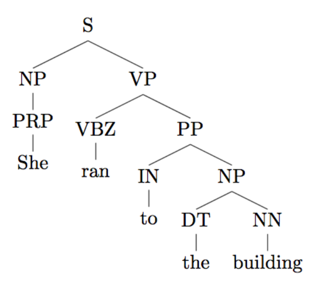

<div align="center">
  <h1>结构化预测</h1>
</div>

* [0. 写在大模型前面的话](#0-写在大模型前面的话)
* [1. 词法分析](#1-词法分析)
  * [1.1. 分词](#11-分词)
  * [1.2. 词性标注](#12-词性标注)
* [2.2. 句法分析](#2-句法分析)
  * [2.3. 成分句法分析](#21-成分句法分析)
  * [2.3. 依存句法分析](#22-依存句法分析)
* [3. 序列标注](#3-序列标注)
  * [3.1. 使用分类器进行标注](#31-使用分类器进行标注)
* [4. 语义分析](#4-语义分析)

# 0. 写在大模型前面的话

在介绍大语言模型之前，先把自然语言处理中遗漏的结构化预测补充一下，因为大模型实打实地最先干掉的行业便是自然语言处理，虽然网传各个最容易被大模型替代的行业里从来没有自然语言处理，但现实是有了大模型后，之前的所有自然语言处理技术都显得不那么有价值了。

当然，大模型本质上还是处理自然语言，但其实最大的变化便是忘掉之前的技术，一切像数据和算力看齐。

**老兵不死，只是逐渐凋零。**

# 1. 词法分析

词法分析(Lexical Analysis)是对输入文本进行预处理和基础处理的关键步骤。其主要任务是将文本分割成更小的单元（通常是词素或token），并对这些单元进行进一步处理以提取有用的信息。

以下是NLP中词法分析的主要任务和功能：
* 分词(Tokenization)：将输入文本分割成独立的词素(Token)。将连续的文本字符串切分成有意义的单词或符号。
* 词性标注(Part-of-Speech Tagging)：为每个词素分配其词性（如名词、动词、形容词等）。识别每个单词的语法类别和功能，有助于理解句子的结构和含义。
* 词形还原(Lemmatization)：将单词还原为它的词根或规范形式（如动词的原形）。减少词汇形态的多样性，将不同形式的单词归为同一个词。
* 词干提取(Stemming)：将单词简化为词干形式，一般通过删减词缀来实现。简化单词，尽量捕捉其基础形式。
* 命名实体识别(Named Entity Recognition)：识别文本中的命名实体，如人名、地名、组织名、日期等。从文本中提取有意义的实体信息。
* 正则表达式匹配(Regex Matching)：使用正则表达式从文本中提取特定模式或信息。识别和抽取符合特定模式的数据如电子邮件地址、日期等。
* 分块(Chunking)：将词性标注后的文本进行分块。例如标识出名词短语（NP）、动词短语（VP）等。为更高层次的语法分析提供基础。


## 1.1. 分词

分词(Tokenization)是将连续的文本字符串拆分成独立的词素(Token)的过程。分词策略在处理各种自然语言时有所不同，这是由于各个语言的词汇结构和语法规则存在显著差异。

英文分词相对来说比较直接，因为英文单词通常由空格和标点符号分隔。大多数情况下，英文句子中的空格、标点符号等自然分隔符可以有效地分隔词汇。还可以依托自然分隔符和基本规则，如撇号和连字符等特别符号处理。

中文分词相对复杂，因为汉字连续书写，不像英文单词那样有明显的分隔符（如空格）。这使得中文分词成为NLP领域中的一个重要且具有挑战性的任务。中文句子中的词汇之间没有明确的分隔符。同一个字符序列可能有不同的词汇组合方式，导致多种解析结果。处理新词、专有名词和更新快的词汇（如网络用语）。

中文分词的方法：
1. 基于规则和字典的方法：利用预定义的词典和规则进行分词。前向最大匹配(Maximum Forward Matching, MFM)，从左到右扫描，选择最长的词。逆向最大匹配(Maximum Backward Matching, MBM)，从右到左扫描，选择最长的词。
2. 统计模型：计算n-gram概率序列进行分词。利用隐马尔可夫模型结合观测概率和转移概率进行词性标注和分词。
3. 机器学习和深度学习方法：基于Transformer的模型，如BERT，利用自注意力机制处理全局信息，适用于复杂的分词任务。

* 前向最大匹配 Python 实现
```python
def forward_max_match(text, dictionary):
    max_len = max(len(word) for word in dictionary)
    i = 0
    tokens = []
    while i < len(text):
        match = None
        for j in range(max_len, 0, -1):
            if i + j <= len(text) and text[i:i+j] in dictionary:
                match = text[i:i+j]
                tokens.append(match)
                i += j
                break
        if not match:
            tokens.append(text[i])
            i += 1
    return tokens

dictionary = {"我", "爱", "北京", "天安门"}
text = "我爱北京天安门"
tokens = forward_max_match(text, dictionary)
print(tokens)
# Output: ['我', '爱', '北京', '天安门']
```

## 1.2. 词性标注

词性标注是自然语言处理（NLP）中的一种技术，用于为给定文本中的每一个单词分配其适当的词性标签。常见的词性标签包括名词（Noun, N）、动词（Verb, V）、形容词（Adjective, Adj）、副词（Adverb, Adv）等等。这种标注在各种语言处理任务中非常重要，包括语法解析、信息抽取、机器翻译等。

词性标注方法:
1. 基于规则的标注方法：基于一组预定义的规则（如词形变化规则）来标注词性。这种方法简单但受限于规则的定义和复杂性。
2. 基于统计的标注方法：基于概率和统计模型，使用大规模标注数据训练模型来预测词性。如隐马尔可夫模型（HMM）、条件随机场（CRF）等。
3. 深度学习方法：使用现代深度学习技术，如RNN和Transformers来标注词性。如BERT等预训练语言模型。

常见的标签集有以下几种：
1. Penn Treebank标签集：这是用于英语的一个广泛采用的标签集，如NN（名词单数）、NNS（名词复数）、VB（动词原形）、VBD（动词过去式）等。
2. Universal POS Tags：这是一个通用性更强的标签集，适用于多种语言，如NOUN（名词）、VERB（动词）、ADJ（形容词）、ADV（副词）等。
3. ICTCLAS标签集：这是由中科院计算技术研究所开发的中文词性标注标准。


假设我们有一句话：“The quick brown fox jumps over the lazy dog.”，我们需要对其进行词性标注。下面是一个可能的标注结果：

1. "The" - DET（限定词）
2. "quick" - ADJ（形容词）
3. "brown" - ADJ（形容词）
4. "fox" - NOUN（名词）
5. "jumps" - VERB（动词）
6. "over" - ADP（介词）
7. "the" - DET（限定词）
8. "lazy" - ADJ（形容词）
9. "dog" - NOUN（名词）


词性标注在自然语言处理中的重要性在于：
1. 简化结构化分析：帮助其他语言处理任务理解句子的结构。
2. 信息抽取：提高信息抽取的精度。
3. 机器翻译：改善翻译的语法和流畅度。
4. 命名实体识别：有助于识别专有名词和其他关键元素。

# 2. 句法分析

句法分析(Syntactic Parsing)是自然语言处理中的重要任务，旨在识别和解释输入文本的语法结构。句法分析的目标是生成解析树(Parse Tree)，以显示句子各成分之间的关系，以及句子的整体语法结构。解析树包括成分关系(Constituency Parsing)和依存关系(Dependency Parsing)两种主要类型。

## 2.1. 成分句法分析

成分句法分析(Constituency Parsing)，又称为短语结构分析，是自然语言处理中一个关键的技术任务。它的目标是将输入句子解析成一个语法树(Parse Tree)，该树描述了句子如何根据某种句法规则结构化。

成分句法分析的目标是构建一个树状结构，用以表示句子的层级关系和组成成分。树的每一个节点表示一个句法成分，如短语、词组或词的类型（如名词短语、动词短语等）。

<div align="center">
  
</div>

常见的成分标签：
- **S**：句子（Sentence）
- **NP**：名词短语（Noun Phrase）
- **VP**：动词短语（Verb Phrase）
- **PP**：介词短语（Prepositional Phrase）
- **DT**：限定词（Determiner）
- **JJ**：形容词（Adjective）
- **NN**：名词（Noun）
- **VBZ**：动词三单现（Verb, 3rd person singular present）

主要方法：
1. 上下文无关文法(Context-Free Grammar, CFG)：基于一组规则和词典来生成和解析句子。规则示例：S -> NP VP，NP -> DT NN，VP -> VBZ NP。使用生成递归下降解析器或CKY算法进行解析。
2. 概率上下文无关文法(Probabilistic Context-Free Grammar, PCFG)：在CFG的基础上增加规则使用的概率，用于更精细的控制和解析。通过最大似然估计或EM算法进行规则概率的训练。
3. Chart Parsing：使用动态规划技术，如CYK算法或Earley算法，进行高效的句法树生成。可以处理模糊语法和解析数据的不确定性。
4. 基于统计模型的解析：如斯坦福解析器(Stanford Parser)，使用PCFG和其他统计方法进行解析。通过大规模语料库（如Penn Treebank）训练模型。
3. 基于神经网络端到端解析：结合深度学习模型，直接输出解析树。如使用CRF（条件随机场）层在最后一层优化标签序列的选择。

成分句法分析在多个领域有广泛应用：
- **机器翻译**：理解源语言和目标语言的句法结构，提高翻译质量。
- **信息抽取**：解析复杂文本以提取有用信息，如实体、关系等。
- **问答系统**：理解用户输入以提供更准确的答案。
- **情感分析**：分析句子的情感倾向，由其组成成分的情感进行聚合。

## 2.2. 依存句法分析

依存句法分析(Dependency Parsing)是一种句法分析方法，旨在识别句子中词语之间的语法依存关系。每个词语都有一个或多个依赖词（即其修饰词），这些依存关系能揭示句子的结构和词语在句子中的作用。

两个词语之间的一种语法关系，通常表示为一个头词(Head)和一个依存词(Dependent)，这是一种依存关系(Dependency Relation)
一个有根的、有向、无环图，每个节点代表句中的一个词，边表示依存关系，这样就形成了依存树(Dependency Tree)。

句子：“The quick brown fox jumps over the lazy dog.”

依存树可能如下：
```
   jumps
   ├── fox
   │   ├── The
   │   ├── quick
   │   └── brown
   └── over
       └── dog
           ├── the
           └── lazy
```
在这个依存树中，“jumps”是主谓关系的中心词，“fox”是主语，“dog”是宾语。

依存关系可以细分为不同类型，如：
- **主谓关系（subject-verb）**：如“fox” -> “jumps”
- **动宾关系（verb-object）**：如“jumps” -> “over”
- **形容词修饰名词（adjective-noun）**：如“quick” -> “fox”

这些关系常用统一的标签表示，称为依存标签(Dependency Labels)，例如：nsubj（名词主语）、dobj（直接宾语）、amod（形容词修饰）。

依存句法分析的方法：
1. 基于规则的方法：转换系统(Transition-Based Systems)，使用一系列操作（如SHIFT、REDUCE、LEFT-ARC、RIGHT-ARC）逐步构建依存树。优点：高效，适合实时应用。缺点：规则繁琐，容易出错，需要大量领域知识。
2. 数据驱动的方法：图算法(Graph-Based Methods)，将句法分析问题转化为图的最优生成问题，使用图算法生成依存树。
3. 基于统计模型的解析：离散特征（如词性、词汇）和连续特征（如词嵌入）结合，使用统计模型预测依存关系。
4. 神经网络方法：神经依存解析(Neural Dependency Parsing)：对于每个词，使用神经网络预测其依存头和依存关系。


# 3. 序列标注

序列标注(Sequence Labeling)是一种自然语言处理任务，目标是给序列中的每个元素分配一个标签。常见的应用包括词性标注(POS tagging)、命名实体识别(NER)、分块(Chunking)、语义角色标注(Semantic Role Labeling)、句法解析(Syntactic Parsing)等。

在序列标注任务中，每个标签不仅依赖于当前元素，还可能依赖于上下文中的其他元素。这使得序列标注不同于独立的单元素标注任务。因此，合理的建模方法通常需要考虑元素之间的依赖关系。常用方法包括：隐马尔可夫模型(HMM)，条件随机场(CRF)。

## 3.1. 使用分类器进行标注

使用分类器进行标注(Tagging with Classifiers)适用于较为独立的标注任务，在这种方法中，我们把标注任务视为分类问题，即为每个元素分配一个类别。我们可以使用各种分类器，如支持向量机(SVM)、随机森林(Random Forests)和神经网络等。 

使用分类器进行标注的主要步骤:
1. 特征提取：为序列中每个元素提取特征，这些特征可以包括词本身、词的上下文、词的形态学特征等。
2. 训练分类器：使用带标注的数据集训练分类器，其中每个元素对应一个特定的标签。
3. 预测标签：训练好的分类器用于预测新数据的标签。

使用分类器进行标注的优点是比较简单，容易实现，可以利用很多不同的机器学习算法。缺点是如果不考虑上下文信息，标注效果可能会受限。独立于上下文的分类器可能无法捕捉词与词之间的依赖关系。


# 4. 语义分析

语义分析(Semantic Analysis)旨在理解和解释语言背后的意义。语义分析不仅仅关注词语的表面形式，而是试图理解词语和句子在特定语境中的真实含义。

大语言模型直接建模语义，利用大量的文本数据，通过自监督学习来捕捉复杂的语言规律和语义信息。就像我们母语学习类似，是从实际生活中学习语义，并不需要先进行词法分析或句法分析。
