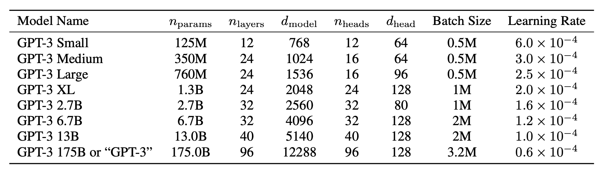
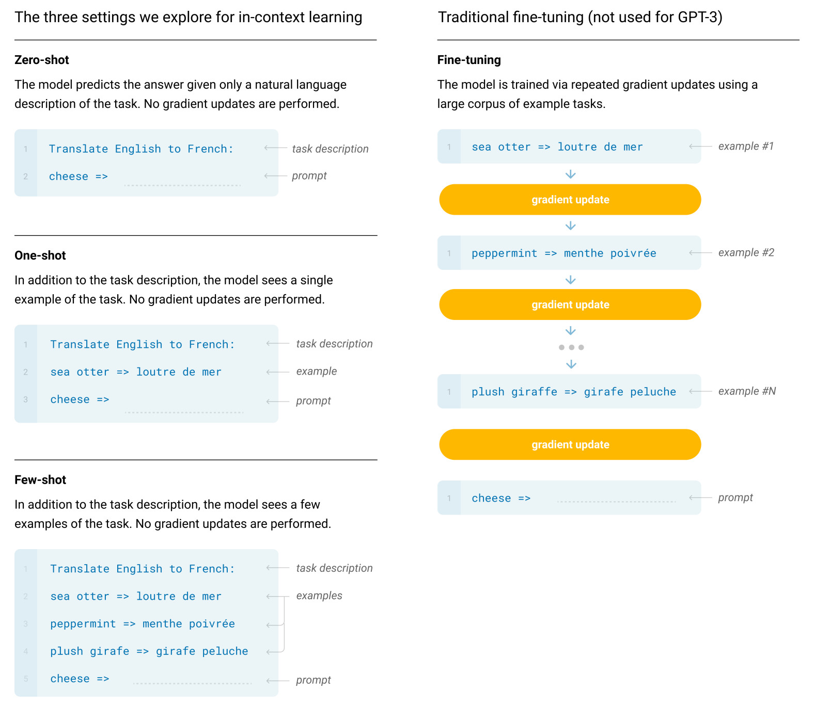
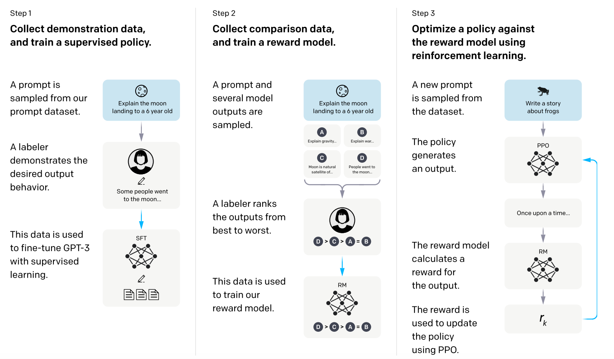
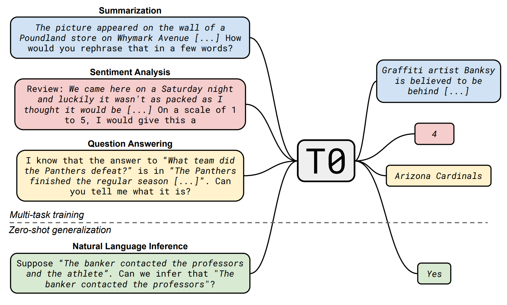
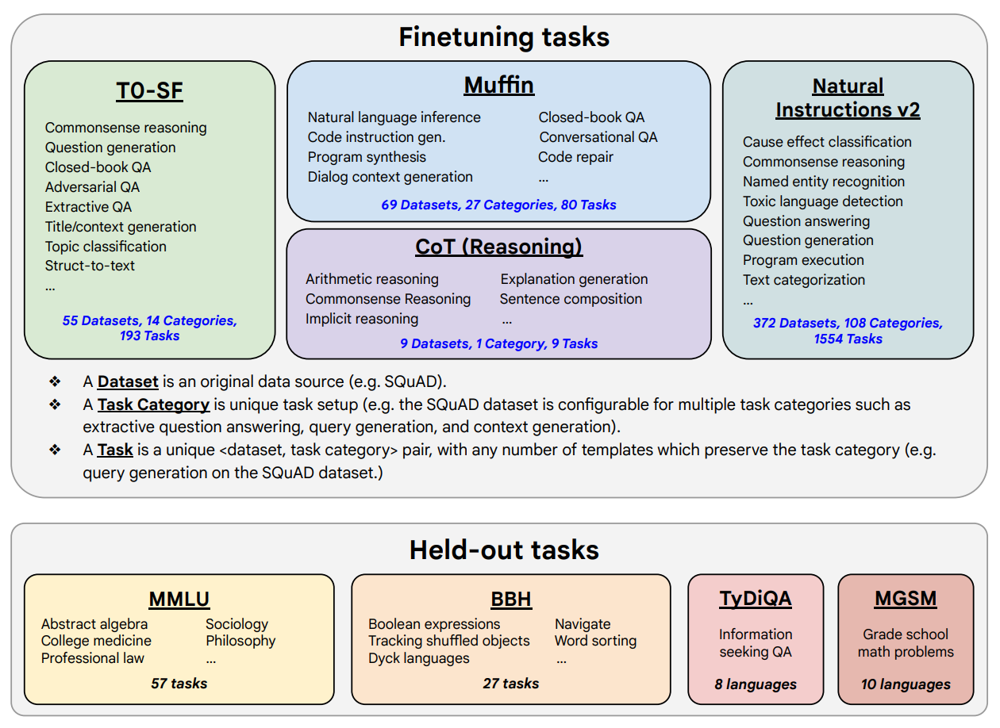

  <h1>现代大语言模型</h1>

* [1. GPT-3](#1-gpt-3)
* [2. 上下文学习](#2-上下文学习)
  * [2.1. 零样本提示](#21-零样本提示)
  * [2.2. 少样本提示](#22-少样本提示)
  * [2.3. 归纳头](#23-归纳头)
* [3. 对齐](#3-对齐)
  * [3.1. 指令微调](#31-指令微调)
  * [3.2. 基于人类反馈的强化学习](#32-基于人类反馈的强化学习)
  * [3.3. 事实与幻觉](#33-事实与幻觉)

# 1. GPT-3

* GPT系列论文
  * GPT-1(2018): [Improving Language Understanding by Generative Pre-Training](https://cdn.openai.com/research-covers/language-unsupervised/language_understanding_paper.pdf)
  * GPT-2(2019): [Language Models are Unsupervised Multitask Learners](https://d4mucfpksywv.cloudfront.net/better-language-models/language_models_are_unsupervised_multitask_learners.pdf)
  * GPT-3(2020): [Language Models are Few-Shot Learners](https://arxiv.org/abs/2005.14165)
  * InstructGPT(2022): [Training language models to follow instructions with human feedback](https://arxiv.org/abs/2203.02155)

GPT-1(GPT)在之前章节中就介绍过了，GPT-2相比GPT使用了更多的训练数据，并且增加了模型规模。GPT-2是截止到2019年3月训练的最大模型(1.5B)。它能够连续地生成流利和连贯的句子，而这是较小的模型或LSTM所无法实现的。

GPT-3拥有惊人的1750亿个参数(175B)，这是GPT-2参数数量的100多倍。这使得GPT-3成为当时最大的语言模型。训练使用45TB超大规模数据。GPT-3可以执行各种自然语言处理任务，包括但不限于文本生成、翻译、问答、总结和文本分类。GPT-3展示了强大的少样本学习能力，只需要通过极少的例子就可以理解和执行新的任务。这种能力被称为“in-context learning”，它使得GPT-3在没有专门训练的情况下可以处理广泛的任务。由于其庞大的参数数量和先进的架构，GPT-3能够生成非常自然和连贯的文本，这在许多情况下几乎无法与人类的写作区分开来。

  

# 2. 上下文学习

GPT-3提出了微调(Fine-Tuning, FT)之外的另一种方法：上下文学习或语境学习(In-Content Learning, ICL)。仅使用现成的模型，不进行梯度更新。

传统的微调方法通常需要对预训练模型进行进一步的训练，以适应特定任务或数据集。这涉及在新的数据集上进行额外的训练，并更新模型的梯度来调整参数，从而使模型更好地处理特定任务。与此相对，GPT-3引入了上下文学习的概念。这种方法不需要对模型进行额外的训练或梯度更新，而是直接使用预先训练好的模型。通过在输入中提供一些示例或提示，GPT-3能够根据这些上下文信息来理解任务并生成相应的输出。这种方法的优势在于：
1. 无需额外训练：用户可以直接使用预训练好的GPT-3，无需再进行细调或训练过程。这大大简化了使用流程，减少了计算和时间成本。
2. 多样性和灵活性：由于不需要对模型进行修改，可以在同一个模型上处理多种任务，只需提供不同的上下文示例即可。
3. 即时适应：模型能够通过提供的上下文快速适应新的任务或主题，展示出强大的通用性和适应能力。

这种上下文学习的能力来自于GPT-3庞大的训练数据和参数，使其在理解和生成文本方面有着卓越的表现。它可以通过少量示例(few shot)或提示(prompt)来学习新的任务，并在输入的上下文中生成合理的响应。

上下文学习的核心是语言模型能够延续观察到的模式。即一个有效的语言模型应该能够根据已经观察到的文本模式，延续这个模式并生成合理的序列。这种延续观察到的模式的能力是语言模型生成高质量文本的基础，尤其是在上下文学习中，模型通过提供的示例来掌握任务，并生成符合这些示例模式的输出。

  

* 相关研究

[Demystifying Prompts in Language Models via Perplexity Estimation](https://arxiv.org/abs/2212.04037)

[Calibrate Before Use: Improving Few-Shot Performance of Language Models](https://arxiv.org/abs/2102.09690)

[Holistic Evaluation of Language Models](https://arxiv.org/abs/2211.09110)

[Rethinking the Role of Demonstrations: What Makes In-Context Learning Work?](https://arxiv.org/abs/2202.12837)

## 2.1. 零样本提示

零样本提示(Zero-shot Prompting)指的是在没有任何特定的训练样本或特定示例的情况下，通过提示模型（如GPT-3）执行特定的任务。这意味着模型不需要额外的训练数据或任务示例，就可以理解并尝试完成用户给出的任务指令。

零样本提示是一种能力，即在没有额外训练的情况下，通过给定一个清晰的提示或指令，模型能够完成特定任务。它不需要对特定任务进行专门的训练数据。模型通过预训练阶段学习了丰富的语言模式和知识，从而能够理解和执行各种自然语言任务。当接收到一个新的任务提示时，模型使用其预训练知识来推断并提供相应的答案或解决方案。

零样本提示的优点：
* 灵活性高：可以处理多种不同类型的任务，而无需为每个任务单独收集和标注数据。
* 成本低：减少了在特定任务上进行额外训练的数据需求和计算成本。

零样本提示的例子：
* 翻译：输入提示“将以下句子翻译成法语：‘Hello, how are you?’”，模型直接给出翻译“Bonjour, comment ça va?”。
* 问答：输入提示“谁是美国的第一任总统？”，模型能直接回答“乔治·华盛顿”。
* 文本分类：输入提示“这是一个积极的评论还是消极的评论：‘这部电影非常棒！’”，模型可以回答“积极”。

## 2.2. 少样本提示

少样本提示(Few-shot Prompting)指的是通过提供少量适当的示例作为提示，指导语言模型（如GPT-3）执行特定任务的一种技术。它是一种介于零样本提示和监督学习（需要大量标注数据）之间的方法。少样本提示是指通过提供几个任务示例作为提示，引导语言模型完成对应任务。示例的数量通常很少，可能只有一到几个。换句话说，就是给模型提供少量的任务示例和任务描述，通过这些示例来告诉模型如何处理类似的输入。

为什么使用少样本提示：
1. 数据效率：相比全监督学习，需要大量标注数据，少样本提示大大减少了数据需求。
2. 快速适应：可以快速应用于新领域或新任务，不需要大量的数据收集和标注过程。
3. 灵活性：模型可以利用少量示例迅速调整自身行为以满足特定任务需求。

少样本提示的挑战：
1. 提示设计：如何设计有效的提示，即选择哪些少量的示例能最好地引导模型完成任务。
2. 覆盖面：少量示例能否充分代表任务的广泛性和复杂性。

少样本提示的例子：
1. 翻译：提供几对源语言和目标语言的句子对，提示模型翻译新的句子。
2. 问答：示例包括一些问题及其对应答案，提示模型按照示例的方式回答新问题。
3. 文本分类：输入包括几条带有分类标签的示例，如情感分析的正面和负面评论。提示模型根据这些示例对新输入进行分类。

研究表明，即使是错误的少样本示例，也比没有示例好。

## 2.3. 归纳头

归纳头(Induction Heads)是两个位于不同层的注意力头，它们协同工作来完成某种模式匹配或复制任务。第一个头的作用是复制信息，第一个注意力头（位于较早的层）会从前一个标记(token)中提取信息并复制到当前标记中。例如，如果当前标记是[B]，那么这个头会从前一个标记[A]中复制信息到[B]中。第二个头的作用是关注前序信息，第二个注意力头（处于更高层）会关注那些在它之前出现的标记，而不是当前标记的内容。这个头会“回溯”之前的标记，试图根据之前的信息来确定接下来应该是什么标记。最后，协同工作模式完成，这两个头协同工作，可以让模型更加容易地完成特定的模式。例如，在序列...[A][B]...[A]中，由于第一个头复制了信息，而第二个头根据前面发生的情况来关注标记，这使得模型可以更准确地预测和完成[B]。例如，在文本生成任务中，如果有一部分输入是[A][B]，随后再出现一个[A]，模型通过这两个头的协同工作，很有可能会预测出下一个标记是[B]，因为它识别到这种模式并进行了有效的复制和传播。

归纳头能让两层模型做到更多的事情，但它们与全尺寸Transformer的相关性尚不清楚，全尺寸Transformer有数百个注意力头协同工作，感应头似乎对一些复杂多层架构的显著行为做出了重大贡献。

在这些行为中，算术的能力得到彰显，因为模型只被训练来完成文本。例如，如果给出重复prompt：「问：48 加 76 等于多少？答：124；问：48 加 76 等于多少？A：___。一个强大的模型会得到正确的答案，并且在获得足够多的非重复prompt后，它就能正确回答它从未见过的算术问题。这种从上下文中明显学习新能力的现象称为上下文学习。

这种现象令人费解，因为从上下文中学习是不可能的。这是因为决定模型性能的参数仅在训练期间进行调整，而没有在模型处理输入上下文时进行调整。归纳头至少解决了部分难题。它们解释了上下文学习的简单、重复形式的可能性，同时提供了所需要的复制模型未经训练使用的新词的能力。

* 相关研究

[In-context Learning and Induction Heads](https://arxiv.org/abs/2209.11895)

[Transformer Circuits Thread](https://transformer-circuits.pub/)

# 3. 对齐

GPT-3虽然在各大NLP任务以及文本生成的能力上惊艳，但是仍然还是会生成一些带有偏见的，不真实的，有害的造成负面社会影响的信息，而且并不按人类喜欢的表达方式去说话。OpenAI提出了一个概念对齐(Alignment)，模型输出与人类真实意图对齐，符合人类偏好。InstructGPT的独特之处在于它经过了特定的训练，使其能够更好地理解和遵循用户的指令，从而提供更准确和有用的答案。

InstructGPT的目标：
1. 有用性，有用的(helpful)：能帮助用户解决问题。
2. 真实性，诚实的(honest)：不能捏造事实，不能误导用户。
3. 无害性，无害的(harmless)：不能对用户或环境造成物理、精神、社会层面的伤害。

以下是InstructGPT的一些关键特点：
1. 指令微调：InstructGPT经过了所谓的指令微调(Instruction Tuning)训练，这意味着它不仅仅是根据大量文本进行预训练，还特别针对遵循用户指令的任务进行了优化。这使得它在执行具体任务时表现更佳。
2. 人类反馈训练：为了增强模型对指令的理解和响应能力，InstructGPT利用了来自人类的反馈进行强化学习。通过人工评估模型的输出质量，模型逐渐调整其生成策略，提高了响应的相关性和准确性。

  

* 相关研究
  * DeepMind Sparrow: [Improving alignment of dialogue agents via targeted human judgements](https://arxiv.org/abs/2209.14375)
  * Google LaMDA: [LaMDA: Language Models for Dialog Applications](https://arxiv.org/abs/2201.08239)

## 3.1. 指令微调

在自然语言处理领域，模型通常通过语言建模目标来训练，即在给定上下文(context)的情况下预测接下来会出现的词语。然而，在实际应用中，我们希望模型能够更好地处理特定任务，例如问答系统用户提出问题，系统给出相应的回答。为了实现这个目标，研究人员可以在原始语言模型的基础上，进行进一步的优化和微调。

语言模型目标：通常的训练目标是预测下一个词，这意味着模型学习了大量的语言特征和模式。

任务优化：具体的任务如问答系统，需要模型在上下文提示下生成一个具体的答案。

指令微调(Instruction Tuning)是对已经训练好的基础语言模型进行进一步优化，通过在多种任务数据上进行有监督的微调，使模型能够处理各种具体的自然语言处理任务。指令微调是一种方法，通过在从多个NLP任务中派生的数据上进行有监督的训练，将通用语言模型调整为能够执行特定任务的模型。

  

基础语言模型（如GPT-3、BERT等）通过大量的无监督文本数据进行预训练，主要是学习语言结构和语法。然而在实际应用中，我们需要模型能够执行更具体的任务，如问答、文本分类、翻译等。指令微调就是通过在特定任务数据上进行训练，让模型学会这些具体任务的处理方式。

  

* 指令微调的优势

通过在多种任务数据上进行训练，模型可以学习到应对不同任务的通用特征，从而在新的任务上表现得更好。通过简单调整训练数据和目标任务，可以使同一个基础模型应用于不同的实际场景。微调使得模型能够更加精确地解决特定任务中的问题，从而提升模型的实际应用效果。

* 指令微调的挑战

需要大量的标注数据来进行微调，以确保模型能够在各种任务上表现良好。微调过程需要大量的计算资源，尤其是在处理大规模模型时。虽然模型在多任务上训练，但在某些特定任务上的泛化能力仍然可能有限，需要不断更新和调整训练数据和方法。

* 相关研究

[Multitask Prompted Training Enables Zero-Shot Task Generalization](https://arxiv.org/abs/2110.08207)

[Scaling Instruction-Finetuned Language Models](https://arxiv.org/abs/2210.11416)

## 3.2. 基于人类反馈的强化学习

基于人类反馈的强化学习(Reinforcement Learning from Human Feedback, RLHF)是一种结合强化学习和人类反馈，优化深度学习模型输出质量的方法。主要用于提高模型在生成任务（如对话系统、文本生成）上的表现。

RLHF 的主要目标是通过人类的反馈信号来优化模型，使其生成的输出更符合人类的期望和标准。这使得模型不仅可以基于统计规律生成文本，还可以生成更加自然、有用和合适的回答。

RLHF的步骤:
1. 初步预训练：使用大规模无监督文本数据进行预训练，类似于标准语言模型的训练过程。目标是学习基本的语言结构和生成能力。
2. 生成初始输出：预训练的模型生成初始答案（或输出）集合，这些答案可能是回答问题、继续对话或者是其他形式的文本生成。
3. 人类反馈：人类对这些生成的答案进行评分和评价，反馈可以是直接的分数（如1到5星）或更详细的批评和建议。收集尽可能多的关于模型输出质量的反馈，从而为后续的强化学习步骤提供指导。
4. 奖励模型训练：将人类的评分和反馈转换为奖励信号，训练一个奖励模型，它能基于生成的输出分配奖励分数。建立一个可以预测某个输出好坏的奖励机制。
5. 强化学习优化：使用强化学习算法（如PPO, Proximal Policy Optimization）来进一步训练生成模型，使其生成的答案能够获得更高的奖励分数。模型生成新的答案，这些答案被奖励模型评估，得到奖励分数，并将这一分数反馈到生成模型中，以优化其生成策略。

  

RLHF的优势：
1. 提高输出质量：通过直接的人类反馈信号，模型生成的输出更贴近用户的需求和期望。
2. 灵活性和适应性：可以根据不同任务或不同用户的需求动态调整模型表现。
3. 增强用户满意度：生成更有意义和反应更符合实际情况的答案，从而提高用户的满意度。

RLHF的挑战：
1. 反馈质量：需要大量高质量的人类反馈，这可能会涉及高昂的时间和人力成本。
2. 复杂性：训练和使用奖励模型，以及使用强化学习算法来训练生成模型，增加了系统的复杂性。
3. 标注一致性：人类反馈可能存在主观性和不一致性，这对训练奖励模型会构成挑战。

* 相关研究

[Training language models to follow instructions with human feedback](https://arxiv.org/abs/2203.02155)

[Alpaca: A Strong, Replicable Instruction-Following Model](https://crfm.stanford.edu/2023/03/13/alpaca.html)

## 3.3. 事实与幻觉

语言模型建模的是文本分布，而不是事实。因此，它们生成的内容不一定是事实。语言模型的目标是学习和生成符合训练数据分布的文本，而不是验证这个内容是否真实。因此，它们生成的文本可能看起来合乎逻辑和语法正确，但并不保证其真实性。

语言模型是在互联网数据上训练的。广为传播的谬误可能会在语言模型中被重现。它们的训练数据来源于互联网。互联网上的许多信息并不可靠或准确，甚至可能包含大量谣言和错误。因此，这些错误信息可能会被语言模型学习并重现。

语言模型可能无法存储所有的罕见事实，因此会对几种选项分配一个适当的概率。由于某些罕见事实在训练数据中出现的频率很低，语言模型可能没有足够的信息去正确记住或生成这些事实。因此，当被问及这些罕见事实时，模型可能会根据已经知道的情况给予几个选项一个大致的概率，而不是能准确回答。

* 相关研究

[Revisiting the Gold Standard: Grounding Summarization Evaluation with Robust Human Evaluation](https://arxiv.org/abs/2212.07981)

[WiCE: Real-World Entailment for Claims in Wikipedia](https://arxiv.org/abs/2303.01432)

[SummaC: Re-Visiting NLI-based Models for Inconsistency Detection in Summarization](https://arxiv.org/abs/2111.09525)

[FActScore: Fine-grained Atomic Evaluation of Factual Precision in Long Form Text Generation](https://arxiv.org/abs/2305.14251)

[RARR: Researching and Revising What Language Models Say, Using Language Models](https://arxiv.org/abs/2210.08726)

